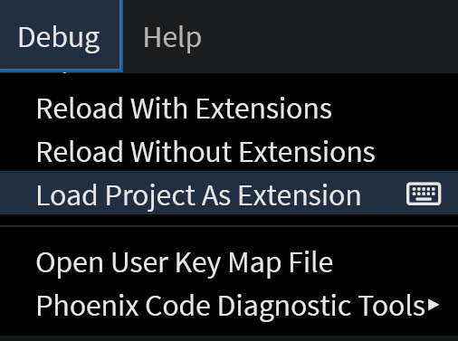

import React from 'react';
import VideoPlayer from '@site/src/components/Video/player';

This document outlines how to create your own themes for **Phoenix Code**.

## Follow these steps to create a new theme:

### Step 1:
Open this link [Theme-Template](https://github.com/phcode-dev/theme-template).
This is the default Phoenix Code theme template repository.

### Step 2:
Use the template to create your repository.

<VideoPlayer 
  src="https://docs-images.phcode.dev/videos/creating-themes/template.mp4"
/>

### Step 3:
Clone the repository you created in Step 2 to your local machine.

Go to [https://create.phcode.dev](https://create.phcode.dev). This is a development-focused version of phcode.dev which shows non minified JS/CSS files in the browser developer tools.

Now, open the cloned folder in `create.phcode.dev`. Refer to [this guide](https://docs.phcode.dev/docs/quick-start-project#open-folder) to see how to open a folder in Phoenix Code.

### Step 4:

Now, go to `package.json` file and update the values accordingly. 

Here is a quick reference :-

| Field | Description |
| --- | --- |
| `title` | Replace "Name of the theme" with the actual title of your theme. |
| `name` | Change `github-<owner>-<repo>` to your specific package name, formatted as `github-yourusername-repositoryname`. |
| `description` | Update to a brief, relevant description about your theme. |
| `version` | Start with "0.0.1" or update to reflect your current version following semantic versioning. |
| `license` | Confirm "MIT" is suitable or specify another license, if necessary. |
| `author` | Replace with your name and a link to your GitHub profile or another URL. |
| `homepage` | Set to the URL of your project’s homepage or GitHub repository. |
| `engines` | Ensure compatibility with the required Brackets version, e.g., ">=3.0.0". |
| `categories` | Update "demo" with relevant categories that fit your theme. |
| `keywords` | Update or append additional keywords that describe your theme. Example :- ‘dark-theme’, ‘aesthetic’, ‘blue’. |
| `theme` | Make sure all necessary theme files and folders are included. Set “Dark” to `true` if its a dark theme, else `false`. |

Save the file after making all the changes.

### Step 5:

Now, go to `my-theme.less` file.  Click on `Debug` in the Menu bar and select `Load Project As Extension`.

This should be the default output. 

This file contains all the UI elements as variables. You can modify the colors as per your needs and live preview them.

<VideoPlayer 
  src="https://docs-images.phcode.dev/videos/creating-themes/change-colors.mp4"
/>

> You can also select `Debug > Reload Project As Extension` to test the new code changes.

When you are done developing the theme, select `Debug > Unload Project As Extension` to unload the theme.

Once the theme is complete, you can publish it to [phcode.dev](https://phcode.dev) extension repository. 

Refer to [this link](./publishing-extensions) to see how to publish the theme.
