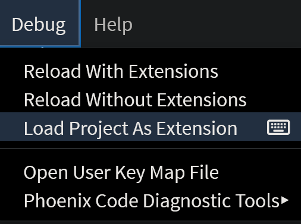

This document outlines how to write your own extensions for **Phoenix Code**.

## How to create a new Extension
Click on the link below and follow the instructions there to start:
[Create an Extension](https://github.com/phcode-dev/extension-template)

## API docs
Please refer to the links below for extension API docs and code references.
* Phoenix Code APIs - [API Reference](./API-Reference/NodeConnector)
* Take a look at our default extensions for code reference -  [Default Extensions](https://github.com/phcode-dev/phoenix/tree/main/src/extensions/default)

## Running and Debugging your Extension
Follow the steps below to run and debug your extension:

* Clone your extension repository onto the machine.

* Go to [https://create.phcode.dev](https://create.phcode.dev). This is a development-focused version of phcode.dev which shows non minified JS/CSS files in the browser developer tools.

* Now, open the cloned folder in `create.phcode.dev`. 
> Refer to [this guide](https://docs.phcode.dev/docs/quick-start-project#open-folder) to see how to open a folder in Phoenix Code.
* Select `Debug > Load Project As Extension`

* The extension will be loaded in Phoenix Code.

* You can now make code changes and live preview them. 

> You can also select `Debug > Reload Project As Extension` to test the new code changes.

* When you are done developing the extension, select `Debug > Unload Project As Extension` to unload the extension.

**You can use the browser developer tools to debug the extension.**

