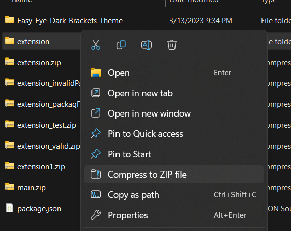
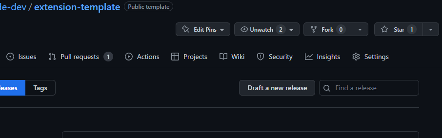
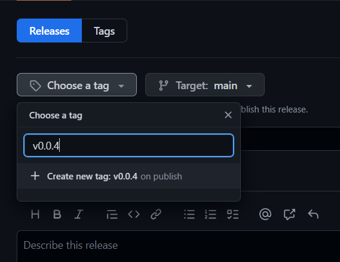
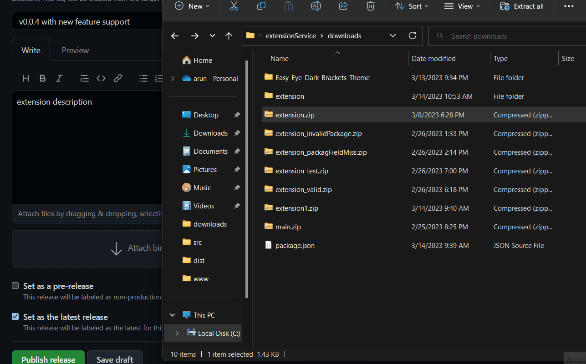
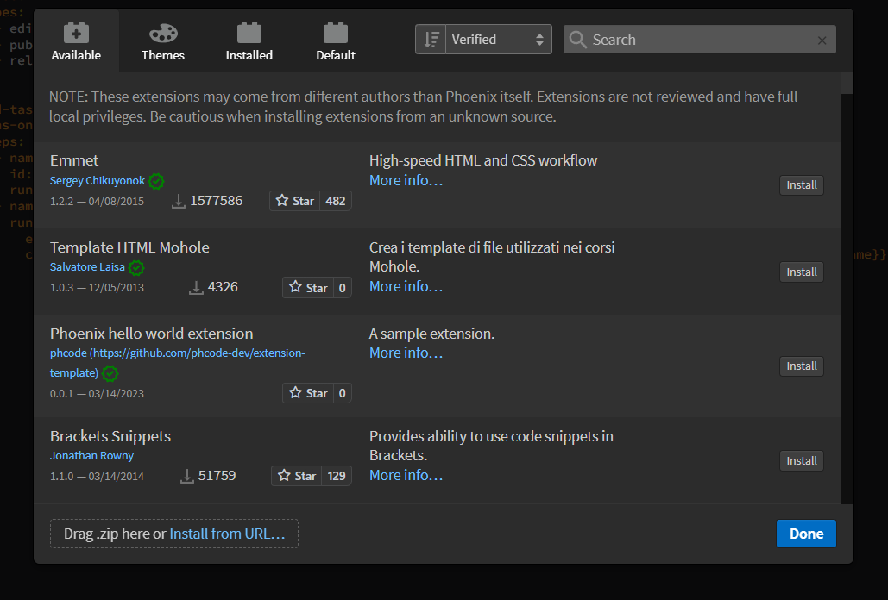

This document outlines how to publish your Extensions/Themes to Phoenix Code Extension store.

## Publishing Extensions/Themes.
Extensions created from the Phoenix Code extension/theme template can be easily published from your GitHub repository to the store.

Follow these steps:

1. Increment the `version` field in `package.json` file before publishing, if needed. 
2. Compress the extension folder into a zip file with name `extension.zip`. 
> **It is important to name the file as exactly `extension.zip`** 

3. Create a new release in GitHub and attach the above `extension.zip` file in the release.
   1. On GitHub.com, navigate to the main page of the repository.
   2. To the right of the list of files, click `Releases`. 

   

   3. Click on `Draft a new release`.

   
   
   4. Select `choose a tag` and type in your new extension version and `Create new tag`. 

    

   5. Fill out all the remaining fields.
   6. Drag and drop the `extension.zip` file to the release.

   

   7. Click on `Publish release` button.
   >    See Release Example: https://github.com/phcode-dev/extension-template/releases/tag/0.0.1
4. You will get an issue in your issue tab regarding the publishing status of the extension/theme.
   > See Example: https://github.com/phcode-dev/extension-template/issues/2
5. If there are any errors in publishing, please visit the link in the issue to see the errors. Fix and `retry` publishing the release.

    

6. Once published, your extension will appear in the Phoenix Code Extension Store at [https://phcode.dev](https://phcode.dev).

    

## Publishing legacy Brackets extensions
> Follow this section only for old brackets extensions.

To publish Extensions/themes that are not created from the above [theme](https://github.com/phcode-dev/theme-template) and [extension](https://github.com/phcode-dev/extension-template) template
or old Brackets extensions, please follow the steps below:

1. Create a GitHub repository for your extension if it is not present.
2. Create a file `.github/workflows/publishToPhcode.yml` in your repo with the following contents: https://github.com/phcode-dev/theme-template/blob/main/.github/workflows/publishToPhcode.yml

That's all, you can now follow the above [Publishing to the extension/theme store](#publishing-to-the-extensiontheme-store) section.

## FAQ
### Why is my extension not being published?
Your repository must be **public** to be able to be published to the Phoenix Code Extension store.
See this link on [understanding how to change repository visibility](https://docs.github.com/en/repositories/managing-your-repositorys-settings-and-features/managing-repository-settings/setting-repository-visibility#changing-a-repositorys-visibility) to public in GitHub.

### How can I get a Verified Badge for my extension?
The `verified` extension badge(tick mark) will be automatically granted to verified GitHub Organizations.

### How do I delete my extension from the store
Please raise an issue here: https://github.com/phcode-dev/phoenix/issues/new/choose, mention your extension repository.

