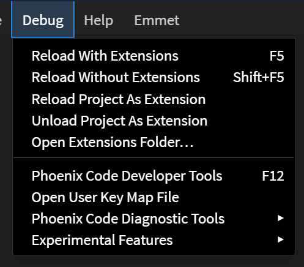
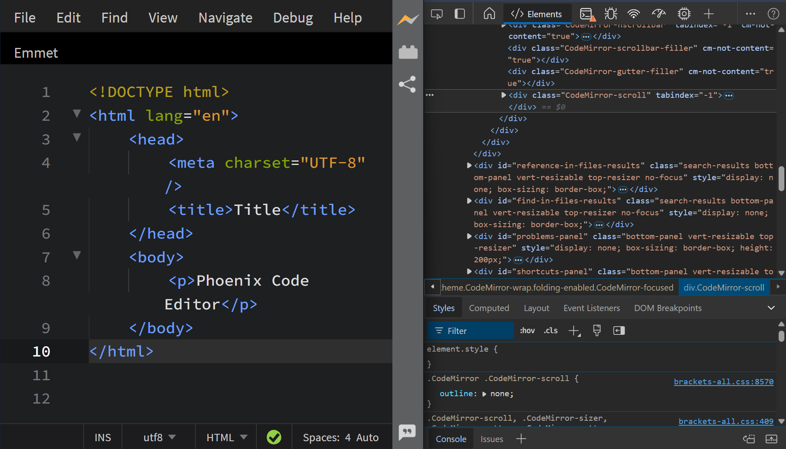
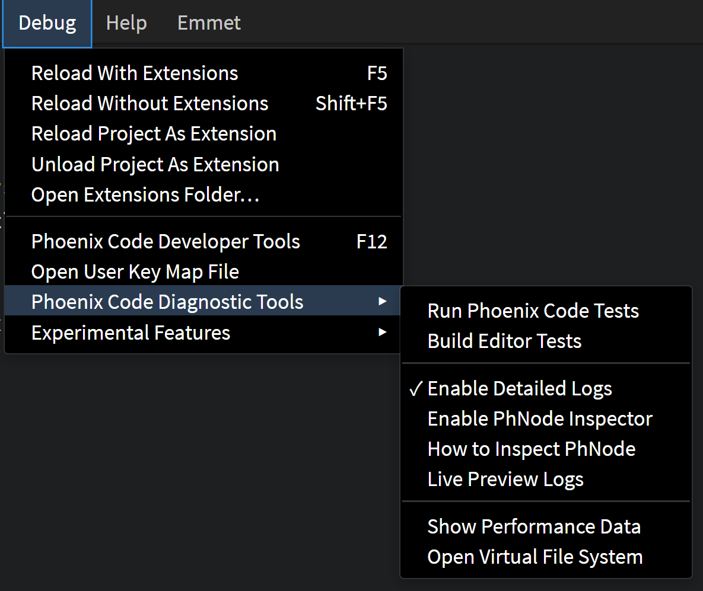
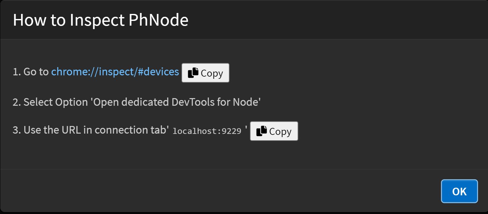

The Debug menu provides several options for extension development. 

## Phoenix Code Developer Tools

The `Phoenix Code Developer Tools` option (shortcut: F12) opens up the DevTools. Use this to inspect the DOM, preview logs and debug scripts.

## Phoenix Code Diagnostic Tools

To open Phoenix Code Diagnostic tools, click on the `Debug` menu on the menu bar and navigate to the `Phoenix Code Diagnostic Tools` option. This section provides several tools for debugging purposes.

### Available Diagnostic Tools

1. `Run Phoenix Code Tests`
 Executes built-in tests to verify the functionality of Phoenix Code.

2. `Build Editor Tests`
 Builds and runs tests specifically for the editor environment.

3. `Enable Detailed Logs`
 Activates verbose logging for better insight into extension behavior. Use this to identify errors or unexpected behaviors during development.

4. `Enable PhNode Inspector`
 Launches the PhNode inspector, allowing in-depth inspection of the extension runtime environment.

5. `How to Inspect PhNode`
 Provides a guide to effectively use the PhNode Inspector.

6. `Live Preview Logs`
 Displays real-time logs for active live previews, helping debug changes dynamically.

7. `Show Performance Data`
 Generates performance metrics to identify bottlenecks or performance issues within the extension.

8. `Open Virtual File System`
 Opens and inspects the virtual file system used by Phoenix Code.

## FAQs

Q. Why is console.log not displaying?

- By default, console logs are disabled. To enable them, click on Enable Detailed Logs under Phoenix Code Diagnostic Tools.