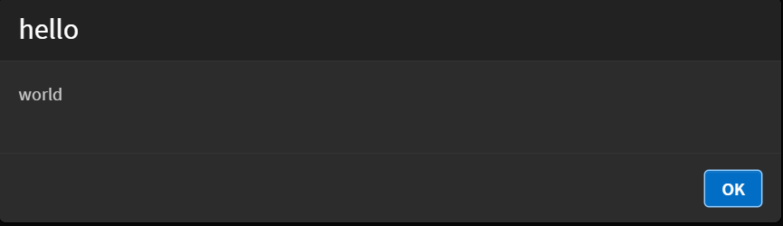
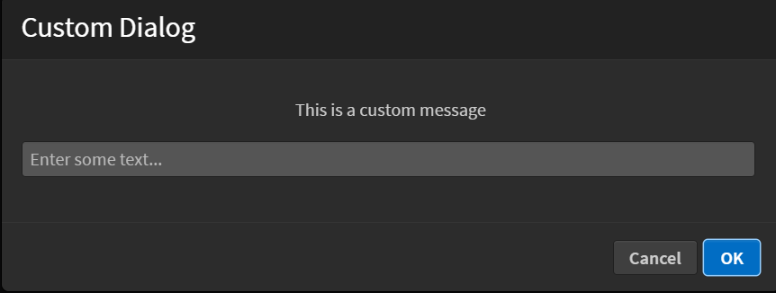
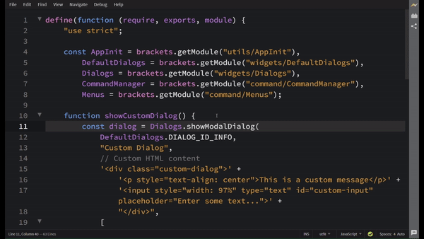

## Adding a Dialog Box and Buttons

To add a dialog box, follow these steps:

1. **Import the required modules.**
Import the `Dialogs` and `DefaultDialogs` modules along with other necessary modules:

```jsx
const DefaultDialogs = brackets.getModule("widgets/DefaultDialogs"),
      Dialogs = brackets.getModule("widgets/Dialogs");
      
 // other modules you may require
const AppInit = brackets.getModule("utils/AppInit"),
      CommandManager = brackets.getModule("command/CommandManager"),
      Menus = brackets.getModule("command/Menus");

```

2. **Create a function to show the dialog**
    
    To create a dialog you can use the specialized dialog APIs such as `Dialogs.showConfirmDialog`, `Dialogs.showInfoDialog` and `Dialogs.showErrorDialog` provided by the `Dialogs` module:
    

```jsx
function handleHelloWorld() {
    Dialogs.showInfoDialog(
        "hello",   // Title
        "world"    // Message
    );
}
```

The `Dialogs.showInfoDialog()` method is the preferred way to display information messages.

Similarly, you can use `Dialogs.showErrorDialog()` for error messages:

```jsx
function handleError() {
  Dialogs.showErrorDialog(
				"Error",
				"Something went wrong!"
	);
}
```

You can also close the dialog programmatically using the `Dialog.close()` method.

```jsx
function handleHelloWorld() {
    const dialog = Dialogs.showInfoDialog(
        "hello",
        "world"
    );

    // Close the dialog after 2 seconds
    setTimeout(() => {
        dialog.close();
    }, 2000);
}
```

This will automatically close the dialog after 2 seconds.

These specialized dialog methods handle the common use cases.

Click on the functions to read more about them : [showConfirmDialog()](https://docs.phcode.dev/api/API-Reference/widgets/Dialogs#showConfirmDialog), [showInfoDialog](https://docs.phcode.dev/api/API-Reference/widgets/Dialogs#showInfoDialog), [showErrorDialog](https://docs.phcode.dev/api/API-Reference/widgets/Dialogs#showErrorDialog).

If you require custom buttons or advanced functionality, you can use the generic `showModalDialog()` method. 

[Click here](#creating-custom-dialog-boxes) to read more about creating custom dialog boxes.

3. **Register the command**
Register a command that will trigger the dialog:

```jsx
const MY_COMMAND_ID = "helloworld_sayhello";
CommandManager.register("Hello World", MY_COMMAND_ID, handleHelloWorld);
```

4. **Add the menu item**
Add a menu item that will execute the command:

```jsx
const menu = Menus.getMenu(Menus.AppMenuBar.FILE_MENU);
menu.addMenuItem(MY_COMMAND_ID);
```

Full Code Example:

```jsx
define(function (require, exports, module) {
    "use strict";

    // Brackets modules
    const AppInit = brackets.getModule("utils/AppInit"),
        DefaultDialogs = brackets.getModule("widgets/DefaultDialogs"),
        Dialogs = brackets.getModule("widgets/Dialogs"),
        CommandManager = brackets.getModule("command/CommandManager"),
        Menus = brackets.getModule("command/Menus");

    // Function to run when the menu item is clicked
    function handleHelloWorld() {
        Dialogs.showInfoDialog(
            "hello",
            "world"
        );
    }

    // Register command
    const MY_COMMAND_ID = "helloworld_sayhello";
    CommandManager.register("Hello World", MY_COMMAND_ID, handleHelloWorld);

    // Add menu item
    const menu = Menus.getMenu(Menus.AppMenuBar.FILE_MENU);
    menu.addMenuItem(MY_COMMAND_ID);

    // Initialize extension
    AppInit.appReady(function () {
        console.log("hello world");
    });
});
```

Expected Output:

When the menu item is clicked, a dialog box appears:




## Creating Custom Dialog Boxes

While the specialized dialog methods like `showInfoDialog()`, `showConfirmDialog()` and `showErrorDialog()` cover the common use cases, you can also create more complex custom dialog boxes using `showModalDialog()`. Here's how:

```jsx
const dialog = Dialogs.showModalDialog(
  DefaultDialogs.DIALOG_ID_INFO,
  "Custom Dialog",
  // Custom HTML content with CSS styling
  '<div class="custom-dialog">' +
    '<p style="text-align: center">This is a custom message</p>' +
    '<input style="width: 97%" type="text" id="custom-input" placeholder="Enter some text...">' +
    "</div>",
  [
    // For buttons
    {
      className: Dialogs.DIALOG_BTN_CLASS_PRIMARY,
      id: Dialogs.DIALOG_BTN_OK,
      text: "OK",
    },
    {
      className: Dialogs.DIALOG_BTN_CLASS_NORMAL,
      id: Dialogs.DIALOG_BTN_CANCEL,
      text: "Cancel",
    },
  ]
);
```

The `showModalDialog()` method provides more flexibility, allowing you to create custom dialog boxes with HTML content and buttons. However, it's recommended to use the specialized dialog APIs like `showInfoDialog()`, `showConfirmDialog()` and `showErrorDialog()` whenever possible, as they provide a simpler and more standardized interface for the most common dialog types.

Visual Reference 



[Click Here](https://docs.phcode.dev/api/API-Reference/widgets/Dialogs#showModalDialog) to read more about `showModalDialog()`.

→ Each button object can have:

- `className`: Button styling class
- `id`: Button identifier
- `text`: Button label text

→ Available Button Classes:

- `Dialogs.DIALOG_BTN_CLASS_PRIMARY`: Primary action button
- `Dialogs.DIALOG_BTN_CLASS_NORMAL`: Normal button
- `Dialogs.DIALOG_BTN_CLASS_LEFT`: Left-aligned button

→ Common Button IDs:

- `Dialogs.DIALOG_BTN_OK`
- `Dialogs.DIALOG_BTN_CANCEL`
- `Dialogs.DIALOG_BTN_SAVE_AS`
- `Dialogs.DIALOG_BTN_DONTSAVE`
- `Dialogs.DIALOG_BTN_DOWNLOAD`

## Handle Button Clicks

You can handle button clicks using the dialog's promise:

```jsx
dialog.done(function (buttonId) {
  if (buttonId === Dialogs.DIALOG_BTN_OK) {
    const inputValue = $input.val();
    alert("Input value: " + inputValue);
  }
});
```

Complete Code Block with Custom Dialog Box and handling the button clicks.

```jsx
define(function (require, exports, module) {
    "use strict";
    
    const AppInit = brackets.getModule("utils/AppInit"),
        DefaultDialogs = brackets.getModule("widgets/DefaultDialogs"),
        Dialogs = brackets.getModule("widgets/Dialogs"),
        CommandManager = brackets.getModule("command/CommandManager"),
        Menus = brackets.getModule("command/Menus");

    function showCustomDialog() {
        const dialog = Dialogs.showModalDialog(
            DefaultDialogs.DIALOG_ID_INFO,
            "Custom Dialog",
            // Custom HTML content
            '<div class="custom-dialog">' +
                '<p style="text-align: center">This is a custom message</p>' +
                '<input style="width: 97%" type="text" id="custom-input" placeholder="Enter some text...">' +
                "</div>",
            [
                {
                    className: Dialogs.DIALOG_BTN_CLASS_PRIMARY,
                    id: Dialogs.DIALOG_BTN_OK,
                    text: "OK"
                },
                {
                    className: Dialogs.DIALOG_BTN_CLASS_NORMAL,
                    id: Dialogs.DIALOG_BTN_CANCEL,
                    text: "Cancel"
                }
            ]
        );

        // Get dialog element and ensure input is accessible
        const $dlg = dialog.getElement();
        const $input = $dlg.find("#custom-input");

        if (!$input.length) {
            console.error("Failed to find input element in dialog");
            return;
        }

        // Handle dialog button clicks
        dialog.done(function (buttonId) {
            if (buttonId === Dialogs.DIALOG_BTN_OK) {
                const inputValue = $input.val();
                alert("Input value: " + inputValue);
            }
        });
    }

    // Register command
    const MY_COMMAND_ID = "test_customdialog";
    CommandManager.register("Show Custom Dialog", MY_COMMAND_ID, showCustomDialog);

    // Add menu item
    const menu = Menus.getMenu(Menus.AppMenuBar.FILE_MENU);
    menu.addMenuItem(MY_COMMAND_ID);

    // Initialize extension
    AppInit.appReady(function () {
        console.log("Custom dialog extension loaded");
    });
});
```

Visual Reference




## Adding a button on Status Bar

1. Import the `StatusBar` module.
    
    ```jsx
    const StatusBar = brackets.getModule("widgets/StatusBar");
    ```
    

2. Register the command.
    
    Register the command that will trigger the clicking.
    
    ```jsx
    var MY_COMMAND_ID = "helloworld_sayhello";
    CommandManager.register("Hello World", MY_COMMAND_ID, handleHelloWorld);
    ```
    

3. Add the button to the StatusBar.
    
    To add the button to StatusBar, use `addIndicator()` :-
    

```jsx
StatusBar.addIndicator(
    MY_COMMAND_ID, // unique ID for this indicator
    $("<div>Test</div>").click(handleHelloWorld), // Optional DOMNode for the indicator
    true, // show the indicator
    "hello-world-status", // CSS class
    "tooltip", // tooltip text
);
```

   → The parameters of the `addIndicator()` method :-

| Param | Type | Description |
| --- | --- | --- |
| id | `string` | Registration id of the indicator to be updated. |
| [indicator] | `DOMNode` or `jQueryObject` | Optional DOMNode for the indicator |
| [visible] | `boolean` | Shows or hides the indicator over the statusbar. |
| [style] | `string` | Sets the attribute "class" of the indicator. |
| [tooltip] | `string` | Sets the attribute "title" of the indicator. |
| [insertBefore] | `string` | An id of an existing status bar indicator. The new indicator will be inserted before (i.e. to the left of)          the indicator specified by this parameter. |

> For a detailed description, refer to [this link](https://docs.phcode.dev/api/API-Reference/widgets/StatusBar).