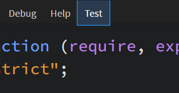
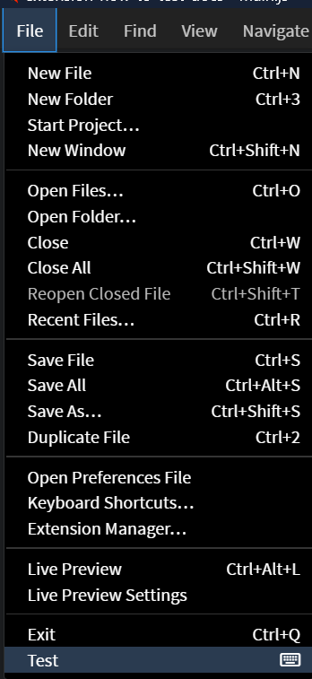
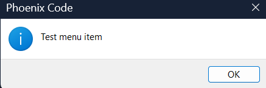
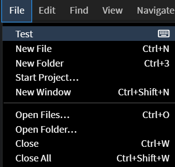
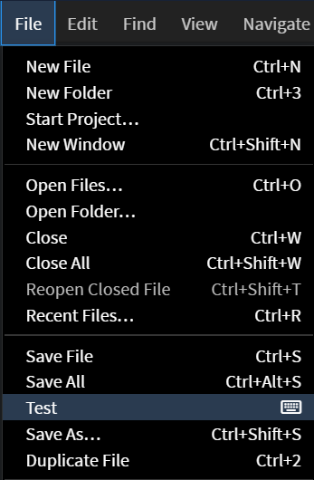
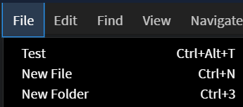
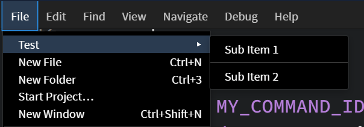

This document outlines the basic features of working with Menus, including:

* [How to add a Menu](#adding-a-menu)
* [How to add a SubMenu](#adding-a-sub-menu)
* [How to add a Menu item](#adding-a-menu-item)
* [How to position a Menu item](#position-the-menu-item)
* [How to add a keyboard shortcut to a Menu item](#attach-a-keyboard-shortcut-to-a-menu-item)

---


## Adding a Menu

To add a custom menu, follow these steps :-

1. **Import the `Menus` module.** 
    To use the menu functionality, import the `Menus` module:

    ```jsx
    const Menus = brackets.getModule("command/Menus");
    ```

2. **Create the menu.** 
    
    Use `Menus.addMenu()` to add a menu to the menu bar. Provide the display name and the identifier.  *The identifier must be written in* `snake_case`.
    <br />
    > Providing the identifier is necessary to display the menu on the menu bar. This identifier may later be used to add menu items inside it or even remove the menu if needed.
    
    ```jsx
    // Add a menu to the menu bar
    const menu = Menus.addMenu('Test', 'Test_Extension_Docs');
    ```
    

> For a detailed description, refer to [this link](https://docs.phcode.dev/api/API-Reference/command/Menus#addMenu).

Full Code Example :-

```jsx
define(function (require, exports, module) {
    "use strict";

    // Brackets modules
    const AppInit = brackets.getModule("utils/AppInit"),
        Menus = brackets.getModule("command/Menus");
    
    // Add a menu to the menu bar
    const menu = Menus.addMenu('Test', 'Test_Extension_Docs');
    
    // Initialize extension once shell is finished initializing.
    AppInit.appReady(function () {
        console.log("hello world");
    });
});
```

Expected Output :-




## Adding a Menu Item

To add a menu item, follow these steps :-

1. **Import the `Menus` and `CommandManager` module.**
    
    These modules allow you to register commands and add items to menus:
    
    ```jsx
    const CommandManager = brackets.getModule("command/CommandManager");
    const Menus = brackets.getModule("command/Menus");
    ```
    

2.   **Register the Command**

Use `CommandManager.register()` to associate an ID with a function:

```jsx
function handleTestExtension() {
    alert("Test menu item");
}

// The `CommandID` must be written in snake_case
const MY_COMMAND_ID = "test_menuitem";
CommandManager.register("Test", MY_COMMAND_ID, handleTestExtension);
```

- The first argument is the label for the menu item.
- The second argument is a unique command ID.
- The third argument is the handler function to execute when the item is clicked.

3. **Add the Menu Item**
To add the menu item, use `menu.addMenuItem()`. For instance, if you wish to add an item to the **File menu**, you can write:

    
    ```jsx
    const menu = Menus.getMenu(Menus.AppMenuBar.FILE_MENU);
    menu.addMenuItem(MY_COMMAND_ID);
    ```
    

> These are some of the menus available by default :-

- FILE_MENU : ‘file-menu’
- EDIT_MENU : ‘edit-menu’
- FIND_MENU : ‘find-menu’
- VIEW_MENU : ‘view-menu’
- NAVIGATE_MENU : ‘navigate-menu’

You can also add menu items to any custom menus you create.

> For a detailed description, refer to [this link](https://docs.phcode.dev/api/API-Reference/command/Menus#addMenuItem).

Full Code Example :-

```jsx
define(function (require, exports, module) {
    "use strict";

    // Brackets modules
    const AppInit = brackets.getModule("utils/AppInit"),
        CommandManager = brackets.getModule("command/CommandManager"),
        Menus = brackets.getModule("command/Menus");

    // Function to run when the menu item is clicked
    function handleTestExtension() {
        alert("Test menu item");
    }

	  // The `CommandID` must be written in snake_case
	  const MY_COMMAND_ID = "test_menuitem";
	  CommandManager.register("Test", MY_COMMAND_ID, handleTestExtension);

    // Add Menu item
    const menu = Menus.getMenu(Menus.AppMenuBar.FILE_MENU);
    menu.addMenuItem(MY_COMMAND_ID);
    
    // Initialize extension once shell is finished initializing.
    AppInit.appReady(function () {
        console.log("hello world");
    });
});
```

Expected Output :-





The alert box that appears when the `Test` menu item is clicked!


## Position the Menu Item

You can position the menu item to make it appear at the first, last or before/after a given item.

To position the menu item at the top, use 

```jsx
// second parameter is for keyboard shortcut. Empty string means no shortcut.
menu.addMenuItem(MY_COMMAND_ID, "", Menus.FIRST);
```



`Menus.FIRST` is used to position it before every other item. *Note: It is recommended to avoid using this and prefer relative menu IDs for better positioning.**

`Menus.LAST` is used to position it at the end. It is the Default value.

To position the menu item before or after any item, use

```jsx
// second parameter is for keyboard shortcut. Empty string means no shortcut.
menu.addMenuItem(MY_COMMAND_ID, "",  Menus.BEFORE, Commands.FILE_SAVE_AS);
```

- Third parameter must specify `BEFORE` or `AFTER` the item should be set.
- Fourth parameter must specify the “relativeID” of the menu item to set the position.



Here, the menu item is set before the `Save As...` option.

To get the list of all the `RelativeIDs` available by default, refer to [this link](https://docs.phcode.dev/api/API-Reference/command/Commands).


## Attach a keyboard shortcut to a Menu Item

You can assign a keyboard shortcut to your menu item. 

*Note: Only add shortcuts if they're essential and frequently used, ensuring compatibility across platforms. Users can set custom shortcuts, so default shortcuts should be reserved only for high-use actions.*

To add the keyboard shortcut, use :-

1. Import the `KeyBindingManager` module.
    
    ```jsx
    const KeyBindingManager = brackets.getModule("command/KeyBindingManager");
    ```
    

2. Add the keyboard shortcut to `addMenuItem`. The keyboard shortcut will be displayed next to the menu item in the UI.
    
    > Ensure that the keyboard shortcut you choose doesn't conflict with any existing shortcuts already in use.
    
    ```jsx
    menu.addMenuItem(MY_COMMAND_ID, "Ctrl-Alt-T", Menus.FIRST);
    ```
    
       

3. Register the keyboard shortcut. To register use `addBinding()`. The first parameter will be the `CommandID` of the menu item and the second parameter will be the keyboard shortcut.
    
    ```jsx
    KeyBindingManager.addBinding(MY_COMMAND_ID, "Ctrl-Alt-T");
    ```
    

That's it! Now, pressing the assigned keyboard shortcut will trigger the corresponding menu item.

> For a detailed description, refer to [this link](https://docs.phcode.dev/api/API-Reference/command/KeyBindingManager).

Full Code Example :-

```jsx
define(function (require, exports, module) {
    "use strict";

    // Brackets modules
    const AppInit = brackets.getModule("utils/AppInit"),
        CommandManager = brackets.getModule("command/CommandManager"),
        Menus = brackets.getModule("command/Menus"),
        KeyBindingManager = brackets.getModule("command/KeyBindingManager");

    // Function to run when the menu item is clicked
    function handleTestExtension() {
        alert("Test menu item");
    }

	  const MY_COMMAND_ID = "test_menuitem";
	  CommandManager.register("Test", MY_COMMAND_ID, handleTestExtension);

    // Add Menu item
    const menu = Menus.getMenu(Menus.AppMenuBar.FILE_MENU);   
    
    menu.addMenuItem(MY_COMMAND_ID, "Ctrl-Alt-T", Menus.FIRST);
    
    // Register the keyboard shortcut
    KeyBindingManager.addBinding(MY_COMMAND_ID, "Ctrl-Alt-T");
    
    // Initialize extension once shell is finished initializing.
    AppInit.appReady(function () {
        console.log("hello world");
    });
});
```

## Adding a Sub Menu

To add a submenu to an existing menu item, follow these steps:

1. **Import the `Menus` and `CommandManager` modules**

```jsx
const CommandManager = brackets.getModule("command/CommandManager");
const Menus = brackets.getModule("command/Menus");
```

2. **Create and register the main command**
First, create a command that will serve as the parent menu item:

```jsx
function handleTestExtension() {
    alert("Test menu item");
}

const MY_COMMAND_ID = "Test";
CommandManager.register("Test", MY_COMMAND_ID, handleTestExtension);
```

3. **Get the parent menu and create the submenu**
Use `menu.addSubMenu()` to create a submenu under an existing menu:

```jsx
const menu = Menus.getMenu(Menus.AppMenuBar.FILE_MENU);
const subMenu = menu.addSubMenu(MY_COMMAND_ID, "Test_Sub_Menu");
```

- First parameter is the command ID of the parent menu item
- Second parameter is the identifier for the submenu (must be in `snake_case`)

4. **Create and register submenu commands**
Register commands for each submenu item:

```jsx
const SUB_COMMAND_1 = "Test_SubCommand1";
const SUB_COMMAND_2 = "Test_SubCommand2";

CommandManager.register("Sub Item 1", SUB_COMMAND_1, function() {
    alert("Sub Item 1 clicked");
});
CommandManager.register("Sub Item 2", SUB_COMMAND_2, function() {
    alert("Sub Item 2 clicked");
});
```

5. **Add items to the submenu**
Use `addMenuItem()` to add the registered commands to your submenu:

```jsx
subMenu.addMenuItem(SUB_COMMAND_1);
subMenu.addMenuDivider();  // Add a separator line
subMenu.addMenuItem(SUB_COMMAND_2);
```

> For visual separation between menu items, you can add a divider using `addMenuDivider()`.

→ For a detailed description, refer to [this link](https://docs.phcode.dev/api/API-Reference/command/Menus#addSubMenu).

Full Code Example:

```jsx
define(function (require, exports, module) {
    "use strict";

    // Brackets modules
    const AppInit = brackets.getModule("utils/AppInit"),
        CommandManager = brackets.getModule("command/CommandManager"),
        Menus = brackets.getModule("command/Menus");

    // Function to run when the menu item is clicked
    function handleTestExtension() {
        alert("Test menu item");
    }

    // Main command
    const MY_COMMAND_ID = "Test";
    CommandManager.register("Test", MY_COMMAND_ID, handleTestExtension);

    // Add menu item
    const menu = Menus.getMenu(Menus.AppMenuBar.FILE_MENU);

    // Add sub menu
    const subMenu = menu.addSubMenu(MY_COMMAND_ID, "Test_Sub_Menu");

    // Additional submenu commands
    const SUB_COMMAND_1 = "Test_SubCommand1";
    const SUB_COMMAND_2 = "Test_SubCommand2";

    // Register new commands
    CommandManager.register("Sub Item 1", SUB_COMMAND_1, function() {
        alert("Sub Item 1 clicked");
    });
    CommandManager.register("Sub Item 2", SUB_COMMAND_2, function() {
        alert("Sub Item 2 clicked");
    });

    // Add items inside sub menu
    subMenu.addMenuItem(SUB_COMMAND_1);
    subMenu.addMenuDivider();  // Add separator
    subMenu.addMenuItem(SUB_COMMAND_2);

    // Initialize extension once shell is finished initializing.
    AppInit.appReady(function () {
        console.log("hello world");
    });
});

```

Expected Output:



When a submenu item is clicked, it will show an alert box with the corresponding message.

> Note: Make sure all command IDs are unique throughout your extension to avoid conflicts.

> You can add as many submenu items as needed by repeating steps 4 and 5 for each new item. You can even create nested submenu items.

> Submenu items can have their own keyboard shortcuts using the same method described in the "Attach a keyboard shortcut to a menu item" section.