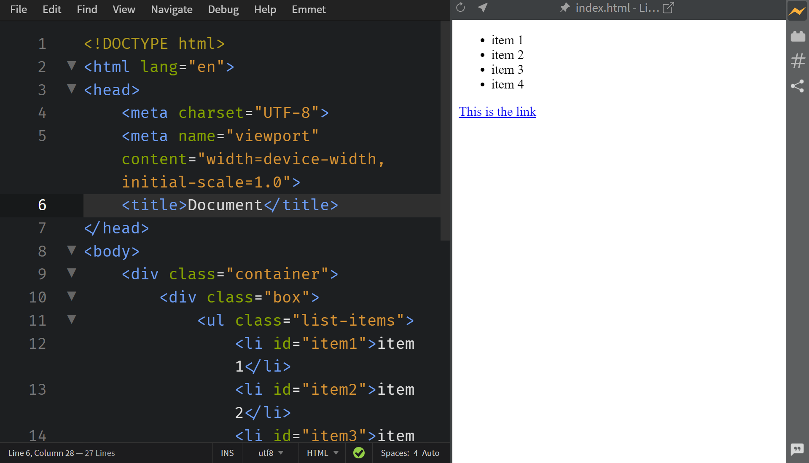
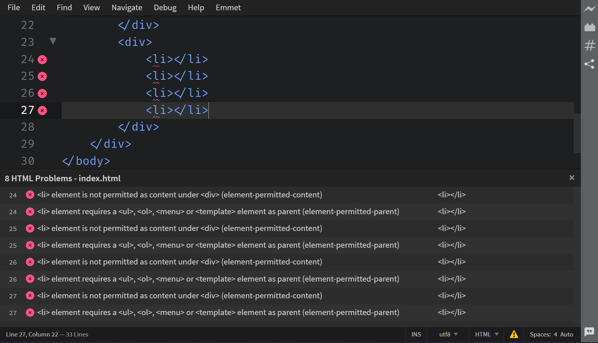
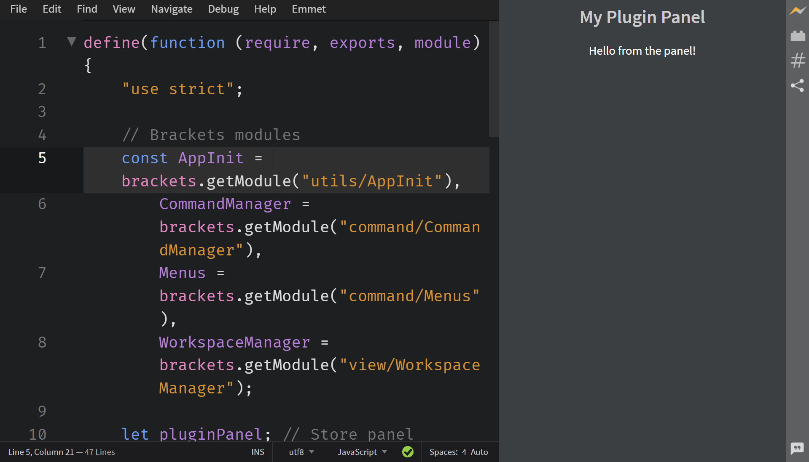
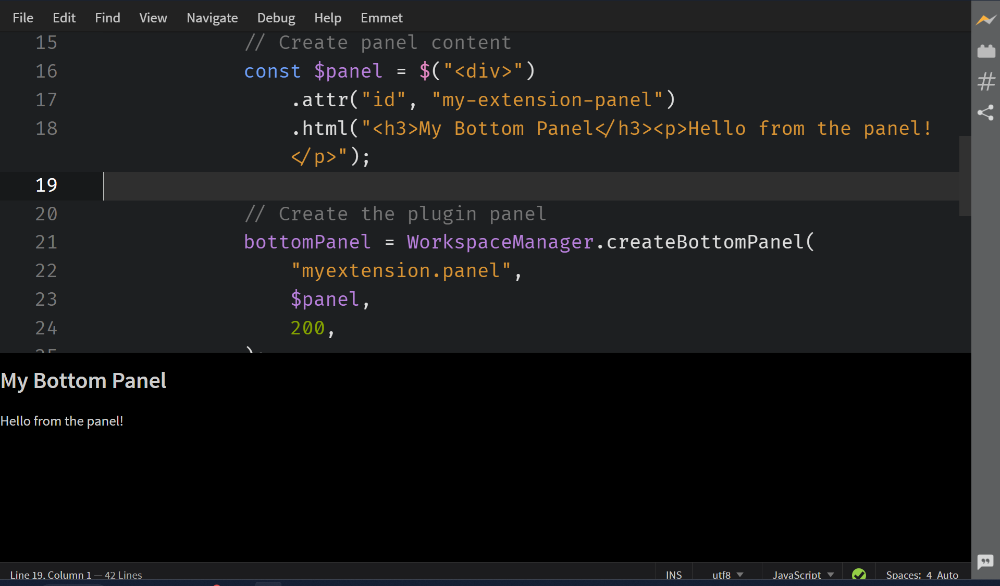

In Phoenix Code, Panels are of two types :- `Plugin Panel` and `Bottom Panel`. 

**Plugin Panel** appears on the side of the screen, generally the left side. For Example :- *Live Preview* feature uses the `Plugin Panel`.

 


**Bottom Panel** appears on the bottom of the screen. For Example :- *Problems* feature uses the `Bottom Panel`.

 


This document outlines the basic features of working with Panels.

* [How to create a Plugin Panel](#creating-a-plugin-panel)
* [How to manage Plugin Panel state](#managing-plugin-panel-state)
* [How to create a Bottom Panel](#creating-a-bottom-panel)
* [How to manage Bottom Panel state](#managing-bottom-panel-state)
* [Best Practices for Panels](#best-practices)

---

## Creating a Plugin Panel

To create a plugin panel, follow these steps:

1. **Import the `WorkSpaceManager` modules**
    ```jsx
    const WorkspaceManager = brackets.getModule("view/WorkspaceManager");
    ```

2. **Create panel content**
    Create a jQuery object containing your panel's HTML content:
    ```jsx
    const $panel = $("<div>")
        .attr("id", "my-extension-panel")
        .html("<h3>My Plugin Panel</h3><p>Hello from the panel!</p>");
    ```

3. **Create toolbar icon**
    Create a toolbar icon to toggle the panel.
    > Creating a toolbar icon is mandatory, else the panel won't show up.

4. **Create the plugin panel**
    Use `WorkspaceManager.createPluginPanel()` to create your panel:
    ```jsx
    const pluginPanel = WorkspaceManager.createPluginPanel(
        "myextension.panel", // Unique ID using package-style naming
        $panel,             // jQuery object for panel content
        200,               // minSize in pixels
        $toolbarIcon,      // toolbar icon
        400               // initialSize in pixels (optional)
    );
    ```

> For a detailed description, refer to [this link](https://docs.phcode.dev/api/API-Reference/view/WorkspaceManager#createPluginPanel).


Full Code Example:

```jsx
define(function (require, exports, module) {
    "use strict";
    
    // Brackets modules
    const AppInit = brackets.getModule("utils/AppInit"),
        CommandManager = brackets.getModule("command/CommandManager"),
        Menus = brackets.getModule("command/Menus"),
        WorkspaceManager = brackets.getModule("view/WorkspaceManager");
    
    let pluginPanel; // Store panel reference
    
    // Function to run when the menu item is clicked
    function handleTestExtension() {
        if (!pluginPanel) {
            // Create panel content
            const $panel = $("<div>")
                .attr("id", "my-extension-panel")
                .html("<h3>My Plugin Panel</h3><p>Hello from the panel!</p>");
            
            // Create toolbar icon
            const $toolbarIcon = $("#panel");
            
            // Create the plugin panel
            pluginPanel = WorkspaceManager.createPluginPanel(
                "myextension.panel",
                $panel,
                200,
                $toolbarIcon,
                400
            );
            pluginPanel.show();
        }
    }
    
    // Register command
    const MY_COMMAND_ID = "test_menuitem";
    CommandManager.register("Toggle Panel", MY_COMMAND_ID, handleTestExtension);
    
    // Add Menu item
    const menu = Menus.getMenu(Menus.AppMenuBar.FILE_MENU);
    menu.addMenuItem(MY_COMMAND_ID);
    
    // Initialize extension
    AppInit.appReady(function () {
        console.log("Panel extension initialized");
    });
});
```

Visual Reference 



## Managing Plugin Panel State

You can control the visibility and state of your plugin panel:

1. **Show/Hide Panel**
    ```jsx
    // Show panel
    pluginPanel.show();
    
    // Hide panel
    pluginPanel.hide();
    ```

    
2. **Check Panel Visibility**
    ```jsx
    const isVisible = pluginPanel.isVisible();
    ```

3. **Toggle Panel Visibility**
    ```jsx
    function togglePanel() {
        if (pluginPanel.isVisible()) {
            pluginPanel.hide();
        } else {
            pluginPanel.show();
        }
    }
    ```


## Creating a Bottom Panel

Bottom panels are created similarly to plugin panels but use different methods:
> For `Bottom Panels` creating a toolbar icon is not required.

1. **Import required modules**
    ```jsx
    const WorkspaceManager = brackets.getModule("view/WorkspaceManager");
    ```

2. **Create the bottom panel**
    ```jsx
    const bottomPanel = WorkspaceManager.createBottomPanel(
        "myextension.panel",
        $panel,
        200,
    );
    ```
> For a detailed description, refer to [this link](https://docs.phcode.dev/api/API-Reference/view/WorkspaceManager#createBottomPanel).

Full Code Example for Bottom Panel:

```jsx
    define(function (require, exports, module) {
        "use strict";
        
        // Brackets modules
        const AppInit = brackets.getModule("utils/AppInit"),
            CommandManager = brackets.getModule("command/CommandManager"),
            Menus = brackets.getModule("command/Menus"),
            WorkspaceManager = brackets.getModule("view/WorkspaceManager");
        
        let bottomPanel; // Store panel reference
        
        // Function to run when the menu item is clicked
        function handleTestExtension() {
            if (!bottomPanel) {
                // Create panel content
                const $panel = $("<div>")
                    .attr("id", "my-extension-panel")
                    .html("<h3>My Bottom Panel</h3><p>Hello from the panel!</p>");
                
                // Create the plugin panel
                bottomPanel = WorkspaceManager.createBottomPanel(
                    "myextension.panel",
                    $panel,
                    200,
                );
                bottomPanel.show();
            }
        }
        
        // Register command
        const MY_COMMAND_ID = "test_menuitem";
        CommandManager.register("Toggle Panel", MY_COMMAND_ID, handleTestExtension);
        
        // Add Menu item
        const menu = Menus.getMenu(Menus.AppMenuBar.FILE_MENU);
        menu.addMenuItem(MY_COMMAND_ID);
        
        // Initialize extension
        AppInit.appReady(function () {
            console.log("Panel extension initialized");
        });
    });
```

Visual Reference 


## Managing Bottom Panel State

Bottom panels support similar state management to plugin panels:

1. **Show/Hide Panel**
    ```jsx
    // Show panel
    bottomPanel.show();
    
    // Hide panel
    bottomPanel.hide();
    ```

2. **Check Panel Visibility**
    ```jsx
    const isVisible = bottomPanel.isVisible();
    ```

3. **Toggle Panel Visibility**
    ```jsx
    function togglePanel() {
        if (bottomPanel.isVisible()) {
            bottomPanel.hide();
        } else {
            bottomPanel.show();
        }
    }
    ```

## Best Practices

1. Always use unique, package-style IDs (e.g., "yourextension.panel-name") to avoid conflicts with other extensions.

2. Save panel state (e.g., visibility, size) in preferences if needed, to restore state when the extension is reloaded.

Example CSS for Bottom Panel:

```css
.bottom-panel {
    background-color: #f8f9fa;
    border-top: 1px solid #ddd;
}

.bottom-panel .toolbar {
    padding: 4px 8px;
    display: flex;
    justify-content: space-between;
    align-items: center;
    background-color: #e9ecef;
    border-bottom: 1px solid #ddd;
}

.bottom-panel .panel-content {
    padding: 8px;
    overflow-y: auto;
}
```

> For more information about the WorkSpace Manager API, refer to the [Phoenix Code API documentation](https://docs.phcode.dev/api/API-Reference/view/WorkspaceManager).