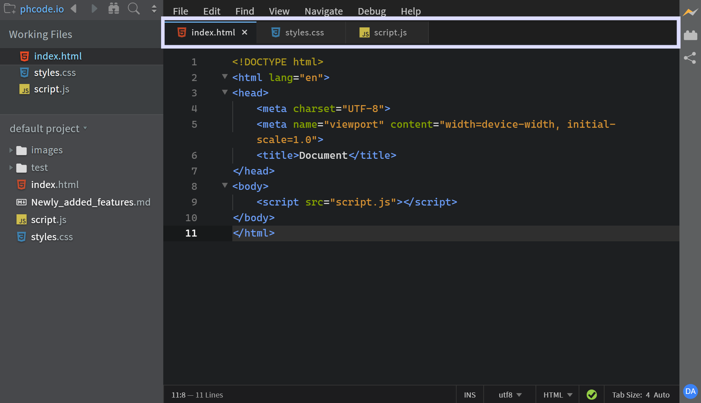

import React from 'react';
import VideoPlayer from '@site/src/components/Video/player';

2026 January release (5.0) of Phoenix Code is now available for download at [phcode.io](https://phcode.io).

Our biggest update yet - introducing `Phoenix Pro` and major upgrades like `Live Preview Edit`, `Emmet`,
`Tab Bar`, and `Custom Snippets`.

<!-- truncate -->

## Phoenix Pro - A Sustainable Future

Phoenix Code has been free and open source from day one - and **everything you’ve used so far will remain free forever**, including **Live Preview**.

We’re a small, full-time indie team with **no VC backing**, building Phoenix Code because we believe the web deserves a
code editor that’s genuinely **simple and joyful to use**. We tried to sustain development through community donations
([Open Collective](https://opencollective.com/phoenix-ide)), but over the last few years it hasn’t been enough to
support full-time work - and we reached a hard choice: slow down drastically, or find a sustainable path that keeps Phoenix Code healthy.

So we’re introducing **Phoenix Pro** as an *optional* way to support Phoenix Code’s future - with **one Pro feature: Live Preview Edit**.
If Phoenix Code has helped you, Phoenix Pro is a way to help keep the project moving forward.

Students & educators get **Phoenix Pro for Education** at no cost, because we want classrooms to have easy 
access to modern, easy-to-use development tooling. [Read More](https://docs.phcode.dev/docs/phoenix-pro-school)

## Live Preview Edit

*Included with Phoenix Pro.*

**Live Preview Edit** lets you make changes directly on your page — and updates your source code instantly.

Edit text, links, and images. Drag & drop to rearrange elements. Cut, copy, paste, and use measurement tools
to place things precisely.

Learn more: [Live Preview Edit](https://docs.phcode.dev/docs/Pro%20Features/live-preview-edit), [Image Gallery](https://docs.phcode.dev/docs/Pro%20Features/image-gallery), [Measurements](https://docs.phcode.dev/docs/Pro%20Features/measurements).

<VideoPlayer
  src="https://docs-images.phcode.dev/videos/live-preview-edit/live-preview-edit.mp4"
/>

## Emmet

**Emmet** one of our most requested features is finally here.

Write Emmet abbreviations and Phoenix Code shows you hints. Select a hint to expand it into a full code snippet. Code faster than ever. [Read More](https://docs.phcode.dev/docs/Features/emmet)

<VideoPlayer
  src="https://docs-images.phcode.dev/videos/editing-text/emmet-html.mp4"
/>

## Tab Bar

Tab Bar is here. View all your open files at the top of the editor and switch between them instantly.

Choose what works for you -Tab Bar, Working Files, or both at the same time. [Read More](https://docs.phcode.dev/docs/file-management#tab-bar)

## Custom Snippets

Define your own code hints with Custom Snippets.

Create hints that expand into full code blocks. You can also add cursor positions so Phoenix Code places your cursor exactly where you need it after expansion. [Read More](https://docs.phcode.dev/docs/Features/custom-snippets)

<VideoPlayer
  src="https://docs-images.phcode.dev/videos/custom-snippets/custom-snippets-main.mp4"
/>

## Collapse Folders

After working for some time, your project structure gets messy with lots of open and nested directories.

But no worries now. Phoenix Code supports Collapse All Folders, which lets you reset your view by collapsing all expanded folders to their root level in one click. [Read More](https://docs.phcode.dev/docs/file-management#collapse-all-folders)

<VideoPlayer
  src="https://docs-images.phcode.dev/videos/file-management/collapse-folders.mp4"
/>

## Notable changes and fixes

- Improved Live Preview to support internal stylesheets and SVGs better than before.
- Smarter color hints. Phoenix Code prioritizes your previously used colors. [Read More](https://docs.phcode.dev/docs/editing-colors#color-hints)
- Git markers now appear in the scrollbar, making it easier to locate changes in a file.
- Improved Git so that it doesn't show stale project status.
- Reduced the number of popups shown when first installing Phoenix.
- Fixed an issue where macOS/iOS and browser autocorrect or smart keyboards altered filenames during renames.
- Added a dialog to notify users when they have security compromised extensions installed.
- Slowed down the Quick View popup on hover as it was interfering with user workflows.
- Fixed ghost image appearing in Safari when dragging from CodeMirror.
- Long names in Working Files are now truncated for better readability.
- Added Horizontal Scroll support. Use Shift + mouse scroll.

## All changes

Please see [this link](https://github.com/phcode-dev/phoenix/commits/main/?since=2025-01-30&until=2026-01-18) for a full list of changes
in GitHub.

## A Request from the Phoenix Team:

-   **Share your feedback:** https://github.com/orgs/phcode-dev/discussions
-   **Spread the word** about Phoenix to friends and colleagues.

With gratitude,

The Phoenix Team
