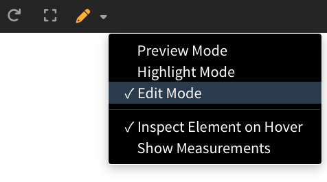

import VideoPlayer from '@site/src/components/Video/player';

You're editing HTML. Switch to browser. Refresh. Switch back. *Where was I?* Scroll... scroll... find your place... repeat. 50+ times a day—that's hours lost per week.

<!-- truncate -->

After years of using Live Server, I noticed something: the original creator is seeking maintainers. The forums were full of the same complaints. So I tested all the alternatives.

## Quick Decision Guide

| Your situation | Best choice |
|----------------|-------------|
| "I just want save → reload" | **Live Server** |
| "I want instant updates while typing" | **Five Server** |
| "I want a built-in preview panel" | **Live Preview (Microsoft)** |
| "I want to click an element → jump to its code" | **Phoenix Code** |
| "I want to edit directly in the preview" | **Phoenix Code Pro** |

---

## The Three VS Code Options

### Live Server

The classic. 73M+ downloads. Save your file, browser reloads.

⚠️ The original creator is [seeking maintainers](https://github.com/ritwickdey/vscode-live-server)—it works but development has slowed.

[View on Marketplace](https://marketplace.visualstudio.com/items?itemName=ritwickdey.LiveServer)

### Five Server

Modern fork of Live Server. Instant updates while typing, element highlighting, built-in PHP support. Actively maintained.

**For most developers, this is the better choice.**

[View on Marketplace](https://marketplace.visualstudio.com/items?itemName=yandeu.five-server)

### Live Preview (Microsoft)

Microsoft's official extension. Embeds a browser panel directly in VS Code—no external window.

⚠️ Microsoft's own description says it's "still under development" and not for framework projects.

[View on Marketplace](https://marketplace.visualstudio.com/items?itemName=ms-vscode.live-server)

---

## Comparison

| Feature | Live Server | Five Server | Live Preview (MS) |
|---------|-------------|-------------|-------------------|
| Update speed | On save | While typing | On save |
| Maintained | ⚠️ Seeking maintainer | ✅ Yes | ✅ Yes |
| Preview location | External browser | External browser | In-editor panel |
| PHP support | Setup needed | Built-in | No |
| Element → code | No | Limited | No |

---

## The Workflow Problem They Don't Solve

All three extensions give you live reload. That's useful. But here's what actually eats your time:

1. You spot something wrong in the preview
2. You switch to your editor
3. You scroll... searching... wrong `div`... keep scrolling...
4. You find the element (maybe)
5. You make your edit
6. You save and check the preview
7. Repeat

**The reload isn't the bottleneck. Finding your code is.**

> "I click something in the preview and the editor jumps to that HTML/CSS."

This request appears constantly in developer forums. VS Code extensions don't deliver it.

---

## Phoenix Code: A Different Approach

Phoenix Code has Live Preview built in—no extension needed. But the difference is how you work with it.

### Edit Mode (Pro)

Stop switching between preview and code. Click text to edit it. Swap images visually. Drag elements to rearrange. Your source updates automatically.

<VideoPlayer src="https://docs-images.phcode.dev/videos/live-preview-edit/live-preview-edit.mp4" />

[See all Edit Mode features →](/docs/Pro%20Features/live-preview-edit)

### Highlight Mode (Free)

Click any element in the preview → jump directly to its code. No more hunting through your source.

This is the workflow developers keep asking for.

---

## When to Switch (and When Not To)

**Stay in VS Code if:**

- Live reload is enough for your workflow
- You're in a framework project with its own dev tools
- You don't need element → code navigation

**Consider Phoenix Code if:**

- You want click-to-code navigation
- You build static sites, landing pages, or marketing content
- You're tired of scrolling through source to find elements

---

## Learn More

- [Download Phoenix Code](https://phcode.dev)
- [Live Preview Documentation](/docs/Features/Live%20Preview/live-preview)
- [Edit Mode (Pro)](/docs/Pro%20Features/live-preview-edit)
