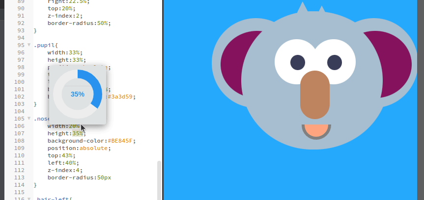

If you've used Brackets, Phoenix Code will feel immediately familiar.

Built by the same team behind Brackets, Phoenix Code keeps Live Preview and fast visual front-end development at its core — now rebuilt on a modern foundation.

Phoenix Code isn’t a tribute or a spiritual successor. It’s the natural continuation of the ideas that started with Brackets.

Here’s what’s changed — and how to switch.

---

## Brackets vs Phoenix Code: What's New

Phoenix Code includes everything Brackets offered — Live Preview, lightweight workflow, web-first focus — plus built-in Git, a browser edition, visual CSS editing, and an active extension marketplace. Here's the full comparison.

| Feature | Brackets | Phoenix Code |
|---------|----------|-------------|
| Live Preview | Basic (view only) | Full live preview (editing in preview with [Pro](/docs/Pro%20Features/live-preview-edit)) |
| Visual Editing | Limited | Color pickers, number dials, gradient editors, drag-and-drop |
| Git Integration | Required third-party extension | Built-in |
| Browser Version | No | Yes — [phcode.dev](https://phcode.dev), no install needed |
| Chromebook / Tablet Support | No | Yes |
| Extension Marketplace | No longer maintained | Active and growing |
| Active Development | In maintenance mode since 2021 | Regular releases, active team |
| Open Source | Yes | Yes (AGPL-3.0) |
| Built-in Image Library | No | Yes — stock photos you can drag into projects |
| Price | Free | Free ([Pro](https://phcode.dev/pricing) from $9/mo for Live Preview Edit) |

The free version of Phoenix Code covers everything Brackets did and more — Git, the browser edition, visual editing tools, all included. [Phoenix Pro](/docs/Pro%20Features/live-preview-edit) adds Live Preview Edit, and exists to help sustain full-time development by a small indie team.

---

## What Happened to the Brackets Editor?

Brackets was created at Adobe and built on CEF (Chromium Embedded Framework) — a technology choice that made sense in 2014 but became increasingly difficult to maintain. Security patches, OS compatibility, performance work — it all got harder every year. Adobe moved on in 2021, and the original Brackets entered maintenance mode with no further updates.

Rather than keep patching an aging foundation, we modernized the platform so it can run anywhere — in browsers, on desktop with Electron or Tauri, pretty much any modern system. One codebase that works everywhere, from [phcode.dev](https://phcode.dev) in your browser to a native desktop app.

The architecture changed. The team didn't. The design philosophy didn't.

---

## What Carried Over from Brackets

If you're wondering whether Phoenix Code will feel familiar — it will.

**Live Preview** is still the core of the experience. Edit HTML or CSS and watch the browser update in real time, no manual refresh. This is the feature that defined Brackets, and it's still front and center.

**The lightweight workflow** is intact. Open a folder, start editing. No massive install, no mandatory plugins, no project configuration files to set up first.

**Web-first focus.** HTML, CSS, JavaScript — that's the sweet spot. Phoenix Code is purpose-built for front-end work, not trying to be a general-purpose IDE.

**Keyboard shortcuts and UI layout** are familiar. If you had muscle memory in Brackets, most of it still applies.

---

## What's New in Phoenix Code

These are the features the Brackets community asked for — and we finally built them.

### Edit Directly in the Live Preview (Pro)

Brackets' live preview was view-only. You could see changes reflected in real time, but you always had to make edits in the code. With [Phoenix Pro](/docs/Pro%20Features/live-preview-edit), you can click on any element in the live preview and edit it right there — change text, swap images by dragging, rearrange elements visually. The source code updates automatically.

### Visual CSS Editing

Brackets had inline color pickers — Phoenix Code keeps those and adds number dials you can scrub to adjust CSS values like margins, padding, font sizes, and more. Hover over a number, drag to adjust, and see the result update in live preview instantly.

### Built-in Git

Phoenix Code ships with native Git support based on the familiar Brackets Git extension, addressing many of its earlier limitations with a simpler UX and improved reliability. Commit, push, pull, diff, and branch management, all built in.

### Runs in Your Browser

Open [phcode.dev](https://phcode.dev) and start editing — no install or admin privileges needed. Works on Chromebooks, tablets, shared computers, anywhere you have a browser. The web app runs the same core as the desktop app, so for website editing and live preview it's just as capable. For Git, AI features, and the full experience, grab the [native app](https://phcode.dev/download).

### Measurement and Inspection Tools

Inspect spacing between elements, measure distances, and check alignment directly in the live preview. If you work from design mockups, this replaces the constant back-and-forth between your editor and a separate design tool.

---

## How to Switch from Brackets

Short version: open your project folder in Phoenix Code. That's it.

**No migration needed.** Your project files work as-is. No config conversion, no import wizard. Just open the folder.

**Extensions.** The most popular Brackets extensions are now built into Phoenix Code: Emmet for abbreviations, Git for version control, [Beautify/Prettier](/docs/Features/beautify-code) for code formatting, and a Tab Bar for managing open files. The extension marketplace is active and growing for anything else you need.

**Learning curve.** Minimal. The UI layout is familiar, the shortcuts are similar, and all the new features are additive — nothing you relied on was removed. You'll be productive in minutes.

---

## Frequently Asked Questions

### What happened to the Brackets code editor?

Brackets was created at Adobe and actively developed until 2021. Adobe stopped maintaining it and the project entered maintenance mode. The same team that built Brackets continued the work as Phoenix Code — a full platform rewrite that runs in browsers and as a desktop app.

### Is Phoenix Code the same as Brackets?

Phoenix Code is built by the same team and carries forward the same design philosophy — Live Preview, lightweight workflow, and a focus on HTML, CSS, and JavaScript. The codebase was rewritten on modern web technologies, but the experience is familiar. If you used Brackets, you'll feel at home.

### Is Phoenix Code free?

Yes. The free version includes everything Brackets had and more — Git, the browser edition, visual editing tools, and the extension marketplace. [Phoenix Pro](/docs/Pro%20Features/live-preview-edit) adds Live Preview Edit starting at $9/month and helps sustain full-time development.

### Is Brackets still safe to use?

Brackets runs on an outdated version of Chromium that no longer receives security patches. For active web development, Phoenix Code is the maintained alternative with regular updates and security fixes.

### Does Phoenix Code work on Chromebook?

Yes. Open [phcode.dev](https://phcode.dev) in any browser — no install or admin privileges needed. It works on Chromebooks, tablets, and shared computers.

---

## Try Phoenix Code

Phoenix Code was built for the Brackets community by the team behind Brackets.
If you've been waiting for the update Brackets deserved, this is it.

- **[Open Phoenix Code in your browser](https://phcode.dev)** — no install, start immediately
- [Download the desktop app](https://phcode.dev/download)
- [Live Preview documentation](/docs/Features/Live%20Preview/live-preview)
- [Edit Mode (Pro)](/docs/Pro%20Features/live-preview-edit)
- [Read more about the Brackets legacy](/blog/Blog-Legacy)
