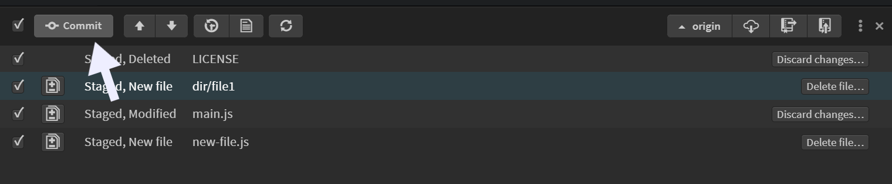

If you're still using Brackets, you already know. The last real update was 2021. Extensions are breaking one by one. The community forums? Ghost towns. And every few months you Google "is Brackets dead" hoping someone will tell you it's not.

It is. And that's okay.

<!-- truncate -->

Look — Brackets was great. I mean genuinely great. The live preview, the inline editors, that lightweight feel that didn't make your laptop sound like a jet engine. There's a reason 85,000 people *still* open it every month even though nobody's fixing bugs anymore. You don't keep using abandoned software unless it did something right.

But here's the thing: there's a successor. And it wasn't built by some random team who liked the idea — it was built by the same community that kept Brackets alive after Adobe walked away. It's called Phoenix Code, and if you're a Brackets user, switching is basically painless.

Let me explain what happened and why it matters.

---

## What Happened to Brackets

Short version:

- **2014** — Adobe releases Brackets 1.0. Web-native editor, built on web standards, live preview baked in. It was ahead of its time.
- **2015–2020** — Brackets gains a loyal following. Designers love it. Front-end devs love it. Adobe... kind of forgets about it.
- **January 2022** — Adobe officially [hands Brackets over](https://x.com/brackets/status/1480581149604782080) to the open source community. No more corporate backing.
- **2022–present** — No meaningful updates to Brackets itself. The community forks it, starts building Phoenix Code.

Here's the part that tells you everything: 52% of Phoenix Code's website traffic comes from brackets.io redirects. Half the people finding Phoenix Code are Brackets users who went looking for Brackets and ended up here instead. That redirect traffic is dropping 43% year over year though — eventually there won't be anyone left to redirect.

The writing's on the wall. Brackets had a good run.

---

## Feature Comparison

So what do you actually get if you switch? Here's the side-by-side:

| Feature | Brackets | Phoenix Code |
|---------|----------|-------------|
| Live Preview | Yes (basic) | Yes + edit directly in preview |
| Visual Editing | Limited | Full: color pickers, number dials, drag-and-drop |
| Git Integration | No (extension needed) | Built-in |
| Browser Version | No | Yes ([phcode.dev](https://phcode.dev)) |
| Chromebook Support | No | Yes |
| Extension Marketplace | Dying | Active + growing |
| Active Development | No (since 2021) | Yes (regular releases) |
| Open Source | Yes | Yes (AGPL-3.0) |
| Image Gallery | No | Built-in stock images |
| Price | Free | Free (Pro from $9/mo) |

The free tier of Phoenix Code already does more than Brackets ever did. That's not a knock on Brackets — it's just what happens when a project gets five years of active development poured into it.

---

## What Phoenix Code Inherited

Phoenix Code isn't some unrelated editor that slapped "Brackets successor" on its marketing page. It grew directly out of the Brackets community. Same people. Same philosophy.

What carried over:

- **Live Preview DNA** — The thing that made Brackets special. Edit your HTML/CSS, see it update in real time. Phoenix Code kept this and cranked it up to eleven.
- **Lightweight feel** — No 2GB install. No fifteen "recommended extensions" before you can actually write code. Open a folder, start working.
- **Web-focused** — HTML, CSS, JavaScript. That's the sweet spot. Phoenix Code doesn't try to be an IDE for everything. It's opinionated about what it does well.
- **The community** — Honestly, this might be the biggest thing. The people who cared enough to keep Brackets going are the same ones building Phoenix Code now.

It's not a fork. Not exactly. Think of it more like... the next chapter. Same book, new pages.

---

## What Phoenix Code Added

This is where it gets interesting. Because Phoenix Code didn't just maintain what Brackets had — it built the features Brackets users had been requesting for years.

### Edit Directly in the Preview

Remember wishing you could just *click* on something in the live preview and change it right there? Yeah. Phoenix Code does that now.

Click text in the preview, type your changes, and the source code updates automatically. Swap images by dragging new ones in. Rearrange elements visually.

This was always the logical next step for Brackets' live preview. It just needed someone to actually build it.

### Visual Editing Tools

Color pickers that work inline. Number dials you can scrub to adjust values. Not groundbreaking on their own, but put together they make CSS tweaking *way* faster than typing hex codes and guessing.

### Built-in Git

No more hunting for a Git extension that half-works and hasn't been updated in three years. Phoenix Code ships with Git integration out of the box — commit, push, pull, diff, all right there.

### Runs in Your Browser

Go to [phcode.dev](https://phcode.dev). That's it. Full editor, no install. Works on Chromebooks, school computers, your tablet in a pinch. Try doing that with Brackets.

### Stock Image Gallery

Kind of a niche feature, but if you build websites for clients, having a built-in library of stock photos you can drag straight into your project saves you from the alt-tab-to-Unsplash-search-download-import dance.

### Measurement Tools

Inspect spacing, measure distances between elements, check alignment — all inside the preview. Designers who used Brackets will feel right at home, except now they don't need a separate design tool open.

---

## How to Switch

Here's the good news: if you know Brackets, you basically already know Phoenix Code.

**Your workflow stays the same.** Open a folder, edit files, live preview — identical flow. The keyboard shortcuts are familiar. The UI layout will feel like home.

**Extensions.** Some Brackets extensions have Phoenix Code equivalents. Some work directly. The marketplace is smaller than what Brackets had at its peak, but it's actively growing — and more importantly, the extensions actually *work* because someone's maintaining them.

**Project files.** Just open your existing project folder in Phoenix Code. No migration wizard. No config file conversion. It just works.

**The learning curve?** Almost flat. You'll spend maybe ten minutes going *"oh, that's where they put that"* and then you're productive. The new features — visual editing, Git, the browser version — are all additive. Nothing you relied on was taken away.

Honestly, the hardest part of switching is the emotional one. Brackets was your editor. You had your setup, your extensions, your muscle memory. I get it. But Phoenix Code was built specifically for people like you. By people like you.

---

## Learn More

- [Download Phoenix Code](https://phcode.dev)
- [Live Preview Documentation](/docs/Features/Live%20Preview/live-preview)
- [Edit Mode (Pro)](/docs/Pro%20Features/live-preview-edit)
- [The Legacy of Brackets — Continued](/blog/Blog-Legacy)
