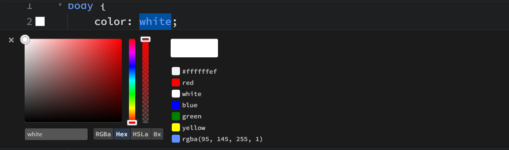

Let's get this out of the way: VS Code is incredible. 74% market share. 50,000+ extensions. 73 million downloads on Live Server alone. If you write code for a living, you're probably using it right now.

So why would anyone look at anything else?

Here's the thing — not everyone writing HTML and CSS is a "developer" in the traditional sense. Designers tweaking client sites. Marketing teams updating landing pages. Students who just want to *see what their code does* without configuring a build pipeline. For that crowd, VS Code can feel like bringing a tank to a water gun fight.

<!-- truncate -->

## Quick Decision Guide

| Your situation | Best choice |
|----------------|-------------|
| "I work in Python/Go/Rust and need deep debugging" | **VS Code** |
| "I manage a monorepo with 15 microservices" | **VS Code** |
| "I build static sites and want to see changes instantly" | **Phoenix Code** |
| "I'm a designer editing HTML/CSS for client projects" | **Phoenix Code** |
| "I want to click something in the preview and edit it right there" | **Phoenix Code Pro** |
| "I need to code on a Chromebook or shared computer" | **Phoenix Code** (runs at [phcode.dev](https://phcode.dev)) |

---

## Feature Comparison

| Feature | VS Code | Phoenix Code |
|---------|---------|-------------|
| Live Preview | No (needs extension) | Built-in, edit directly in preview |
| Visual Editing | No | Color pickers, number dials, image preview |
| Drag and Drop | No | Rearrange elements visually |
| Browser Version | GitHub Codespaces (paid) | [phcode.dev](https://phcode.dev) (free) |
| Git Integration | Built-in | Built-in |
| Extensions | 50K+ marketplace | Growing marketplace |
| Debugging | Full debugging suite | Basic |
| Multi-language | 100+ languages | Web-focused (HTML/CSS/JS) |
| Price | Free | Free (Pro from $9/mo) |

---

## Where VS Code Wins

I'm not going to pretend this is a close fight in every category. It's not.

**Extensions.** Name a language, a framework, a linter, a theme — someone's built an extension for it. 50,000+ and counting. Phoenix Code's marketplace is growing, but it's not in the same ballpark yet. Not even the same sport.

**Debugging.** Breakpoints, watch expressions, call stacks, inline values, remote debugging — VS Code's debugger is genuinely world-class. If you're stepping through Python or Node code daily, nothing else comes close.

**Multi-language support.** Go. Rust. Java. C++. TypeScript. You name it. VS Code handles all of them with full IntelliSense, and the language server protocol means support keeps getting better. Phoenix Code is laser-focused on web languages — HTML, CSS, JavaScript. That's it.

**If you're a backend dev or full-stack engineer working across multiple languages?** Stay with VS Code. Honestly, don't even think about it. It's the right tool.

---

## Where Phoenix Code Is Different

Okay, so VS Code is the better general-purpose editor. *But what if "general-purpose" isn't what you need?*

### Live Preview You Can Actually Edit In

Every code editor has some form of live preview at this point. Save file, browser reloads. Cool. But Phoenix Code does something I haven't seen anywhere else for free — you can click on text *in the preview* and edit it right there. Change a heading, swap an image, rearrange sections. The source code updates automatically.

That's not "live reload." That's a fundamentally different way to work with HTML.

And even in the free version, Highlight Mode lets you click any element in the preview and jump straight to its code. No more scrolling through 400 lines of markup hunting for the right `div`. Sound familiar?

### Visual Tools That Actually Make Sense

Color pickers that appear inline when you hover over a hex value. Number dials for tweaking `padding` and `margin` without typing. An image gallery with stock photos you can drag in.

These aren't gimmicks. If you've ever spent 10 minutes adjusting a shadow value by editing numbers, saving, checking, editing, saving, checking — yeah. The dial is faster.

### It Runs in Your Browser

No install. Go to [phcode.dev](https://phcode.dev), open a project, start coding. That's it.

Got a Chromebook? Works. Shared office computer where you can't install software? Works. Want to quickly edit something from your tablet? ...it works. VS Code has GitHub Codespaces, but that's a paid service tied to your GitHub account. Phoenix Code's browser version is free.

---

## The 7-Box Moat

Here's something I found genuinely interesting. Try to name another tool that checks *all seven* of these boxes:

| | VS Code | Webflow | Dreamweaver | Phoenix Code |
|---|---------|---------|-------------|-------------|
| Free | ✅ | ❌ | ❌ | ✅ |
| Visual WYSIWYG editing | ❌ | ✅ | ✅ | ✅ |
| Real code access | ✅ | ❌ | ✅ | ✅ |
| Desktop app | ✅ | ❌ | ✅ | ✅ |
| Browser app | ❌* | ✅ | ❌ | ✅ |
| Framework-agnostic | ✅ | ❌ | ❌ | ✅ |
| Open source | ✅ | ❌ | ❌ | ✅ |

*\*VS Code has vscode.dev but it can't run extensions or terminals. Codespaces can, but it's paid.*

I kept trying to find a tool that fills all seven. Webflow locks you out of your own code. Dreamweaver costs $23/month and Adobe killed the standalone version. VS Code doesn't do visual editing at all.

Phoenix Code is the only one that checks every box. That's not marketing — it's just... what's available right now.

---

## Stay with VS Code if...

- You work across multiple languages (Python, Go, Rust, Java — pick your poison)
- Debugging is a core part of your daily workflow
- You depend on specific VS Code extensions that don't have equivalents
- You're happy with your current live-reload setup
- You're building complex apps with framework-specific tooling

No shame in that. VS Code is dominant for a reason.

## Try Phoenix Code if...

- You build websites, landing pages, or email templates and want to see changes *as you type*
- You're a designer who's comfortable with HTML/CSS but doesn't want a full IDE experience
- You want to click an element in the preview and jump straight to the code — or edit it right there
- You're working on a Chromebook, a shared machine, or just don't feel like installing anything
- You want visual tools (color pickers, measurement overlays, image galleries) without hunting for extensions

69% of Phoenix Code's paying customers are designers and agencies. Not developers. That tells you something about who this tool is built for.

---

## Learn More

- [Download Phoenix Code](https://phcode.dev)
- [Live Preview Documentation](/docs/Features/Live%20Preview/live-preview)
- [Edit Mode (Pro)](/docs/Pro%20Features/live-preview-edit)
- [All Features](/docs/Features/beautify-code)
