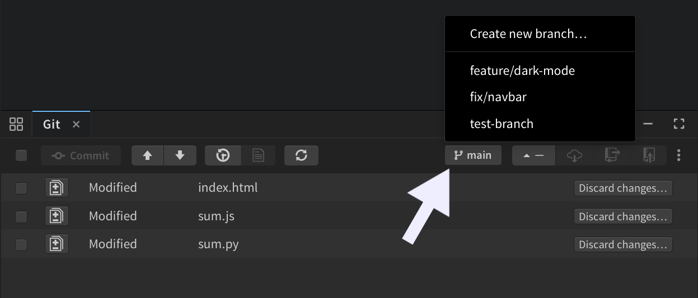

import React from 'react';
import VideoPlayer from '@site/src/components/Video/player';

Phoenix Code 5.2 is now available at [phcode.io](https://phcode.io).

This release brings the [Styles Bar](#style-your-page-visually-with-the-styles-bar) for styling your page visually, [Code Intelligence](#code-intelligence-for-javascript-typescript-json-python-and-php) for JavaScript, TypeScript, JSON, Python, and PHP, a [Starter Bar](#start-from-a-blank-page) for blank pages, [Doc Comment Generation](#generate-doc-comments), [AI Model Selection](#choose-your-ai-model), an [Improved Git Panel](#git-improvements), and [Video and Audio Preview](#video-and-audio-preview) right in the editor.

## Style your page visually with the Styles Bar

Select an element in Live Preview and the new Styles Bar appears with controls for fonts, colors, backgrounds, borders, spacing, and layout. Every change syncs to your code in real time.

Pick where your edits are saved - inline on the element, in an existing CSS rule, or in a new rule the bar creates for you. You can also style `hover`, `focus`, and other element states, and the Live Preview turns the state on while you edit.

The font picker covers system fonts and the full Google Fonts collection, with each font previewed in its own style. [Read More...](https://docs.phcode.dev/app-links/styles-bar)

<VideoPlayer
  src="https://docs-images.phcode.dev/videos/styles-bar/styles-bar-hero.mp4"
/>

## Start from a blank page

Edit Mode needs an element to work on, and a blank page has none. Now a Starter Bar appears on empty pages so you can add your first element right from the preview, and Phoenix Code creates the page structure for you. [Read More...](https://docs.phcode.dev/app-links/live-preview-edit)

<VideoPlayer
  src="https://docs-images.phcode.dev/videos/live-preview-edit/starter-bar.mp4"
/>

## Code Intelligence for JavaScript, TypeScript, JSON, Python, and PHP

Phoenix Code now ships IDE-grade code intelligence: context-aware completions with documentation beside them, parameter hints, hover info, jump to definition, find usages, and live error checking with quick fixes.

- **JavaScript & TypeScript** - full project intelligence with auto imports and automatically managed configuration.
- **JSON** - schema-based completion and validation for well-known config files. In `package.json`, get npm package name and version suggestions as you type, and dependencies with known vulnerabilities are flagged.
- **Python** - type-aware intelligence via Pyrefly, with Ruff powering code formatting.
- **PHP** - full intelligence via Intelephense, installed on demand when you open a PHP file.

Language servers set themselves up automatically in the background and run locally on your machine, so your code is not sent anywhere. [Read More...](https://docs.phcode.dev/app-links/code-intelligence)

<VideoPlayer
  src="https://docs-images.phcode.dev/videos/code-intelligence/code-intelligence.mp4"
/>

> Code intelligence powered by language servers is available only in desktop apps.

## Generate Doc Comments

Type `/**` on the line above a function or class and accept the hint that appears. Phoenix Code reads the signature and generates a documentation comment with every parameter filled in, in each language's own convention: JSDoc for JavaScript and TypeScript, PHPDoc for PHP, docstrings for Python, and more. [Read More...](https://docs.phcode.dev/app-links/doc-comments)

<VideoPlayer
  src="https://docs-images.phcode.dev/videos/doc-comments/jsdoc-generation.mp4"
/>

## Choose your AI model

Pick which Claude model powers your AI chat, right from the chat header, and switch models even in the middle of a conversation. Each model shows a short description so you can pick the right one for the task.

Prefer an editor without AI? It can now be switched off completely from `View > Enable AI` or the AI settings dialog. [Read More...](https://docs.phcode.dev/app-links/ai-models)

## Git improvements

Your current branch is now shown in the sidebar and on the Git panel toolbar. Click either one to switch branches or create a new one.

The panel's menu also gets a new `Open All Changed Files` action that opens every modified file at once. [Read More...](https://docs.phcode.dev/app-links/git)

## Video and Audio Preview

Click a video or audio file in your project to play it right inside the editor, with the file's dimensions, duration, and size shown alongside. [Read More...](https://docs.phcode.dev/app-links/video-audio-preview)

## Notable changes and fixes

- Pasting from Excel and other spreadsheets now inserts text instead of an image. ([#3033](https://github.com/phcode-dev/phoenix/pull/3033))
- Editing an element's attributes in source code now updates the Control Box immediately. ([#3020](https://github.com/phcode-dev/phoenix/pull/3020))
- Element selection in Live Preview no longer lands on the wrong element after property edits. ([#3055](https://github.com/phcode-dev/phoenix/pull/3055))
- Media and image previews now show the file's real path instead of an internal path. ([#3032](https://github.com/phcode-dev/phoenix/pull/3032))
- The Markdown editor's slash menu now opens at the cursor instead of the right edge. ([#2940](https://github.com/phcode-dev/phoenix/pull/2940))
- The Markdown editor no longer indents image-only links on save. ([#2937](https://github.com/phcode-dev/phoenix/pull/2937))
- Live Preview toolbar buttons are no longer hidden by long file names. ([#2942](https://github.com/phcode-dev/phoenix/pull/2942))
- Quick access panel buttons no longer overflow when the bottom panel is small. ([#2945](https://github.com/phcode-dev/phoenix/pull/2945))
- Opening the terminal now exits Design Mode correctly. ([#2915](https://github.com/phcode-dev/phoenix/pull/2915))
- Fixed the Git toolbar icon causing exceptions at startup. ([#2904](https://github.com/phcode-dev/phoenix/pull/2904))
- An expired Claude Code login is now detected, with a prompt to log in again from the chat panel. ([#3065](https://github.com/phcode-dev/phoenix/pull/3065))
- The Claude CLI is now detected when installed via Homebrew or Linuxbrew. ([#2897](https://github.com/phcode-dev/phoenix/pull/2897))
- The guided tour now appears for users who updated from older versions. ([#2892](https://github.com/phcode-dev/phoenix/pull/2892))

## Performance & Stability

- Fixed sidebar resize issues and removed unused title bar space in desktop apps. ([#3021](https://github.com/phcode-dev/phoenix/pull/3021))
- Working set selection bugs fixed and rendering performance improved. ([#3039](https://github.com/phcode-dev/phoenix/pull/3039))
- Screenshots are sharper on high-DPI displays and no longer fail from rounding errors. ([#2947](https://github.com/phcode-dev/phoenix/pull/2947), [#2953](https://github.com/phcode-dev/phoenix/pull/2953))

## Platform Notes

### Linux

- Fixed auto-update failing to detect the installed AppImage path. ([#2926](https://github.com/phcode-dev/phoenix/pull/2926), [#2927](https://github.com/phcode-dev/phoenix/pull/2927))
