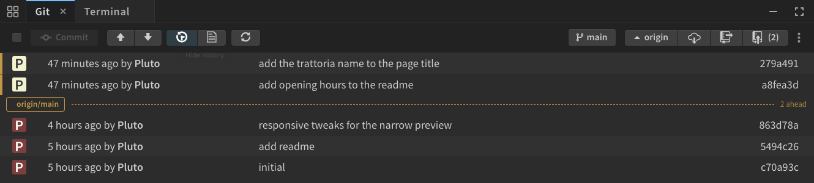
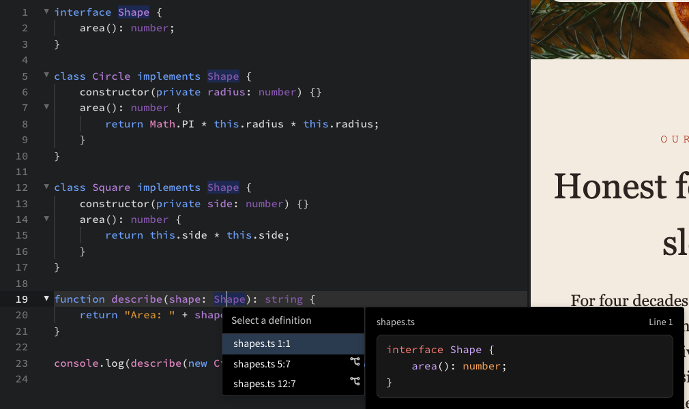

import React from 'react';
import VideoPlayer from '@site/src/components/Video/player';

Phoenix Code 5.5 is now available at [phcode.dev](https://phcode.dev).

This release brings the [Layers Panel](#layers-panel), a [new AI panel](#a-new-ai-panel), [more ways to use AI](#more-ways-to-use-ai), and upgrades to [Live Preview Edit](#live-preview-edit-improvements), the [terminal](#terminal-improvements), [Git](#git-see-what-is-pushed), and [code intelligence](#editor-improvements).

## Layers Panel

The new **Layers** tab shows your page as a tree. Click a row to select the element, then edit its tag, classes, attributes, and styles right in the sidebar. Drag rows to move things around, and insert, duplicate, or delete elements without touching the code.

The Styles section lists every rule that applies to the element, shows which values are overridden and by what, and lets you edit them in place. [Read More...](https://docs.phcode.dev/app-links/layers-panel)

<VideoPlayer
  src="https://docs-images.phcode.dev/videos/layers-panel/layers-panel-hero.mp4"
/>

## A new AI panel

Claude Code now comes built in. Sign in and start chatting, with nothing to install.

The new chat shows you what the AI is doing as it works, and every change it makes can be undone with one click. You decide how much it can do on its own. New to AI? Click **Surprise Me** on the start screen to watch a demo first.

Free accounts get a daily and monthly chat limit. Phoenix Pro removes the limits. [Read More...](https://docs.phcode.dev/app-links/ai-chat)

<VideoPlayer
  src="https://docs-images.phcode.dev/videos/ai/ai-hero.mp4"
/>

## More ways to use AI

### Claude Code CLI and Codex CLI inside the editor

Already use **Claude Code** or **Codex**? Run them inside the AI panel. They see the file you are editing, your unsaved changes, and the Live Preview, and they can take screenshots and open files. [Read More...](https://docs.phcode.dev/app-links/ai-cli)

<VideoPlayer
  src="https://docs-images.phcode.dev/videos/ai/ai-cli.mp4"
/>

> Running the CLIs inside the panel is a Phoenix Pro feature.

### Ask AI in the Live Preview

Select an element and click **Ask AI**. A screenshot of the element and its place in the code go with your question. The AI can ask you back the same way, with a card inside the Live Preview and options you can preview on the page. [Read More...](https://docs.phcode.dev/app-links/ai-ask)

<VideoPlayer
  src="https://docs-images.phcode.dev/videos/ai/ai-ask-element.mp4"
/>

### Ask AI in the editor

Select some code and click **Ask AI** on the small toolbar that appears. The AI reads exactly those lines, unsaved changes included. The same button appears on selected text in the Markdown preview. [Read More...](https://docs.phcode.dev/app-links/ai-ask)

<VideoPlayer
  src="https://docs-images.phcode.dev/videos/ai/ai-ask-code.mp4"
/>

### Find photos

Ask the AI for a picture and it searches Unsplash. Pick one and it goes on your page. [Read More...](https://docs.phcode.dev/app-links/ai-images)

<VideoPlayer
  src="https://docs-images.phcode.dev/videos/ai/ai-image-search.mp4"
/>

## Live Preview Edit improvements

- **Script-generated elements** now get a Control Box. Select them and edit their CSS rules in the Styles Bar.
- **Hidden elements**: Select something you cannot see and Phoenix Code tells you why.
- **Styles Bar toggle**: Turn the bar on and off with the **palette** button in the Control Box.
- **More colors**: `oklch()`, `lab()`, and `color()` values open in the color picker.

[Read More...](https://docs.phcode.dev/app-links/live-preview-edit)

## Terminal improvements

Give your terminal tabs names. Hover a tab, click the pencil, and type. Named tabs come back the next time the panel opens.

When you switch projects, the banner now has a one-click **Restart All Terminals**. Links in the output open in your browser. [Read More...](https://docs.phcode.dev/app-links/terminal)

## Git: see what is pushed

The history view now marks the last pushed commit with the remote branch name. Everything above it is not pushed yet. [Read More...](https://docs.phcode.dev/app-links/git)

## Editor improvements

**Go to Definition** now shows a picker when a symbol has more than one definition, with a preview of each one. [Read More...](https://docs.phcode.dev/app-links/code-intelligence)

Type the first letters of `function` or `arrow` in JavaScript and TypeScript, `function` in PHP, or `def` in Python to get a ready-made snippet. Your own snippets can now have default text in a placeholder, like `${1:name}`. [Read More...](https://docs.phcode.dev/app-links/custom-snippets)

## Notable changes and fixes

- The browser app now lives at [web.phcode.dev](https://web.phcode.dev). Your projects, settings, and extensions from phcode.dev are copied over on first open. ([#3125](https://github.com/phcode-dev/phoenix/pull/3125), [#3139](https://github.com/phcode-dev/phoenix/pull/3139))
- Files with a UTF-16 byte order mark, and HTML, PHP, and XML files that declare a charset, now open in the right encoding. ([#3108](https://github.com/phcode-dev/phoenix/pull/3108))
- Video and audio files of any size play in the desktop app. ([#3235](https://github.com/phcode-dev/phoenix/pull/3235))
- Admins can point the desktop app at their own update server. See [Managing App Updates](https://docs.phcode.dev/docs/managed-updates). ([#3181](https://github.com/phcode-dev/phoenix/pull/3181))
- A Claude Code installed anywhere on your machine is found on its own, or pick a specific copy in AI Settings. ([#3190](https://github.com/phcode-dev/phoenix/pull/3190))
- Beautify on save no longer shows an error for file types without a formatter. ([#3109](https://github.com/phcode-dev/phoenix/pull/3109))
- Fixed the sidebar resizer showing up in the editor area. ([#3133](https://github.com/phcode-dev/phoenix/pull/3133))
- Fixed submenus hidden behind the central control bar. ([#3134](https://github.com/phcode-dev/phoenix/pull/3134))
- Terminal scrollbars now match the rest of the editor. ([#3203](https://github.com/phcode-dev/phoenix/pull/3203))

## Performance & Stability

- Live Preview highlighting is faster on large pages. ([#3188](https://github.com/phcode-dev/phoenix/pull/3188))
- Live Preview reconnects on its own after a dropped connection. ([#3255](https://github.com/phcode-dev/phoenix/pull/3255))
- Command-line tools launch more reliably in the terminal. ([#3199](https://github.com/phcode-dev/phoenix/pull/3199))

## Platform Notes

### Windows

- Fixed auto-update failing after the update to Node 24. ([#3087](https://github.com/phcode-dev/phoenix/pull/3087))

### macOS

- Fixed semibold and bold text looking smeared.
