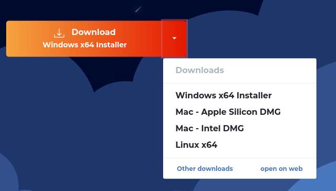
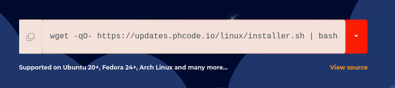

import Tabs from '@theme/Tabs';
import TabItem from '@theme/TabItem';

# Phoenix Code Installation Guide

Phoenix Code is a text editor designed to make coding as intuitive and fun as playing a video game — specially crafted for web developers, designers, and students. This guide walks you through downloading and installing Phoenix Code on Windows, macOS, and Linux, or running it straight from your browser with no install at all.

## Download

Visit the official website — [phcode.io](https://phcode.io) — and click the **Download** button to grab the installer for your operating system.


> **Linux users:** see [Installing on Linux](#linux) below for the one-line terminal installer.

### Choosing a different installer

If you need a build for another operating system, or have specific requirements:

1. Click the **Download** drop-down on the website.
2. Select the installer you need from the list.



Phoenix Code supports a wide range of operating systems:

- **macOS** — Apple Silicon (M1+) and Intel chipsets
- **Windows** — x64 architectures
- **Linux** — Ubuntu, Debian, Pop!_OS, Fedora, Arch, and more

## Install

### Windows & macOS

Run the downloaded installer and follow the on-screen instructions. Once it finishes, launch Phoenix Code and you're ready to start building.

### Linux {#linux}

Open a terminal and run the official installer script — copy it from the website or use the command below:

```bash
wget -qO- https://updates.phcode.io/linux/installer.sh | bash
```



This installs Phoenix Code along with all required dependencies, and sets up app-drawer shortcuts and file associations automatically. It works on all major distributions, including Ubuntu, Debian, Fedora, and Arch-based systems.

Need to install by hand, check dependencies, or uninstall? See [Advanced Linux installation](#linux-advanced) below.

## Use it in the browser

Prefer not to install anything? Run the full editor right in your browser at [phcode.dev](https://phcode.dev) — perfect for Chromebooks, tablets, or just trying things out. Everything runs locally in the browser, with nothing to download.

---

## Advanced Linux installation {#linux-advanced}

The one-line installer above is all most users need. The sections below cover manual installation, runtime dependencies, and common questions.

### Uninstalling

To remove an automatic installation, run:

```bash
wget -qO- https://updates.phcode.io/linux/installer.sh | bash -s -- --uninstall
```

For a manual installation, delete the folder where you placed the Phoenix Code app, along with any related files.

### Manual installation

If automatic installation fails, or you prefer to install by hand:

1. **Check your GLIBC version:**
   ```bash
   ldd --version | awk '/ldd/{print $NF}'
   ```

2. **Download the package:** visit the [Phoenix Code releases page](https://github.com/phcode-dev/phoenix-desktop/releases) and download a build compatible with your GLIBC version.

3. **Extract it:**
   ```bash
   tar -xvf phoenix_code_version.tar.gz
   ```

4. **Read the bundled instructions:**
   ```bash
   cat extracted_folder/ReadMe.txt
   ```

5. **Follow the steps** in `ReadMe.txt` to complete the installation.

### Desktop environment compatibility

Phoenix Code is tested on both **GNOME** and **KDE**. Other desktop environments may work via [manual installation](#manual-installation).

### Dependencies

If Phoenix doesn't start after installing, restart your system and confirm the required dependencies for your distribution are installed:

<Tabs
  defaultValue="ubuntu"
  values={[
    { label: 'Ubuntu/Debian', value: 'ubuntu' },
    { label: 'Fedora/Red Hat', value: 'fedora' },
    { label: 'Arch Linux', value: 'arch' },
  ]}>

<TabItem value="ubuntu">

Update your package list:
```bash
sudo apt update
```

Install WebKitGTK and GTK:
```bash
sudo apt install libgtk-3-0 libwebkit2gtk-4.0-37
```
*Note: In Ubuntu 22+ versions, WebKitGTK may be pre-installed.*

Install optional GStreamer plugins for media playback:
```bash
sudo apt install gstreamer1.0-plugins-base gstreamer1.0-plugins-good gstreamer1.0-plugins-bad gstreamer1.0-plugins-ugly gstreamer1.0-tools gstreamer1.0-libav
```

</TabItem>
<TabItem value="fedora">

Update your package list:
```bash
sudo dnf update
```

Install WebKitGTK and GTK:
```bash
sudo dnf install webkit2gtk3 gtk3
```

Install optional GStreamer plugins for media playback:
```bash
sudo dnf install gstreamer1-plugins-base gstreamer1-plugins-good gstreamer1-plugins-bad-free gstreamer1-plugins-bad-freeworld gstreamer1-plugins-ugly gstreamer1-libav
```

</TabItem>
<TabItem value="arch">

Ensure your system is up to date:
```bash
sudo pacman -Syu
```

Install WebKitGTK and GTK:
```bash
sudo pacman -S webkit2gtk gtk3
```

Install optional GStreamer plugins for media playback:
```bash
sudo pacman -S gst-plugins-base gst-plugins-good gst-plugins-bad gst-plugins-ugly gst-libav
```

</TabItem>
</Tabs>

### FAQ

**How can I verify my distribution is supported?**

Run the [one-line installer](#linux). If it completes successfully, your distribution is supported.

**How do I upgrade Phoenix Code?**

For automatic installations, you'll get an update notification in the app itself. For manual installations, repeat the [manual installation](#manual-installation) steps.

**Phoenix won't start after installing — what can I do?**

Restart your system, then confirm the [dependencies](#dependencies) for your distribution are installed.
