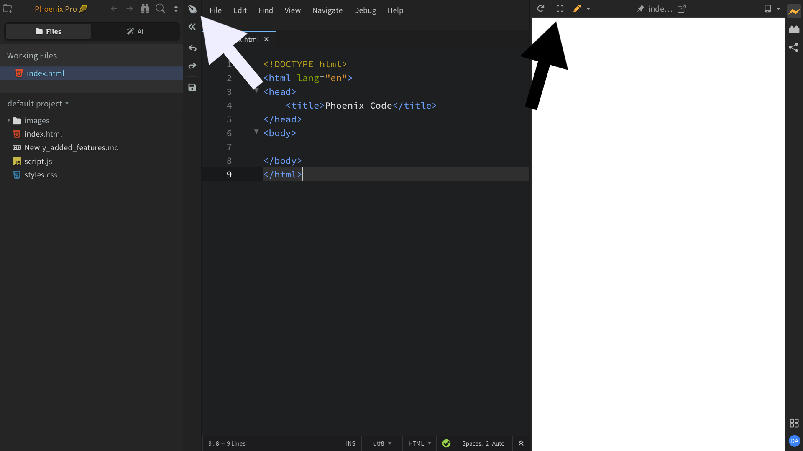
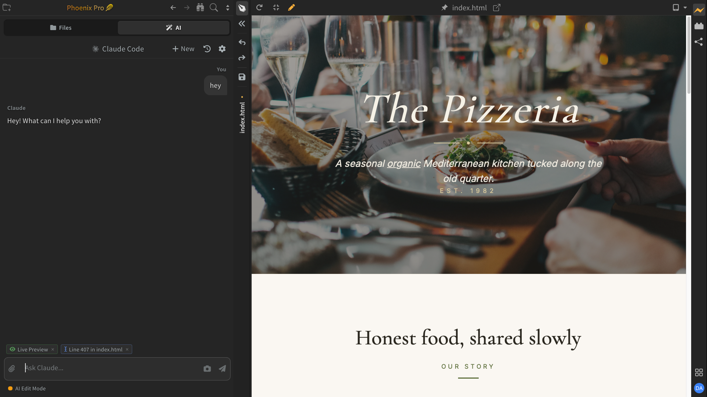

import React from 'react';
import VideoPlayer from '@site/src/components/Video/player';

**Design Mode** is a layout that hides the code editor and gives that entire space to your **Live Preview**. It is built for visual-first work: chatting with the AI while you watch changes land in the preview, editing your page directly in Live Preview Edit Mode, or testing how your design looks at different device sizes.

<VideoPlayer
  src="https://docs-images.phcode.dev/videos/design-mode/design-mode.mp4"
/>

## Why use Design Mode

- **Pair with the AI Chat panel.** Ask the AI to make a change and see it applied instantly in the preview as the code updates without the need to open the editor. [Read More about AI Chat](./Pro%20Features/ai-chat).
- **Edit visually with Live Preview Edit Mode.** Click elements, drag them, change text, swap images, and much more, directly in the preview. [Read More about Live Preview Edit Mode](./Pro%20Features/live-preview-edit).
- **Test responsive designs.** With Device Preview, check how your page looks on phone, tablet, and desktop sizes with just a click. [Read More about Device Preview](./Pro%20Features/device-preview).

## Switching to Design Mode

There are three ways to switch to Design Mode:

- Click the **Design Mode** button *(pen nib icon)* near the top of the **Control Bar**, the narrow vertical strip between the sidebar and the editor.
- Click the **fullscreen** button *(expand icon)* in the Live Preview toolbar, right after the reload button.
- Choose **File > Toggle Design Mode** from the menu bar.

All three toggle the same mode. Use any of them again to switch back to the code editor.

## The Design Mode layout

When Design Mode is on, the sidebar stays visible alongside the maximized Live Preview. The recommended setup is to keep **AI Chat** open in the sidebar so you can ask for changes and watch them appear in the preview as the AI works. If the Live Preview is not already open, Phoenix Code opens it for you.

To hide the sidebar too, click the **toggle sidebar** button *(double left-arrow icon)* just below the Design Mode toggle in the Control Bar. Click it again to bring the sidebar back.
