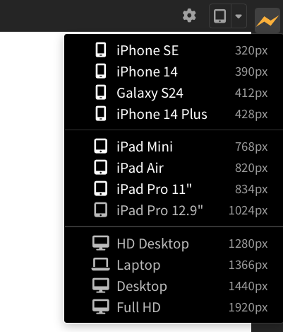
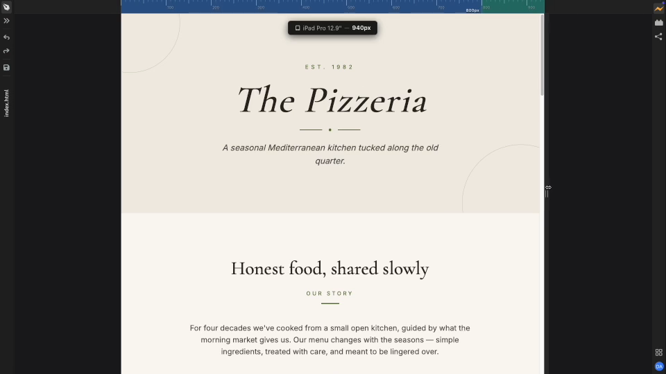

import React from 'react';
import VideoPlayer from '@site/src/components/Video/player';

:::info Pro Feature
[Upgrade to Phoenix Code Pro](https://phcode.io/pricing) to access this feature.
:::

**Device Preview** lets you check how your page looks at different screen widths without leaving Phoenix Code. This is useful for testing responsive designs and debugging CSS media queries.

<VideoPlayer
  src="https://docs-images.phcode.dev/website/videos/device-size-pro-dialog.mp4"
/>

## Choosing a device size

The right end of the Live Preview toolbar has a device-size button.
You can click on the device icon to switch between mobile, tablet and desktop sizes. For more specific sizes, click the dropdown arrow to open a list of predefined devices and CSS breakpoints (from your stylesheets).

> Some devices might not be available if your screen is too narrow to fit the Live Preview at that size. In that case, you can try zooming out (`Ctrl/Cmd + -`) to make more space for the preview.

## CSS breakpoints

Phoenix Code reads your page's stylesheets and picks up the media-query breakpoints. These show up in two places:

- In the **device dropdown**, listed at the bottom as `@media 768px` (etc.). Clicking one snaps the Live Preview to that exact width.
- On the **width ruler**, as colored bands between breakpoints, each labelled with its pixel value.

> When you edit your CSS and change the breakpoints, Phoenix Code updates the device dropdown and width ruler in real time. This makes it easy to test your responsive design as you work.

## Width ruler

While you drag the edge of the Live Preview panel, a ruler appears across the toolbar with tick marks and colored bands for each of your breakpoints. A label above the preview shows the current width and the closest matching device, like `iPad Mini — 768px`.

### In Design Mode

In [Design Mode](./live-preview-edit), the Live Preview takes over the full window. In that case, you'll see resize handles directly on the page: drag the left or right handle to change the **width**, or drag the bottom handle to change the **height**. The same ruler appears, and the label now shows both dimensions, like `iPad Mini — 768px × 1024px`.  
In Design Mode, a **Fit to screen** option is also available in the device dropdown. This resizes the page to fit the available space in the Live Preview.

