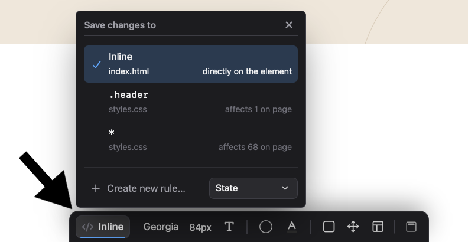

import VideoPlayer from '@site/src/components/Video/player';

:::info Pro Feature
[Upgrade to Phoenix Code Pro](https://phcode.io/pricing) to access this feature.
:::

The **Styles Bar** lets you style elements visually right inside the Live Preview, and it automatically syncs your code in real time.  
When you select an element in [Edit Mode](./live-preview-edit), a bar appears at the bottom of the Live Preview with controls for **fonts**, **colors**, **borders**, **spacing**, **layout**, and more.

<VideoPlayer
  src="https://docs-images.phcode.dev/videos/styles-bar/styles-bar-hero.mp4"
/>

> The controls shown depend on the selected element. For example, text controls are not shown for images.

You can move the bar to the top of the Live Preview using the **dock button** at the right end of the bar.

## Save Changes To

Phoenix Code gives you control to choose where you want to save your edits. By default, all the changes are saved directly on the element as an inline style. If you want to save the changes in one of the CSS rules, you can click on the **Save changes to** button:

It shows all the available selectors for that element. Select the one you want, and all the changes made to that element will automatically get saved in that selector.
> Each selector also shows the number of elements it affects on the page.

### Creating a New Rule

Click **Create new rule…** to save your edits in a new CSS rule. Type a class like `.card` or an id like `#hero` and click **Create**. Phoenix Code creates the rule and also adds the class or id to the element, so the rule applies right away.

<VideoPlayer
  src="https://docs-images.phcode.dev/videos/styles-bar/create-new-rule.mp4"
/>

### Editing Element States

The **State** dropdown in the popover lets you style the element's `hover`, `focus`, and `active` states. Pick a state and the Live Preview turns it on while you edit, with a banner showing which state you are editing.

For any other state, type it in the **Create new rule** field, for example `.button:disabled`.

<VideoPlayer
  src="https://docs-images.phcode.dev/videos/styles-bar/element-states.mp4"
/>

> States need a CSS rule to live in, so they are not available when saving to inline styles.

## Font Family

Opens a font picker with three tabs:

- **System**: Common system fonts like Arial, Georgia, and Verdana. These need no download and work everywhere.
- **Google**: The full Google Fonts collection. Popular fonts are shown first, and you can search for any font. Each font is shown in its own style, so you can see how it looks before picking it. Picking one adds the Google Fonts link to your HTML.
- **Manual**: Type any font name yourself. You can also upload a font file (`.ttf`, `.otf`, `.woff`, `.woff2`), and Phoenix Code adds it to your project and applies it.

Fonts already used on the page appear in an **On this page** group, so you can reuse them quickly.

<VideoPlayer
  src="https://docs-images.phcode.dev/videos/styles-bar/font-family.mp4"
/>

## Font Size

Sets the font size. Type a value or use the **+/-** buttons. Click the unit button to switch between `px`, `em`, `rem`, and `%`, and the value is converted to the new unit automatically.

> These shortcuts work in every number field of the Styles Bar: scroll over a field to change its value, hold `Shift` while clicking **+/-** for bigger steps `(x10)`, or hold `Alt` for smaller ones `(x0.1)`.

<VideoPlayer
  src="https://docs-images.phcode.dev/videos/styles-bar/font-size.mp4"
/>

## Text Style

The text style popover has two tabs.

The **Format** tab:

- **Font weight**: Controls how thick the text is, with a slider from Thin (100) to Black (900).
- **Format**: Italic, underline, strikethrough, and overline.
- **Alignment**: Aligns text left, center, right, or justified.
- **Case**: Shows text as uppercase, lowercase, or capitalized, without changing the text in your HTML.
- **Cursor**: The mouse cursor shown when hovering over the element, like pointer or grab.

The **Spacing** tab:

- **Line height**: The vertical space between lines of text.
- **Letter spacing**: The space between characters.
- **Word spacing**: The space between words.
- **Text indent**: How far the first line of text is indented.

To learn more about these properties, see [MDN's text styling guide](https://developer.mozilla.org/en-US/docs/Learn_web_development/Core/Text_styling/Fundamentals).

<VideoPlayer
  src="https://docs-images.phcode.dev/videos/styles-bar/text-style.mp4"
/>

> Looking for bold? Use the font weight slider.

## Background Color

The **Background color** button shows the element's current background color. Click it to open a full color picker:

- Pick a color visually, or type one as Hex, RGB, or HSL.
- The **opacity** field controls how see-through the color is.
- The **eyedropper** lets you pick a color from anywhere on the page.
- **Swatches** shown on the left side displays all the colors already used in the page, plus a set of common colors.

<VideoPlayer
  src="https://docs-images.phcode.dev/videos/styles-bar/background-color.mp4"
/>

> The eyedropper is not available in Firefox, Safari and in the Linux desktop app.

## Text Color

The **Text color** button works the same way as [Background Color](#background-color), but it controls the color of the element's text. It opens the same color picker.

## Border & Outline

The popover has two tabs, **Border** and **Outline**.

The **Border** tab:

- **Style**: None, solid, dashed, dotted, or double. Hovering an option previews it on the element.
- **Width**: The thickness of the border.
- **Color**: Click the swatch to open the color picker to set the color of the border.
- **Radius**: Rounds the corners of the bordered element.

By default, edits apply to all four sides of the border. Use the **sides button** in the popover header to edit only the top, right, bottom, or left side.

The **Outline** tab has the same style, width, and color options, plus:

- **Offset**: The gap between the outline and the element's edge.

> An outline is drawn outside the element's border and takes up no space on the page.

<VideoPlayer
  src="https://docs-images.phcode.dev/videos/styles-bar/border-outline.mp4"
/>

## Box Model

The popover has three tabs, **Size**, **Padding**, and **Margin**. They sit together because they measure one element from the inside out.

The **Size** tab:

- **Width and Height**: The element's size. Empty fields show the current size of the element as placeholders.
- **Min / max**: Click the chip to set minimum and maximum size limits. This is very useful for creating responsive web pages.

The **Padding** and **Margin** tabs each show four fields for the top, right, bottom, and left sides, arranged around a frame just like they sit on the page.

> Padding is the space inside the element, between its content and its border. Margin is the space outside it.

The button in the center of the frame controls how the sides are linked:

- **Independent**: Each side has its own value.
- **Paired**: Top and bottom are linked, left and right are linked.
- **All linked**: One value for every side.

Linked fields are color coded so you can see which sides move together.

## Layout

The popover has two tabs, **Display** and **Position**.

The **Display** tab:

- **Display**: How the element is laid out: `Block`, `Inline`, `Flex`, `Grid`, `Hidden`, and more. Picking `Flex` or `Grid` reveals options like `direction`, `alignment`, `wrap`, and `gap`.
- **Opacity**: How see-through the element is. This fades the whole element, including its text and children.

The **Position** tab:

- **Position**: `Static`, `Relative`, `Absolute`, `Fixed`, or `Sticky`, with fields to offset the element from each side.
- **Z-index**: Which element appears on top when elements overlap.

To learn more about these properties, see MDN's guides on [display](https://developer.mozilla.org/en-US/docs/Web/CSS/display) and [position](https://developer.mozilla.org/en-US/docs/Web/CSS/position).

## When a Change Is Overridden

Sometimes a more specific CSS rule wins over the rule you are editing, so your change has no visible effect. In that case, Phoenix Code automatically adds `!important` to your change to make it take effect.

If the change is still overridden even after the `!important` property, Phoenix Code shows a notification with an **Apply anyway** button, which applies the style directly on the element so it always takes effect.

Read more about [CSS specificity](https://developer.mozilla.org/en-US/docs/Web/CSS/Guides/Cascade/Specificity) on MDN.

## Reset and Undo

Every popover has a **Reset** button in its header. It reverts all the changes you made since opening that popover. If you have not changed anything, the button stays disabled.

You can also undo any Styles Bar edit with `Ctrl/Cmd + Z`, like every other Edit Mode operation. See [Undo and Redo](./live-preview-edit#undo-and-redo).

## Hiding the Styles Bar

To hide the bar, open the **More Options** menu *(three-dots icon)* in the Control Box and unselect **Show Styles Bar**. While hidden, a **palette icon** appears in the Control Box tools to bring it back.
