import React from 'react';
import VideoPlayer from '@site/src/components/Video/player';

:::info Pro Feature
[Upgrade to Phoenix Code Pro](https://phcode.dev/pricing) to access this feature.
:::

The **Layers panel** shows the structure of the page in the Live Preview as a tree. Click a row to select that element, then edit its tag, classes, attributes, and styles right there in the sidebar. You can also rearrange elements by dragging rows, and insert, duplicate, or delete elements without touching the code.  
**Phoenix Code** updates your source code automatically as you make changes.

<VideoPlayer
  src="https://docs-images.phcode.dev/videos/layers-panel/layers-panel-hero.mp4"
/>

## Opening the Layers Panel

Click the **Layers** tab at the top of the sidebar, next to **Files** and **AI**.

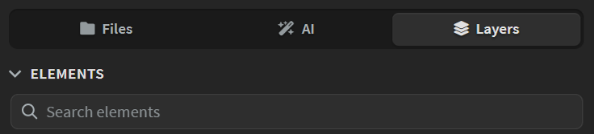

The panel reads the page shown in the Live Preview, so it needs three things:

- **A Live Preview**: If the Live Preview is closed, the panel shows an **Open Live Preview** button. You can also click **Open in Browser** to open the page in a browser window instead. The panel reads a popped-out preview too.
- **An HTML page**: The panel works with `.html`, `.htm`, and `.xhtml` files. If the preview is showing something else, like a Markdown or PHP file, the panel lists the HTML pages in your project instead. Click one to open it.
- **Edit Mode**: Opening the tab switches the Live Preview to [Edit Mode](./live-preview-edit) for you. When you switch to another tab, the previous mode is restored.

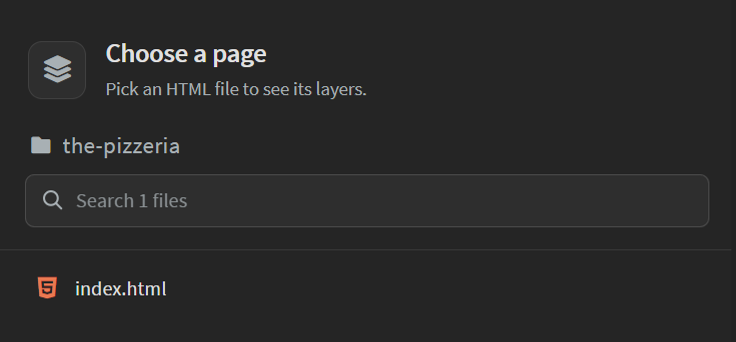

> The page picker groups pages by folder. Type in the search box to find a page by name.

## Panel Layout

The panel has three sections stacked on top of each other:

- **Elements**: The page as a tree. See [Elements](#elements).
- **Properties**: The tag, ID, classes, and attributes of the selected element. See [Properties](#properties).
- **Styles**: The CSS rules that apply to the selected element. See [Styles](#styles).

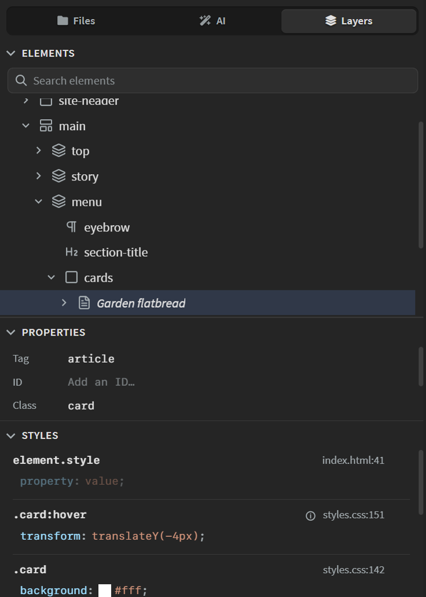

Drag the divider between two sections to resize them. Click the **chevron** in a section header, or double-click the header, to collapse the section. The **Expand Section** button *(diagonal arrows icon)* at the right end of a header gives that section the whole panel. Click it again to restore the other sections.

<VideoPlayer
  src="https://docs-images.phcode.dev/videos/layers-panel/panel-sections.mp4"
/>

## Elements

The **Elements** section shows the body of the page as a tree, one row per element. The rows follow every edit you make, whether in the code, in the Live Preview, or in the panel itself.

### Reading the Tree

Each row shows an icon for the kind of element, a name, and the tag. The name is whatever tells the element apart best:

- Its **ID**, like `hero`, or its first **class**, like `card`.
- Its **text**, shown in italics, when it has no ID or class.
- The **file name** for images and videos, or the **alt**, **title**, or **placeholder** text.
- The **link** for anchors.

When several siblings share a class, like a row of cards, the tree names each one by its own text or image instead, so you can tell them apart.

Elements created by JavaScript at runtime are shown with a **code badge** after the tag. They are not in your source file, so their tag, ID, classes, and attributes are read-only, and the row tools only offer **Select Parent**. The CSS rules that style them can still be edited in the [Styles](#styles) section.

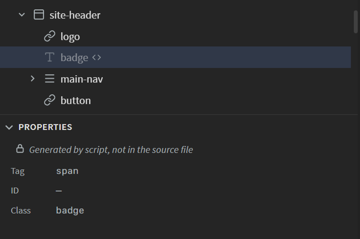

> Text is not shown as rows by default. Turn on **Show Text Nodes** in the [settings menu](#settings) to see it. Very large pages show the first 5000 elements.

### Hovering

Move the pointer over a row to highlight that element in the Live Preview, with a label naming it. If the element is scrolled out of view, the label is pinned to the edge of the preview nearest to it, with an arrow pointing the way. Elements hidden by CSS get a `(hidden)` label.

Turn on **Scroll Preview on Hover** in the [settings menu](#settings) to scroll the preview to the element instead. When the pointer leaves the tree, the preview scrolls back to where it was.

<VideoPlayer
  src="https://docs-images.phcode.dev/videos/layers-panel/hover-highlight.mp4"
/>

### Selecting

Click a row to select the element. Three things happen at once:

- The element is selected in the Live Preview, with its [Control Box](./live-preview-edit#control-box) and [Styles Bar](./styles-bar).
- The cursor in the code editor jumps to the element.
- The **Properties** and **Styles** sections show the element.

This works the other way too. Click an element in the Live Preview and the tree opens up to its row and selects it.

Moving the cursor in the code does not select anything, but the row of the element under the cursor gets an outline, and the element is highlighted in the preview. When nothing is selected, the Properties and Styles sections follow the cursor. Put the cursor inside a CSS rule and the tree marks every element that rule matches.

<VideoPlayer
  src="https://docs-images.phcode.dev/videos/layers-panel/select-elements.mp4"
/>

To deselect, press `Esc` while the tree has focus, or click the empty space below the rows.

> When you select an element that is not visible on the page, Phoenix Code tells you why, for example *Element is hidden - it has display: none*.

### Keyboard Navigation

With the tree focused, the arrow keys move the selection:

- `Up` and `Down`: Move to the previous or next row.
- `Right`: Open the row, or move into it if it is already open.
- `Left`: Close the row, or move to its parent if it is already closed.
- `Home` and `End`: Jump to the first or last row.
- `Enter`: Select the element in the Live Preview again, for example after clicking elsewhere in the preview.
- `Esc`: Deselect.

### Expanding and Collapsing

Click the **chevron** at the left of a row, or double-click the row, to open or close it. When a page loads, the tree opens as many levels as fit in the section.

Two buttons in the section header work on the whole tree:

- **Collapse All**: Closes every row.
- **Expand to Level**: Opens the tree down to level 2, 3, 4, or 5, or opens all levels.

When you select an element that sits under a closed row, the tree opens that branch for you. By default, these branches close again when you select somewhere else, so the tree stays tidy. Turn off **Auto-Collapse Elements** in the [settings menu](#settings) to keep them open.

After **Collapse All** or **Expand to Level**, the tree stays at that depth. If you then select an element in the Live Preview that sits under a closed row, the nearest open row above it gets a **marker** at its left edge. Click the marker to open the way down to the selected element.

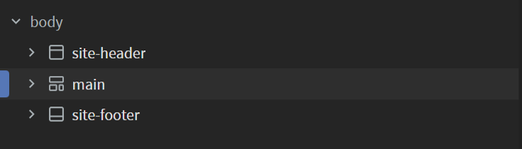

<VideoPlayer
  src="https://docs-images.phcode.dev/videos/layers-panel/expand-collapse.mp4"
/>

### Searching

Type in the **Search elements** box to filter the tree by tag or name. Matching rows are shown along with the rows above them, so you can see where each match sits. Press `Esc` to clear the search.

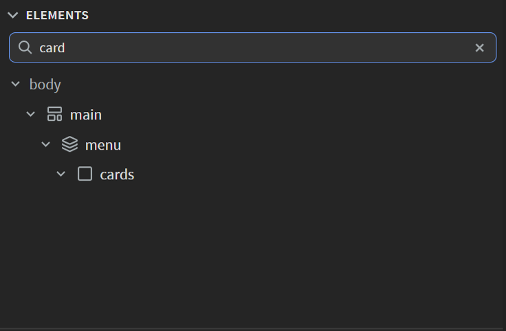

### Editing Elements from the Tree

Hover a row to show its tools at the right end:

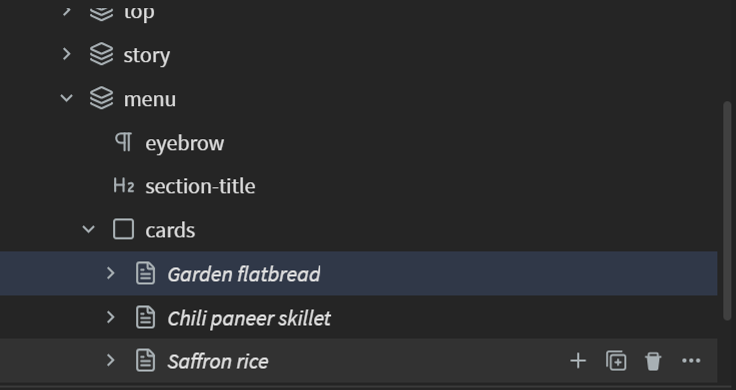

- **Select Parent** *(up-arrow icon)*: Selects the element that contains this one.
- **Insert Element** *(plus icon)*: Adds a new element next to or inside this one. See [Inserting Elements](#inserting-elements).
- **Duplicate** *(copy icon)*: Makes a copy of the element right after it.
- **Delete** *(trash icon)*: Removes the element from the page.
- **More Options** *(three-dots icon)*: Opens the full menu. Right-clicking a row opens the same menu.

The menu also has **Move Up** and **Move Down** to swap the element with its neighbours, and **Cut**, **Copy**, and **Paste**. Paste places the copied element after the one you pasted on.

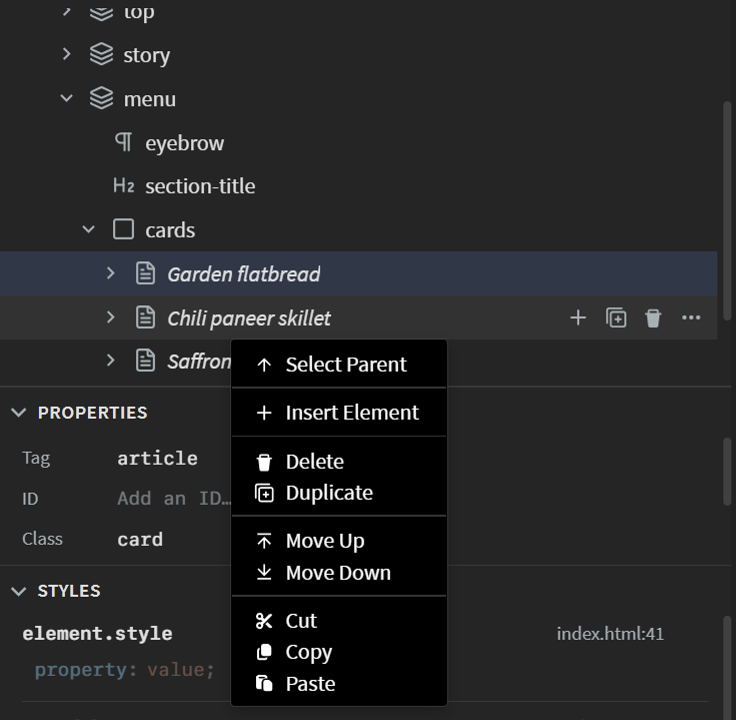

<VideoPlayer
  src="https://docs-images.phcode.dev/videos/layers-panel/row-actions.mp4"
/>

> The tools act on the row you use them on, even when another element is selected.

Every edit can be undone with `Ctrl/Cmd + Z`, like any other Edit Mode change. See [Undo and Redo](./live-preview-edit#undo-and-redo).

### Inserting Elements

Click **Insert Element** *(plus icon)* on a row to open the element picker.

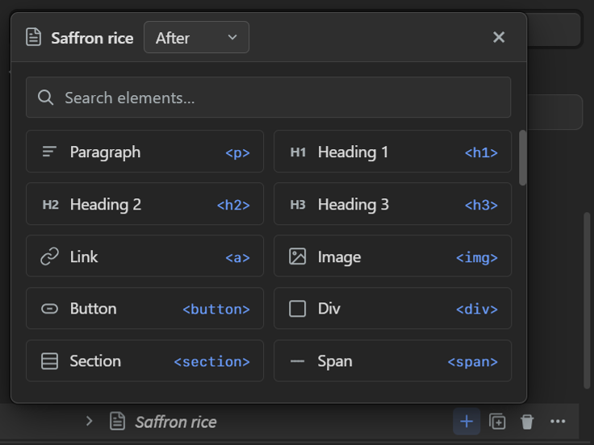

The dropdown at the top sets where the new element goes, relative to the row you clicked:

- **Before** or **After**: Next to the element.
- **Inside**: As the last child of the element.
- **Wrap**: Around the element. Only container elements, like `div` or `section`, are offered here.

Pick an element from the grid, or type in the search box to filter it. If nothing matches, type a tag name and click **Create &lt;tag&gt;** to insert a custom element.

The new element is selected as soon as it lands, so you can carry on editing it.

<VideoPlayer
  src="https://docs-images.phcode.dev/videos/layers-panel/insert-element.mp4"
/>

> On an empty page, the section shows an **Add an element** button instead of a tree. It creates the page structure around your first element.

### Drag and Drop

Drag a row to move its element somewhere else on the page:

- Drop it on the **top or bottom edge** of a row to place it before or after that element. A line shows where it will land.
- Drop it on the **middle** of a row to place it inside that element, as its first child. The row is highlighted.

Hold the pointer over a closed row while dragging and it springs open, so you can drop deeper into the tree. Dragging near the top or bottom of the section scrolls the tree. Press `Esc` to cancel a drag.

<VideoPlayer
  src="https://docs-images.phcode.dev/videos/layers-panel/drag-drop.mp4"
/>

> You cannot drop an element inside itself, inside a text row, or inside elements that cannot have children, like `img` or `input`.

### Settings

Click the **Settings** button *(gear icon)* in the section header to toggle these options:

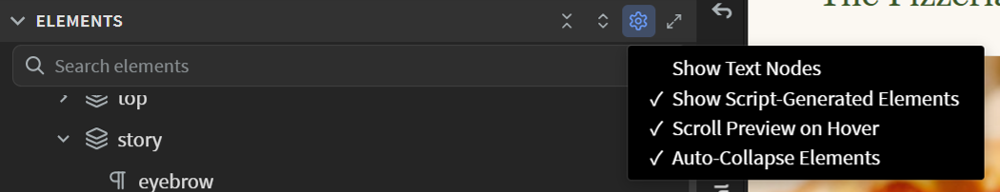

- **Show Text Nodes**: Shows the text inside elements as rows of its own. Off by default.
- **Show Script-Generated Elements**: Shows elements added by JavaScript. On by default.
- **Scroll Preview on Hover**: Scrolls the Live Preview to the element under the pointer. Off by default.
- **Auto-Collapse Elements**: Closes branches that were opened for a selection once you select somewhere else. On by default.

## Properties

The **Properties** section shows the selected element as it is written in your HTML:

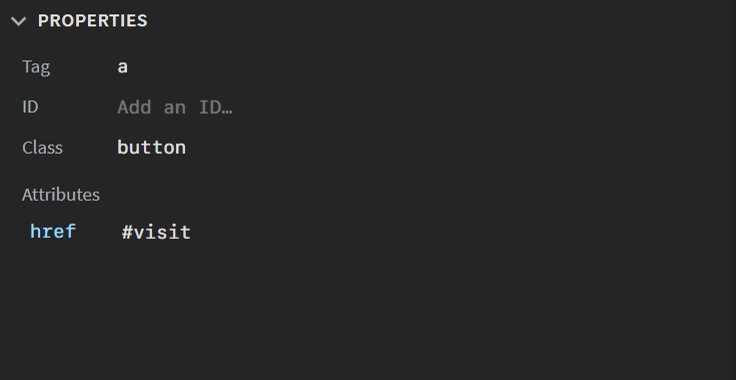

- **Tag**: The element type. Change it to turn, for example, a `div` into a `section`. The `body` and `html` tags cannot be changed.
- **ID**: The element's ID.
- **Class**: The element's classes, separated by spaces.
- **Attributes**: Every other attribute as a name and value pair. Click **+** to add one, or the **remove** button *(backspace icon)* at the end of a row to delete it.

Click a field and type to edit it. Press `Enter` or click elsewhere to apply the change, or `Esc` to revert it. Code hints appear as you type: tag names, the IDs and classes found in your project's stylesheets, attribute names for the current tag, and known attribute values. Press `Tab` to accept the first hint, or `Ctrl + Space` to open the list on an empty field.

<VideoPlayer
  src="https://docs-images.phcode.dev/videos/layers-panel/properties.mp4"
/>

## Styles

The **Styles** section lists every CSS rule that applies to the selected element, with the winning rules first:

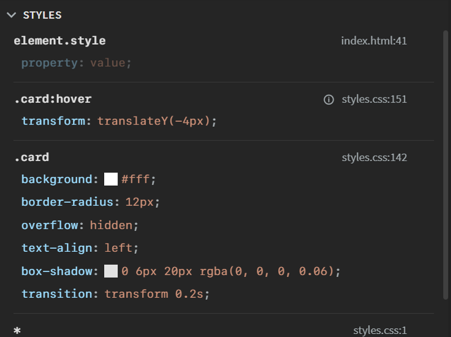

- **element.style** comes first and holds the element's inline styles. It is listed even when empty, so you can add an inline style with one click.
- Each rule shows its selector and where it lives, like `styles.css:142`. Click the location to open that rule in the editor.
- Rules for states the element is not in, like `.card:hover`, are dimmed and marked **Not active in the current state**.
- A declaration that loses to another rule is struck through. Hover the **info** mark next to it to see which rule wins and why, and click the mark to jump to the winning declaration.

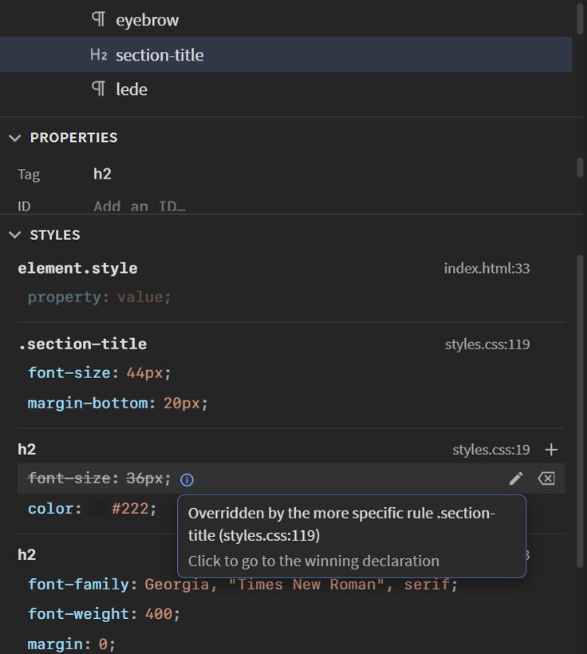

<VideoPlayer
  src="https://docs-images.phcode.dev/videos/layers-panel/overridden-styles.mp4"
/>

### Editing Declarations

Double-click a property name or value to edit it in place, or click the **edit** button *(pencil icon)* at the end of the row. Press `Enter` to apply the change or `Esc` to cancel. `Tab` moves to the next field, and past the last declaration of a rule it starts a new one. Code hints offer property names while you type a name, and keywords and named colors while you type a value.

To add a declaration, click **+** in the rule header, or click the empty space below the rule's last declaration. Type the property name, press `Tab` or `Enter`, then type the value.

To remove a declaration, click the **remove** button *(backspace icon)* at the end of its row, or clear its value.

Numbers can be adjusted without typing:

- **Drag** a value left or right to change it, watching the page update as you go.
- While editing a value, press `Up` or `Down`, or scroll over the field. Hold `Shift` for bigger steps `(x10)` or `Alt` for smaller ones `(x0.1)`.

<VideoPlayer
  src="https://docs-images.phcode.dev/videos/layers-panel/styles-edit.mp4"
/>

> Changes are written to wherever the declaration lives, so editing a shared rule like `.card` changes every element that uses it. Use **element.style** to change only the selected element.

### Colors

Color values show a **swatch** in front of them. Click it to open a color picker with a color field, hue and opacity sliders, and Hex, RGB, and HSL input. Hovering a swatch in the **On this page** or **Common** lists previews it on the page, and clicking one applies it. The **eyedropper** picks a color from anywhere on your screen.

> The eyedropper is not available in Firefox, Safari and in the Linux desktop app.

<VideoPlayer
  src="https://docs-images.phcode.dev/videos/layers-panel/color-picker.mp4"
/>

### Editing in the Styles Bar

Declarations that the [Styles Bar](./styles-bar) has a control for show a **palette** button *(palette icon)* at the end of the row. Click it to open that control in the Styles Bar, already pointed at the same rule, so what you save there lands in the same place.

### Copying and Pasting Styles

Right-click a rule or a declaration for a menu with:

- **Copy property**: Copies the declaration, like `border-radius: 12px;`.
- **Copy rule**: Copies the whole rule, selector and all. For **element.style**, only the declarations are copied.
- **Paste properties**: Adds the declarations on the clipboard to the rule.

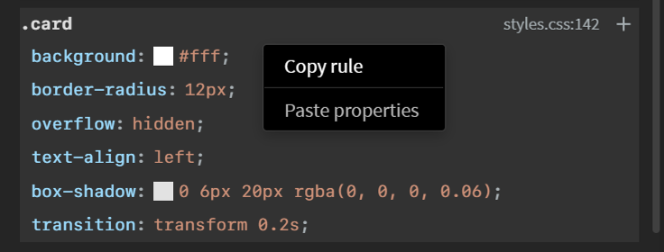

You can also paste CSS straight into a rule while editing a declaration. Paste a list of declarations, or one complete rule, and they are added to that rule.
