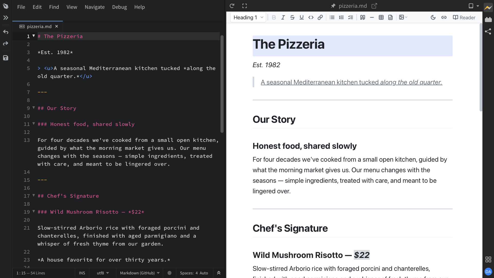

import React from 'react';
import VideoPlayer from '@site/src/components/Video/player';

When you open a Markdown file (`.md`), **Live Preview** shows a nicely formatted version of your document with syntax-highlighted code blocks, rendered Mermaid diagrams, and more. As you type in the editor, the preview updates in real-time.

## Scroll and Cursor Sync

The editor and preview stay in sync as you work. When you scroll or move your cursor in the editor, the preview follows along to show the same section. Clicking a section in the preview scrolls the editor to the matching line too.

You can turn sync on or off using the **cursor sync toggle** *(link icon)* in the preview toolbar.

<VideoPlayer
  src="https://docs-images.phcode.dev/videos/markdown/toggle-cursor-sync.mp4"
/>

The preview toolbar also has a **theme toggle** *(sun/moon icon)* to switch between light and dark themes, a **search** bar (`Ctrl/Cmd + F`), and a **print** button.

> Print is not available on macOS desktop apps.

## Markdown Editor (Pro)

With **Phoenix Pro**, you can go beyond just viewing. Edit your Markdown directly in the Live Preview with a full rich text editor - format text, build tables, drag in images, add links, use slash commands to insert blocks, and much more. All your changes sync back to the source code automatically.

<VideoPlayer
  src="https://docs-images.phcode.dev/website/videos/markdown-pro-dialog.mp4"
/>

[Learn more about the Markdown Editor](../../Pro%20Features/markdown-editor)
