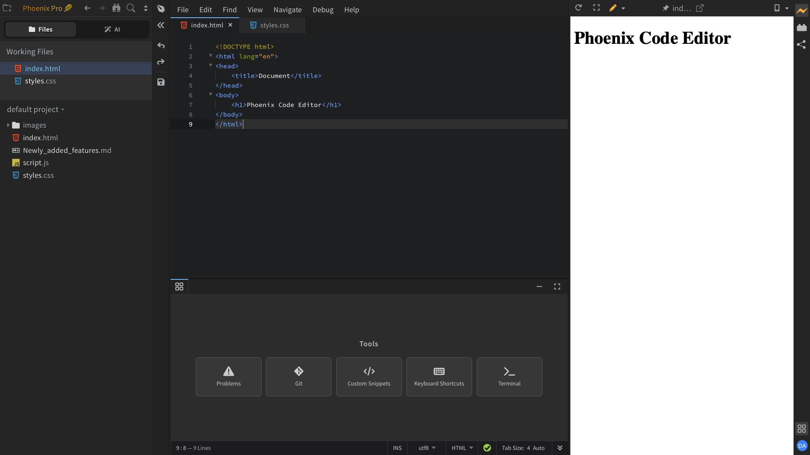

This section is a guided tour of the Phoenix Code interface. Every region of the editor is covered in its own page, so you can quickly find out what a part of the editor does, what is on it, and how to use it.

The editor is made up of the regions described below. Each one has a dedicated page in this Tour.

## Menu Bar

The strip at the top of the window — **File**, **Edit**, **Find**, **View**, **Navigate**, **Debug**, **Help**. Every command in the editor is reachable from here.

## Sidebar

The left panel. It holds the **Files** and **AI** tabs, the **Working Files** list, and the **project tree**. The sidebar header has shortcuts for creating files and folders, navigating recently opened files, and searching the project. The sidebar can be collapsed when you need more screen space.

## Control Bar

The narrow vertical bar between the sidebar and the editor. It contains the sidebar collapse toggle, undo and redo buttons, and the save button.

## Tab Bar

The row of file tabs at the top of the editor area. Use it to switch between open files, drag to reorder them, or close them with one click.

## Bottom Panel

The panel below the editor. It shows the **Quick Access** panel — a launcher for **Problems**, **Git**, **Custom Snippets**, **Keyboard Shortcuts**, and **Terminal** — and is also where the **Terminal** and **Problems** panels open.

## Plugin Panel

The panel on the right side of the editor. It shows the active plugin — for example, **Live Preview**, **Extension Manager**, or **AI Chat** — and is switched between plugins using the icons in the bottom-right.

## Right-Side Toolbar

The toolbar at the top-right of the editor. It holds the controls for whichever plugin is currently active in the Plugin Panel — for instance, the reload, fullscreen, edit, and pin buttons for **Live Preview**.

## Status Bar

The thin strip at the very bottom of the editor. It shows the cursor position, total line count, insert/overwrite mode, file encoding, language mode, and indent settings.
