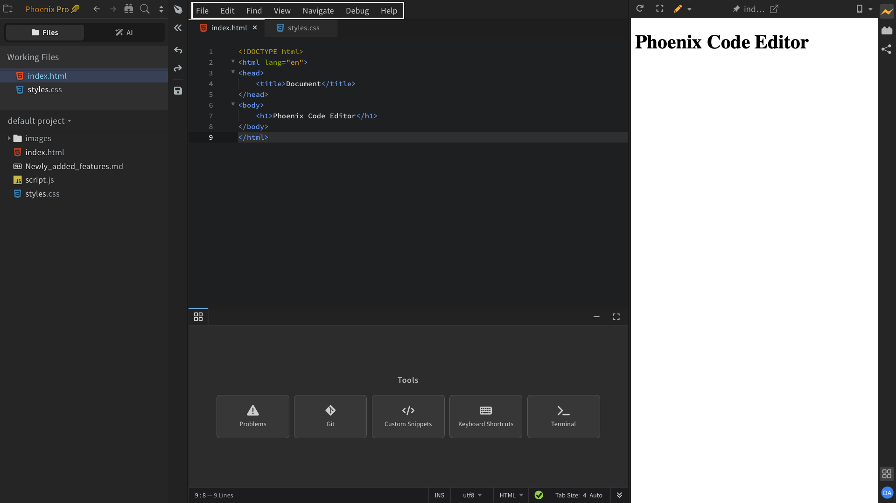

The **Menu Bar** is the strip at the top of the Phoenix Code window. It holds every command in the editor, organized into seven menus — **File**, **Edit**, **Find**, **View**, **Navigate**, **Debug**, and **Help**.

Click any menu to open it. Most items show their default keyboard shortcut next to the label, and toggleable items (like **Word Wrap** or **Line Numbers**) display a checkmark when they are on.

The sections below give a quick overview of what each menu contains. For detailed docs on individual features, follow the links where they appear.

---

## File

The **File** menu handles everything related to your project and the files inside it — creating new files and folders, opening files and folders, closing them, and saving. It also has options to **Duplicate File**, **Download Project** (saves the project as a ZIP), open the **Extension Manager...**, open a **New Window**, and **Quit** the app.

> Some items, such as **Open Files...**, **Save As...**, **New Window**, and **Quit**, only appear in the desktop app.

---

## Edit

The **Edit** menu has all the text-editing commands — undo and redo, cut, copy, paste, **Select All**, and selection helpers like **Select Line**, **Split Selection into Lines**, and **Add Cursor to Previous/Next Line** for multi-cursor editing.

It also covers line operations (**Indent**, **Unindent**, **Duplicate**, **Delete Line**, **Move Line Up**, **Move Line Down**), comment toggles (**Toggle Line Comment**, **Toggle Block Comment**), **Show Code Hints**, and toggles for **Auto Close Braces** and **Emmet**.

For more on multi-cursor editing, snippets, and other editing features, see [Editing Text](../editing-text).

---

## Find

The **Find** menu is for search and replace. **Find** (`Ctrl/Cmd + F`) and **Replace** work within the current file. **Find in Files** (`Ctrl/Cmd + Shift + F`) and **Replace in Files** search across the entire project. **Find All References** locates every usage of the symbol your cursor is on.

You will also find next/previous match navigation and **Add Next Occurrence** / **Skip and Add Next Occurrence** for incremental multi-cursor selection.

For a deeper walkthrough, see [Find in Files](../Features/find-in-files).

---

## View

The **View** menu controls the look and layout of the editor. From here you can:

- Open **Themes...** to change theme, font, line height, scroll sensitivity, and rulers.
- Switch between **Split View** modes — **None**, **Vertical**, or **Horizontal**.
- Toggle the **Sidebar**, **Line Numbers**, **Word Wrap**, **Highlight Active Line**, **Rulers**, and **Indent Guide Lines**.
- Adjust the interface and font size from the **Zoom UI and Fonts** submenu.
- Show or hide the **Problems** panel and the **Terminal** (desktop only).

For details on themes, fonts, and other display settings, see [Customizing the Editor](../customizing-editor).

---

## Navigate

The **Navigate** menu helps you move around your code without leaving the keyboard. The most useful items are:

- **Quick Open** (`Ctrl/Cmd + Shift + O`) — jump to any file by typing part of its name.
- **Go to Line** — jump to a specific line number.
- **Quick Edit** (`Ctrl/Cmd + E`) — open inline editors for related code, such as CSS rules from an HTML element or a function definition from its call site.
- **Quick Docs** (`F1`) — open inline documentation for the symbol at the cursor.
- **Jump to Definition** and **Quick Find Definition** — go straight to where a symbol is defined.
- **Go to Next/Previous Problem** — step through linting errors and warnings.
- **Show in File Tree** — reveal the current file in the sidebar.
- Document switching with **Next Document** and **Previous Document**.

For Quick Edit details, see [Quick Edit](../Features/quick-edit).

---

## Debug

The **Debug** menu is for developers and power users. It has options to reload Phoenix Code with or without extensions, load the current project as an extension, open the user keymap file, launch the developer tools, and access a **Diagnostics** submenu and **Experimental Features**.

> If you are not building or debugging Phoenix Code itself, you can usually skip this menu.

---

## Help

The **Help** menu links to documentation, support, the **Get Phoenix Pro** upgrade page, license information, and community resources like the Phoenix YouTube channel and Twitter/X. The **About Phoenix** item shows the current version and build information.

---

:::tip
To find a command without opening menus, use **Quick Open** (`Ctrl/Cmd + Shift + O`) for files, or open the **Keyboard Shortcuts** panel from the **Quick Access** panel at the bottom of the editor to browse every command and its default shortcut. See [Keyboard Shortcuts](../Features/keyboard-shortcuts) for more.
:::
