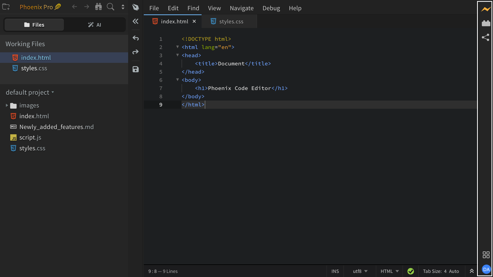

The **Toolbar** is the narrow vertical strip of icons running down the right edge of the Phoenix Code window. It is your jumping-off point for the features that open as panels alongside the editor: **Live Preview**, the **Extension Manager**, **Publish**, the **Quick Access** panel, your **Phoenix Pro** account, and any tools added by extensions such as **Git**.

The Toolbar is split into two groups. The icons at the top open panels you actively work in (Live Preview, Extension Manager, and Publish). The icons at the bottom give you the Quick Access panel, your Phoenix Pro account, and tools that come and go with context, such as Git when the current project is a repository.

Clicking a Toolbar icon opens its panel inside the editor on the right side. Only one panel can be open at a time, so clicking a different icon hides the previous panel and shows the new one. Clicking the same icon a second time closes the panel and gives the space back to the editor. The icon for the panel you currently have open stays highlighted, so you can tell at a glance which panel is on screen. You can resize an open panel by dragging its left edge.

## Top Icons

### Live Preview

The lightning-bolt icon opens **Live Preview**, which renders the HTML or markdown file you currently have open and updates the preview as you type. Phoenix Code can preview plain HTML, markdown, and PHP files, and once Live Preview is open, the preview pane shows its own controls for things like reloading, toggling Design Mode, pinning a file, and opening the preview in your browser.

### Extension Manager

The cube icon opens the **Extension Manager**, where you can browse, install, update, and remove extensions and themes. The same dialog also lists the default-shipped extensions that come with Phoenix Code under the **Default** tab. For details, see [Extensions](../extensions).

### Publish

The publish icon shares the current project as a live website through Phoenix Code's hosting service. When you click it, Phoenix Code uploads any files that have changed since the last publish and gives you a URL you can share with anyone. It is the fastest way to put a static site or HTML demo in front of someone without leaving the editor.

### Update Notification

When a Phoenix Code update is available, an extra icon appears at the top of the Toolbar. Clicking it opens the update dialog so you can install the new version. The icon is hidden when there is nothing to update, so most of the time it does not appear on the Toolbar at all.

## Bottom Icons

### Git

When the project you have open is a Git repository, a Git icon appears in the bottom group of the Toolbar. Clicking it opens the **Git panel**, where you can see staged and unstaged changes, view history, and run common Git actions like commit, push, pull, and switch branches. The icon is hidden when the project is not a Git repository, and it is not available in the browser build of Phoenix Code. For details, see [Git](../Features/git).

### Tools (Quick Access)

The grid icon at the bottom opens the **Quick Access** panel at the bottom of the editor. Quick Access is a launcher for the panels that live in the bottom area of Phoenix Code: **Problems**, **Git**, **Custom Snippets**, **Keyboard Shortcuts**, and **Terminal**. Click the grid icon to bring Quick Access up, then pick whichever tool you need from there.

### User Profile

The circular avatar at the very bottom of the Toolbar represents your **Phoenix Pro** account. When you are signed in, it shows your initials inside a colored circle. Clicking it opens a popup with your account details, links to support, and a sign-out option. If you are not signed in, the icon shows a sign-in prompt instead.

## Hiding the Toolbar

The Toolbar is always visible during normal use. Switching Phoenix Code into **No-Distractions Mode** (`Shift + F11`, or **View > No Distractions**) hides the Toolbar along with the rest of the chrome so you can focus on your code. Toggling No-Distractions Mode off brings the Toolbar back. For details, see [No-Distractions Mode](../customizing-editor#no-distractions-mode).
