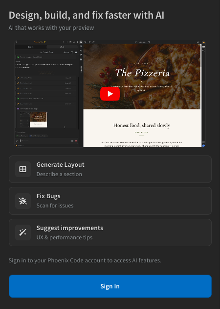
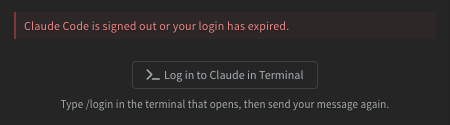

import React from 'react';
import VideoPlayer from '@site/src/components/Video/player';

AI in Phoenix Code is powered by [Claude Code](https://code.claude.com/docs/en/overview), the coding agent from Anthropic. To use it you need three things:

1. A **Phoenix Code account**, signed in to the editor.
2. The **Claude Code CLI**, installed on your machine.
3. A **Claude account** that pays for the AI: either a Claude subscription or an API key.

Phoenix Code walks you through each step in the AI panel. Chats are billed to the Claude account you connect, not to Phoenix Code.

<VideoPlayer
  src="https://docs-images.phcode.dev/website/videos/claude-code-config.mp4"
/>

## Step 1: Sign in to Phoenix Code

Click the **AI tab** *(sparkle icon)* in the sidebar. If you are not signed in, the panel asks you to sign in to your Phoenix Code account. Click **Sign In**.

## Step 2: Install Claude Code

If the Claude Code CLI is not installed on your machine, the panel tells you it must be installed. Click **Install Claude Code**. Phoenix Code opens its built-in terminal and runs the official installer from Anthropic. The install can take a while; Phoenix Code detects when it finishes.

Restart Phoenix Code after the installation completes.

If you prefer to install the CLI yourself, follow [Anthropic's setup guide](https://code.claude.com/docs/en/setup#install-claude-code) and restart Phoenix Code when done.

## Step 3: Connect your Claude account

Once the CLI is installed, the panel shows **Claude Code is installed but needs to be configured**. Click **Setup Claude Code** to open Claude Code in the built-in terminal, where you log in with your Claude account. Restart Phoenix Code after the configuration completes.

You have two ways to log in:

### With a Claude subscription

Claude Code is included in Claude's paid plans (Pro and above). The free claude.ai plan does not include Claude Code.

1. Create a Claude account at [claude.ai](https://claude.ai) if you don't have one.
2. Get a plan that includes Claude Code at [claude.com/pricing](https://claude.com/pricing).
3. Click **Setup Claude Code** and pick the subscription login option in the terminal.

### With an API key

If you don't want a subscription, you can pay per use with an API key instead:

1. Create an API key at [platform.claude.com](https://platform.claude.com).
2. Click **Setup Claude Code** and pick the API key option in the terminal, or add the key as a custom provider in [AI settings](./05-ai-models-providers.md#settings).

You can also use any other provider with an Anthropic-compatible API. See [Models and Providers](./05-ai-models-providers.md#compatible-providers).

> The Claude Code CLI must be installed even when you bring your own API key or use a third-party provider.

## If your login expires

If your Claude login expires later, the chat shows a **Claude Code is signed out or your login has expired** notice with a **Log in to Claude in Terminal** button. Click it, type `/login` in the terminal that opens, then send your message again.

