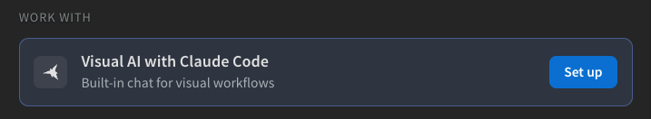
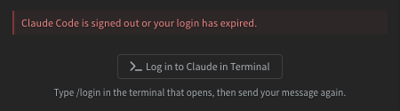

AI in Phoenix Code is powered by [Claude Code](https://code.claude.com/docs/en/overview), the coding agent from Anthropic. Claude Code ships inside the desktop app, so there is nothing to install. To start chatting you need two things:

1. A **Phoenix Code account**, signed in to the editor.
2. A **Claude account** that pays for the AI: either a Claude subscription or an API key.

Chats are billed to the Claude account you connect, not to Phoenix Code. A free Phoenix Code account gets a limited number of chats each day and month. [Phoenix Code Pro](https://phcode.dev/pricing) removes the limits. See [Free Account Limits](./08-ai-usage.md#free-account-limits).

## Step 1: Sign in to Phoenix Code

Click the **AI** tab *(sparkle icon)* in the sidebar. If you are not signed in, the panel asks you to sign in to your Phoenix Code account. Click **Sign In**. Phoenix Code shows a verification code and opens the sign in page in your browser. Use the code there to finish. The panel updates on its own once you are signed in.

> You can watch a demo before signing in. Click **Surprise Me** to see a recorded build play in the panel.

## Step 2: Set up Claude Code

Once you are signed in, the panel shows the start screen. If Claude Code is not signed in to a Claude account yet, the **Visual AI with Claude Code** row shows a **Set up** button, and the message box reads *Set up Claude Code to start chatting*.

Click **Set up**. Phoenix Code opens its built-in terminal and starts the Claude Code login. Pick the way you want to log in and finish the steps in the terminal. The panel picks up the login on its own while the AI tab is open. If it has not after a couple of minutes, click **Set up** again, or just send a message. No restart is needed.

You have two ways to log in:

### With a Claude subscription

Claude Code is included in Claude's paid plans (Pro and above). The free claude.ai plan does not include Claude Code.

1. Create a Claude account at [claude.ai](https://claude.ai) if you don't have one.
2. Get a plan that includes Claude Code at [claude.com/pricing](https://claude.com/pricing).
3. Click **Set up** and pick **Claude account with subscription** in the terminal. It opens your browser to confirm.

### With an API key

If you don't want a subscription, you can pay per use with an API key instead:

1. Create an API key at [platform.claude.com](https://platform.claude.com).
2. Either click **Set up** and pick **Anthropic Console account** in the terminal, which bills your API usage, or add the key as a provider in [AI Settings](./09-ai-models-providers.md#settings). With a provider active, the Claude login step is skipped.

You can also use any other provider with an Anthropic-compatible API. See [Models and Providers](./09-ai-models-providers.md#compatible-providers).

## Using Your Own Claude Code

If you already have Claude Code installed, Phoenix Code uses it unless it is older than the bundled copy. The bundled copy is updated with Phoenix Code itself. To use a specific copy, enter its path in [AI Settings](./09-ai-models-providers.md#settings) under **Path to the Claude Code executable**. Leave the field blank to let Phoenix Code pick.

The **Codex CLI** is not bundled. Phoenix Code offers to install it the first time you pick it. See [Claude Code CLI and Codex CLI](./06-ai-cli.md#setting-up-a-cli).

## If Claude Code Is Not Found

In rare cases the bundled Claude Code cannot run on your machine. The panel then shows **Getting started with Claude Code** with an **Install Claude Code** button. Click it: Phoenix Code opens the built-in terminal, runs the official installer from Anthropic, and starts Claude Code so you can log in. The panel continues on its own when the install finishes. If it does not pick it up, restart Phoenix Code.

If you prefer to install the CLI yourself, follow [Anthropic's setup guide](https://code.claude.com/docs/en/setup#install-claude-code), then open the AI tab again.

If you entered a path in AI Settings and it no longer works, clear or correct it under **Path to the Claude Code executable**.

## If Your Login Expires

If your Claude login expires later, the chat shows a **Claude Code is signed out or your login has expired** notice with a **Log in to Claude in Terminal** button. Click it, type `/login` in the terminal that opens, then send your message again.

