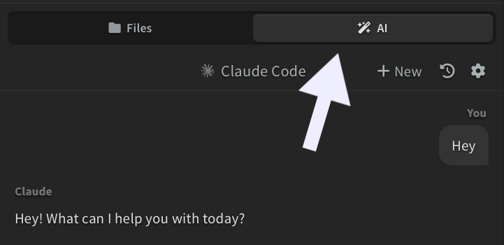
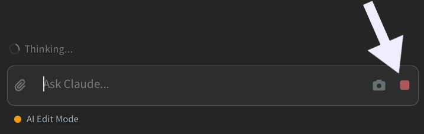
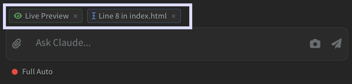
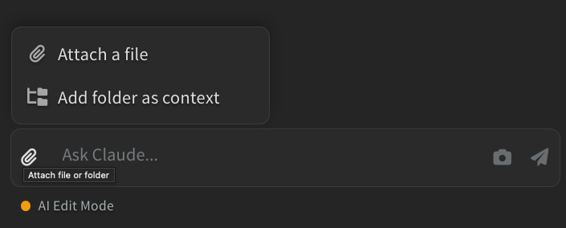
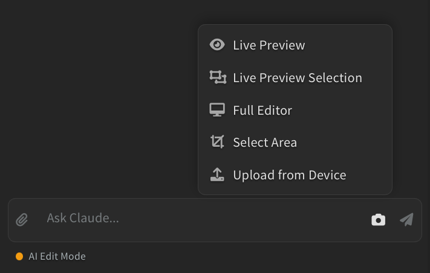
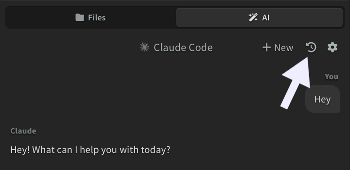

## Opening the AI Panel

Click the **AI tab** *(sparkle icon)* in the sidebar to open the chat panel.

## Sending Messages

Type your message in the input box at the bottom and press `Enter` to send. Press `Shift + Enter` to add a new line.

While the AI is working, you can type your next message. It shows up as a queued message and gets sent automatically once the AI finishes its current response.

To stop the AI mid-response, click the **stop button** *(square icon)* that appears next to the send button while the AI is working, or press `Escape`.

### Context

Phoenix Code automatically provides context about what you're working on. Small chips appear above the input box showing:

- **Selection** - the file and line range you have selected in the editor
- **Cursor** - your current line and file
- **Live Preview** - if the Live Preview panel is open

You can dismiss any of these by clicking the **x** button on the chip.

## Attachments and Screenshots

Click the **paperclip button** to attach a file or folder. The dropdown lets you choose:

- **Attach a file** - attach a single file. Supported image formats include PNG, JPG, GIF, WebP, and SVG. You can also attach code or document files.
- **Add folder as context** - attach an entire folder so the AI can read its contents.

You can also paste an image directly from your clipboard into the input box.

Click the **camera button** to take a screenshot and attach it. The dropdown lets you choose what to capture:

- **Live Preview** - your Live Preview panel (if open)
- **Live Preview Selection** - the currently selected element in Live Preview
- **Full Editor** - the entire editor window
- **Select Area** - a custom region you select with a crop tool
- **Upload from Device** - choose an existing image from your computer instead of taking a new screenshot

## Session History

Every conversation is saved automatically. Click the **history dropdown** at the top of the panel to see your recent sessions and switch between them.

> Sessions are saved per project, so each project has its own chat history.

## Keyboard Shortcuts

| Action | Shortcut |
| -------- | ---------- |
| Send message | `Enter` |
| New line | `Shift + Enter` |
| Cycle permission mode | `Shift + Tab` |
| Stop the AI mid-response | `Escape` (while AI is generating) |
| Clear input and focus the editor | `Escape` (when idle) |
