import React from 'react';
import VideoPlayer from '@site/src/components/Video/player';

## The Start Screen

Click the **AI** tab *(sparkle icon)* in the sidebar. The panel opens on the start screen, which asks *What are we building today?* and lists the assistants you can work with.

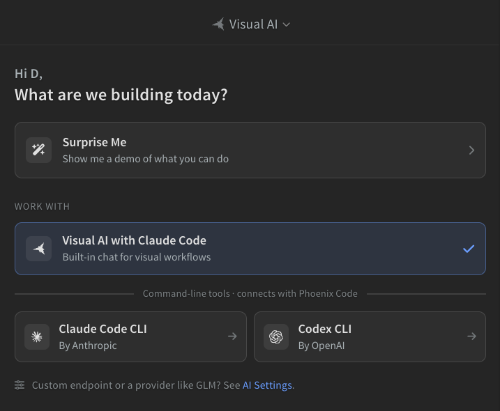

- **Surprise Me**: Plays a demo of what the AI can do. See [Surprise Me](#surprise-me).
- **Visual AI with Claude Code**: The built-in chat. Click the row to put the cursor in the message box, or just start typing.
- **Claude Code CLI** and **Codex CLI**: The command-line tools, running inside the panel. See [Claude Code CLI and Codex CLI](./06-ai-cli.md).
- **AI Settings**: The link at the bottom opens the settings dialog, where you can add a custom provider. See [Models and Providers](./09-ai-models-providers.md).

Once you have used the panel, the Surprise Me card shrinks to a *Want a demo? Surprise me.* line at the bottom, so the rows come first.

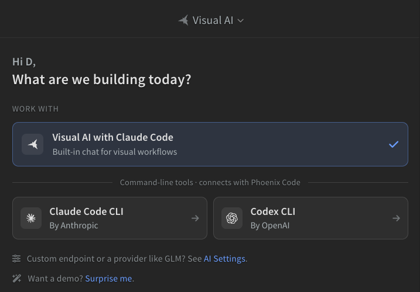

> After your first chat, a **Usage** card appears below the rows. See [Usage and Cost](./08-ai-usage.md).

### Surprise Me

The first time you click **Surprise Me**, the panel plays a recorded build: a real conversation, replayed in the chat while the files land in your project and the Live Preview shows the result. This uses no AI credits and works before you sign in to Claude.

A bar at the bottom of the panel controls the demo. Click the **speed** button to cycle through 1x to 32x, or click **Back** to leave. When the demo ends, a card shows which model built it, with **Reveal the prompt** to see the prompt that was used, **See another demo** to play the next one, and **+ New** to start your own chat.

From then on, **Surprise me** opens a choice:

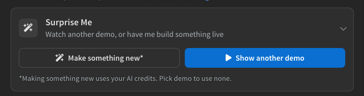

- **Make something new**: The AI builds a small project of its own choosing, live. This uses your Claude credits.
- **Show another demo**: Plays the next recorded demo for free.

> Demos and live builds create files in the project you have open. Try them in a scratch project.

## Sending Messages

Type in the message box at the bottom and press `Enter` to send. Press `Shift + Enter` for a new line. Your message appears under **You**, and the reply under **Claude**.

While the AI is working, a status line under the chat shows what it is doing, like *Thinking...*, *Read...*, or *Edit...*, with a timer once it takes more than a few seconds. The **send** button turns into a **stop** button *(square icon)*. Click it, or press `Esc` while the message box has focus, to stop the AI. Anything it already did stays in the chat.

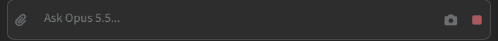

You can keep typing while the AI works. Press `Enter` and the message is held in a **Queued** bubble above the message box. The AI reads it as soon as it finishes its current step and folds it into what it is doing. If the AI finishes first, the queued message is sent as the next turn. Click **Edit** on the bubble to take the text back into the message box.

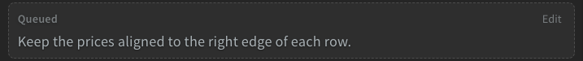

> The first time you send a message, Phoenix Code asks you to confirm that prompts and context are sent to Claude Code.

## Context

Phoenix Code tells the AI what you are looking at. Chips above the message box show what goes along with your next message:

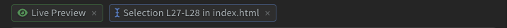

- **Live Preview**: Shown while the Live Preview is open. The AI is told which page it shows.
- **Selection L12-L40 in index.html**: Shown when you have text selected in the editor. The selected text goes with your message.
- **Line 26 in index.html**: Shown when nothing is selected. The AI is told which file you are in and where the cursor is.
- **Folder chips**: One for each folder you added with **Add folder as context**. See [Attachments](#attachments).

The AI is also told which open files have unsaved changes, so it reads what you see in the editor instead of the file on disk.

Click the **x** on a chip to leave that part out. The chip comes back when the selection, the cursor line, or the Live Preview changes.

## Attachments

Click the **paperclip** button to attach more context:

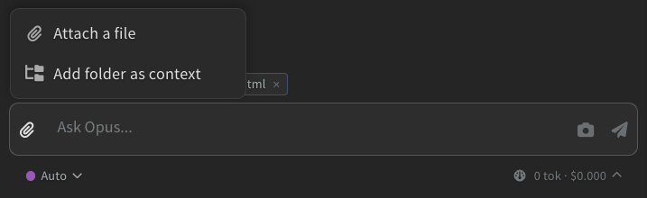

- **Attach a file**: Pick one or more files. Images are attached as pictures the AI can look at. Other files are attached as references, and the AI reads them when it needs to.
- **Add folder as context**: Pick a folder outside your project. It appears as a chip, and the AI can read and edit files inside it without asking. The folder stays attached for this project until you remove the chip.

You can also paste an image from the clipboard into the message box. Attachments appear in a tray above the message box. Click one to preview it, or click its **x** to remove it. A message can carry up to 10 images.

## Screenshots

Click the **camera** button to attach a screenshot:

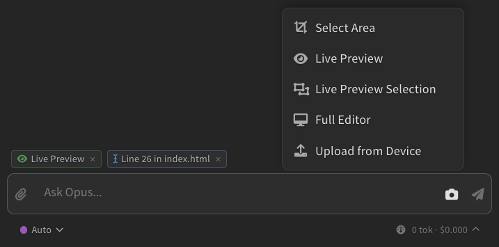

- **Select Area**: Draw a rectangle over any part of the window. Drag the handles to adjust it, then click **Capture** or press `Enter`.
- **Live Preview**: The page in the Live Preview. The preview is opened if it is closed.
- **Live Preview Selection**: Just the element selected in the Live Preview.
- **Full Editor**: The whole Phoenix Code window.
- **Upload from Device**: Pick an image from your computer.

> The AI can take its own screenshots of the Live Preview and the editor while it works. They show up as cards in the chat.

## Following the AI's Work

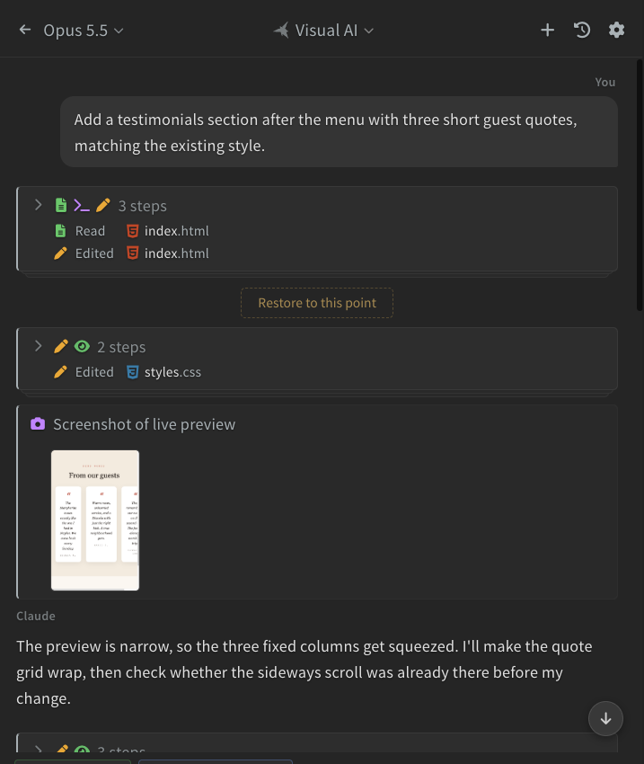

Everything the AI does appears as a card in the chat, in the order it happens: *Read index.html*, *Edit styles.css*, *Ran command*, *Screenshot of live preview*, and so on. Click a card to see the details, like the command it ran or the code it inspected. A card that did not work is marked **failed**.

When several steps finish in a row, they are folded into one card that reads, for example, **3 steps**, with the files it read and edited listed underneath. Click the card to open the steps.

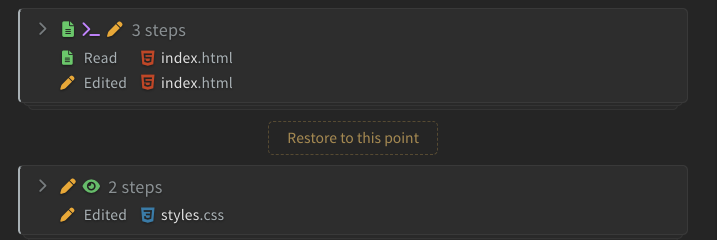

Cards for edits have a **Show diff** button. See [Reviewing and Undoing Changes](./04-ai-reviewing-changes.md).

When the chat is scrolled up, a **Scroll to bottom** button *(down arrow)* appears at the lower right of the chat.

### Questions From the AI

When the AI needs a decision, it asks with a card. Click an option, or type your own answer in the **Type a custom answer** box. If the card has several questions, answer each one and click **Submit**.

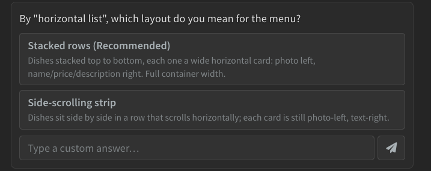

> Typing in the message box does not answer the question. It is queued until the question is answered.

The AI can also ask inside the Live Preview, with options you can preview on the page. See [Questions in the Live Preview](./05-ai-ask.md#questions-in-the-live-preview).

### Code in Replies

Code blocks in a reply have a **Copy** button in their header. Blocks longer than five lines are collapsed. Click the footer to expand them. Color codes outside code blocks get a swatch so you can see the color.

## New, Back, and Home

The buttons in the panel header appear when you move the pointer over the panel:

- **New** *(plus icon)*: Starts a new conversation. The old one stays in [session history](#session-history). If the AI is working, you are asked before it is stopped.
- **Back** *(left arrow)*: Returns to the start screen without stopping the chat. The **Visual AI** row then reads *In progress*. Click it, or pick **Visual AI** from the dropdown in the header, to get back to the chat.
- **Visual AI dropdown**: Switches between the built-in chat and the CLI tools. Each keeps running while you look at another.

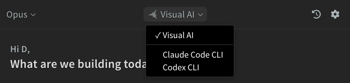

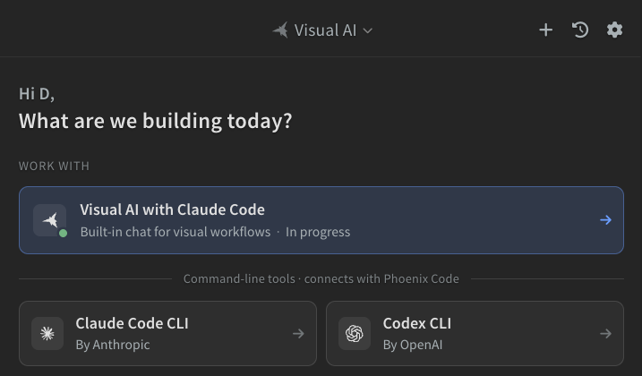

> Opening another project resets the chat. If the AI is working, you are asked before the switch.

## Session History

Every conversation is saved automatically. Click the **history** button *(clock icon)* in the panel header to list the sessions of this project, newest first. Each row shows the first prompt, when it was last used, and the tokens it used. Hover a row to see the title Claude gave the session.

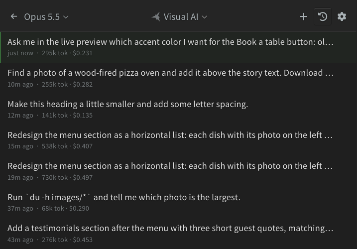

Click a row to continue that conversation. The AI picks up with the full context of the session. Click the **trash** button on a row to delete it, or **Clear all** to delete every session of the project.

> Sessions are saved per project, so each project has its own history. Up to 50 sessions are kept.

## Keyboard Shortcuts

These work while the message box has focus:

| Action | Shortcut |
| -------- | ---------- |
| Send message | `Enter` |
| New line | `Shift + Enter` |
| Cycle permission mode | `Shift + Tab` |
| Stop the AI | `Esc` (while the AI is working) |
| Clear the message box and focus the editor | `Esc` (when idle) |
