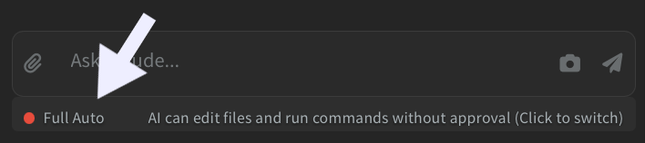

The AI has three permission levels that control how much it can do on its own. Click the **permission label** at the bottom of the panel to cycle between them, or press `Shift + Tab`.

- **Plan** - the AI proposes a plan first as a card in the chat (titled **Proposed Plan**). Click the **expand icon** in the card header to view the plan in full screen. Then click **Approve** to proceed, or **Revise** to open an inline feedback box where you describe what should change before the AI tries again. If the AI tries to edit a file while in Plan mode, you'll see an **Allow / Stay in Plan** prompt; choosing **Allow** switches the session to Edit mode for the rest of the turn. Good for complex tasks where you want to stay in control.
- **Edit** (default) - the AI can read and edit files on its own, but asks for your approval before running terminal commands.
- **Full Auto** - the AI runs everything without pausing. File edits, terminal commands, and tool calls all execute without confirmation. The first time you turn this on in a project, Phoenix Code shows a one-time warning so you understand the risk.

## Approving Terminal Commands

In Edit mode (the default), the AI shows an **Allow / Deny** card before running any terminal command. The card displays the full command so you can verify it before approving. Choosing **Deny** lets the AI continue with the rest of its response without running it.

> Bash confirmations are skipped in Full Auto mode.
