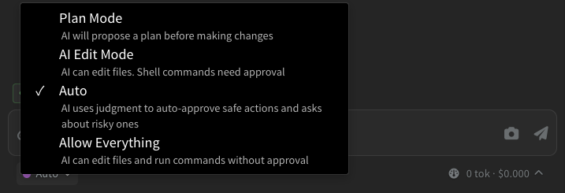
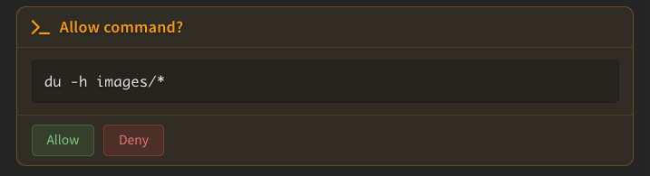
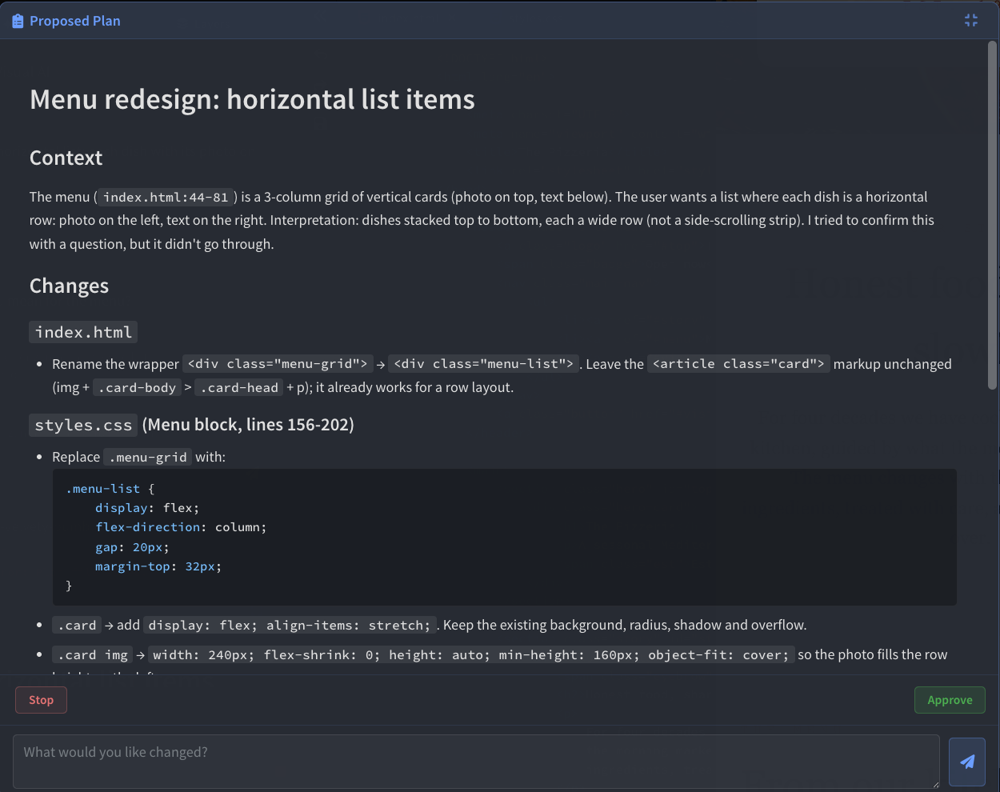
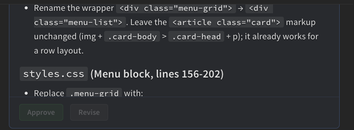

import React from 'react';
import VideoPlayer from '@site/src/components/Video/player';

The permission mode decides how much the AI can do without asking you. The current mode is shown at the bottom left of the panel. Click it to pick another one, or press `Shift + Tab` in the message box to cycle through them.

- **Plan Mode**: The AI reads and inspects, but does not edit files. It still asks before running a command. It proposes a plan for you to approve first. Good for bigger tasks where you want to see the approach before any file changes.
- **AI Edit Mode**: The AI edits files in your project on its own, but asks before running a terminal command. Read-only commands like `ls`, `cat`, `git status`, and `git diff` run without asking. Anything with a pipe or a redirect asks.
- **Auto**: The default. The AI edits files on its own and uses its judgment for terminal commands: safe ones run, risky ones ask.
- **Allow Everything**: The AI runs every tool without asking, including commands that can delete files. The first time you turn it on in a project, Phoenix Code shows a warning. Use it only in projects you trust, and keep them under version control.

You can change the mode while the AI is working. It applies to what the AI does next. To stop edits that are already under way, click **Stop**. The panel starts in **Auto** every time you open Phoenix Code.

<VideoPlayer
  src="https://docs-images.phcode.dev/videos/ai/ai-permission-modes.mp4"
/>

## Approving Actions

When an action needs your permission, a card appears in the chat and the AI waits:

- **Allow command?** shows the full terminal command. Click **Allow** to run it, or **Deny** to skip it. The AI continues either way, and the card records *Command allowed* or *Command denied*.
- **Allow this action?** appears for other actions, like changing an editor preference or writing a file outside your project. It works the same way.

> Files outside your project and attached folders always need your permission, except in Allow Everything.

Stopping the AI while a card is open counts as a deny.

## Plan Mode

In Plan Mode the AI explores your project and then proposes a plan, which opens full screen as soon as it arrives:

- **Approve**: The AI carries out the plan in the same turn. The mode switches to **Auto** so it can edit files.
- **Revise**: Type what should change in the box at the bottom and send it. The AI stays in Plan Mode and proposes a new plan.
- **Stop**: Interrupts the AI and discards the plan. The panel stays in Plan Mode.

Press `Esc`, click outside the plan, or click the **minimize** button to shrink it back into the chat. The card in the chat has the same **Approve** and **Revise** buttons, and an **expand** button *(diagonal arrows icon)* to open it full screen again.

<VideoPlayer
  src="https://docs-images.phcode.dev/videos/ai/ai-plan-mode.mp4"
/>

If the AI tries to edit a file while in Plan Mode, a **Switch to Auto?** card asks first. **Allow & Switch to Auto** lets the edit through, and the rest of that turn, and leaves the panel in Auto. **Stay in Plan Mode** tells the AI to propose a plan instead.

> The AI can decide on its own to plan first for a large task. The mode shows **Plan Mode** while it does, and returns to your mode once the plan is approved.
