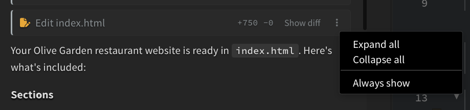
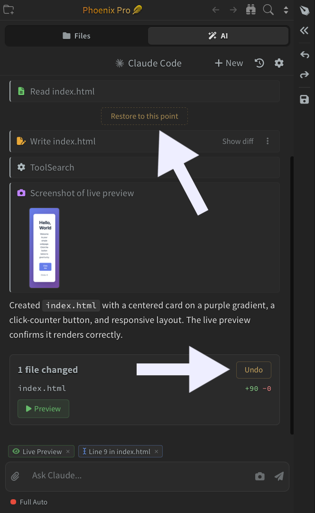

## Reviewing Diffs

Every edit card shows the number of lines added and removed, along with a **Show diff** button that toggles a unified diff of the change inline. Click the **three-dot menu** on the card to:

- **Expand all** - open every diff section on the card at once
- **Collapse all** - hide every diff section on the card
- **Always show** - keep diffs open by default on future edits without clicking Show diff each time

## Undo and Restore

Before each AI response that edits files, Phoenix Code creates a **restore point**. Each edit summary card has a button to revert to that point: it reads **Undo** on the most recent response and **Restore to this point** on earlier ones. Both do the same thing: they roll your files back to the saved state.

The first time you undo or restore in a session, Phoenix Code shows a confirmation dialog before reverting.

> Restore only reverts changes made by the AI. Edits you made outside the AI panel are not tracked and may be lost if they overlap with files the AI also edited. For full version history, use version control like Git.

