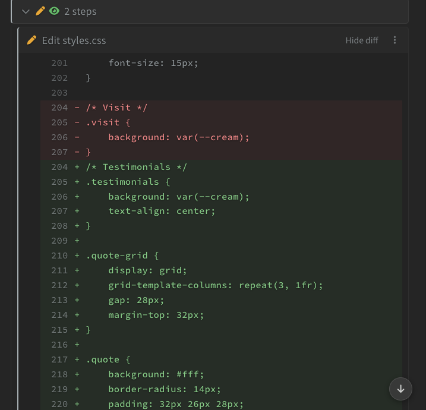
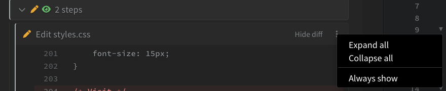
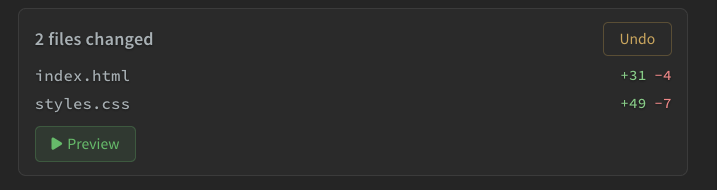
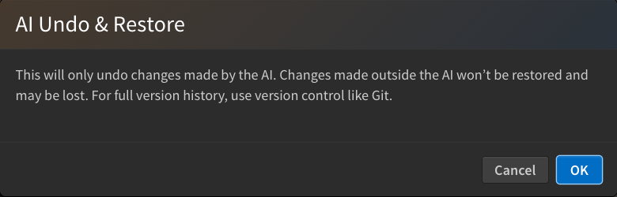

import React from 'react';
import VideoPlayer from '@site/src/components/Video/player';

## Reviewing Diffs

Every file the AI edits or creates gets a card in the chat, like **Edit styles.css**. Click the file name to open it in the editor. Click **Show diff** to see the change inline, with the removed lines in red and the added lines in green.

The **three-dot** button on the card opens the diff options:

- **Expand all**: Opens the diff on every edit card in the chat.
- **Collapse all**: Closes them all.
- **Always show**: Opens the diff on every new edit card as it arrives. Click it again to turn it off.

> Edits go through the editor. Open files update in place, the Live Preview refreshes, and your own undo history in the editor is kept.

## Undo and Restore

When a response changes files, a summary card closes it: **2 files changed**, with the lines added and removed in each file. Click a file to open it.

Phoenix Code keeps a restore point for every response that changes files:

- **Undo** on the latest summary card rolls the files back to how they were before that response.
- **Restore to this point** on an earlier card, or on the card above the first edit of the session, rolls back everything after that point. Files the AI created after it are deleted.

The first time you undo or restore in a session, Phoenix Code asks you to confirm:

After a restore, the card you used reads **Restored**, and the Live Preview shows the restored page.

<VideoPlayer
  src="https://docs-images.phcode.dev/videos/ai/ai-undo.mp4"
/>

> Restore only reverts changes made by the AI. Edits you made yourself to the same files may be lost. For full version history, use version control like Git.

Restore points live with the conversation. They are gone when you start a new chat, resume an older session, or switch projects.

## Preview

When the AI edits the HTML page that is open in the editor, the summary card also offers a **Preview** button. It opens the Live Preview in Preview Mode and gives it the whole editor area, so you can look at the result. The button reads **Previewing** while that view is on.
