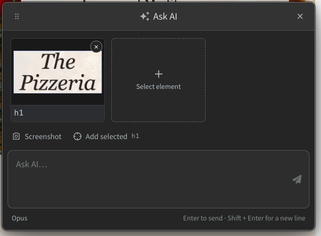
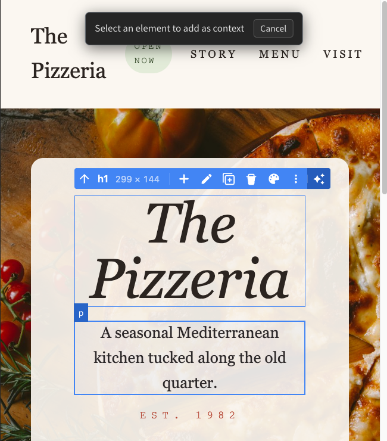
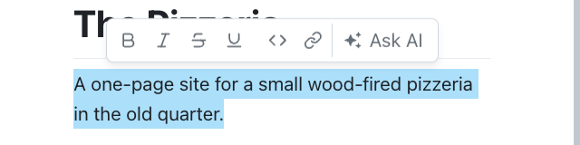
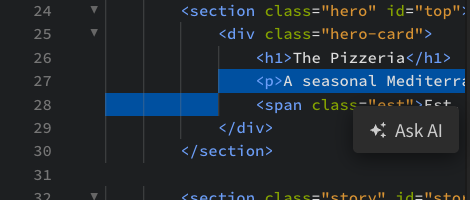
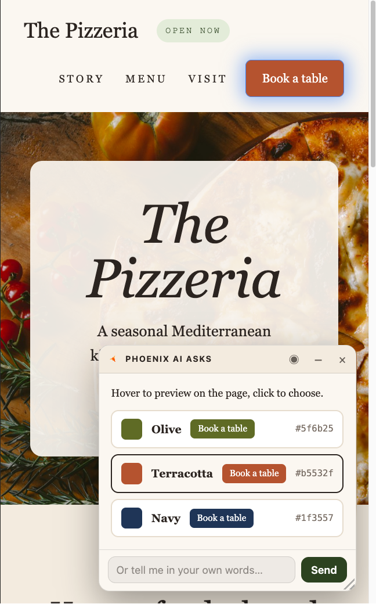
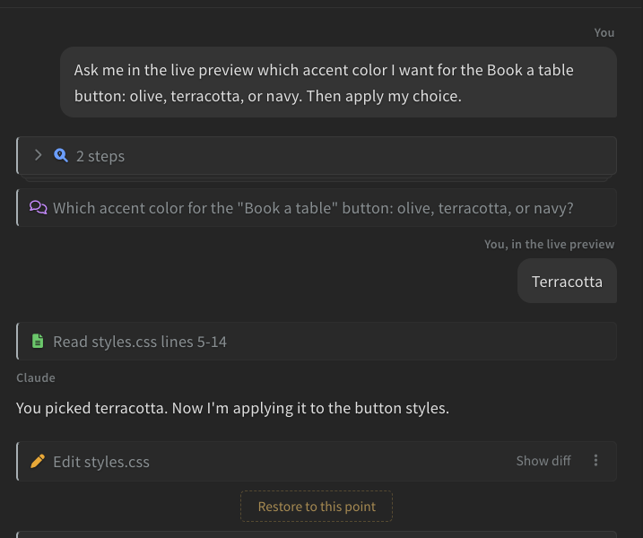

import React from 'react';
import VideoPlayer from '@site/src/components/Video/player';

**Ask AI** lets you ask about the thing you are looking at: an element in the Live Preview, a passage in a Markdown page, or a selection in the code. Your question goes to the AI panel with a screenshot or the exact source location attached, so you don't have to describe where it is.

<VideoPlayer
  src="https://docs-images.phcode.dev/videos/ai/ai-ask-element.mp4"
/>

## Asking About an Element

Select an element in the Live Preview in [Edit Mode](../02-Live%20Preview/02-live-preview-edit.md). The element toolbar ends with an **Ask AI** button *(sparkle icon)*:

Click it. The **Ask AI** dialog opens with a screenshot of the element already attached, labelled with its selector, like `h1` or `div.card`. Hover the label to see the file and line it comes from.

Type your question and press `Enter`, or click **Send to Visual AI**. The chat shows your message with the screenshot, and the AI gets the selector and the source location along with it.

The dialog can carry more than one thing:

- **Select element** *(the dashed card)*: Pick another element on the page. The page dims, and the element under the pointer is outlined. Click it to attach it, or press `Esc` to cancel.
- **Add selected**: Attaches the element that is currently selected in the preview.
- **Screenshot**: Draw a rectangle over any part of the window and attach it.

Up to 10 images can go with one question. Click the **x** on a card to remove it. The dialog keeps your draft when you close it, switch files, or close the Live Preview, so you can come back to it.

> Drag the dialog by its header to move it. Double-click the header to put it back.

The **Ask AI** button *(sparkle icon)* in the Live Preview toolbar opens the same dialog without attaching anything. To hide the Ask AI buttons in the preview, turn off **Show Ask AI** in the Live Preview mode dropdown.

## Asking About Markdown

In the Markdown Live Preview, select some text. The toolbar that appears above it ends with **Ask AI**:

Click it to attach the selection to the dialog as a card showing the file name, the first lines, and the line range in the source. Click the card later to jump back to that spot.

## Asking About Code

Select some code in the editor. A small toolbar appears above the selection with an **Ask AI** button:

Click it to attach the exact range to the dialog. The AI reads those lines from the editor, so it sees unsaved changes too. To hide this button, right-click in the editor and turn off **Show Ask AI**.

## Sending to a CLI

The dialog sends to whichever assistant the AI panel is showing. When the panel is on **Claude Code CLI** or **Codex CLI**, the send button reads **Transfer to Claude Code CLI** or **Transfer to Codex CLI**. The question is pasted into the CLI's prompt, with a note about what is attached, and the CLI fetches the screenshots and code when it reads the question. Review the prompt and press `Enter` in the terminal to send it.

> The CLI must be connected to Phoenix and waiting at its prompt. See [Claude Code CLI and Codex CLI](./06-ai-cli.md#connected-to-phoenix).

## Questions in the Live Preview

Sometimes the AI asks you something that is easier to answer by looking at the page: which of two layouts, which color, which element. It then shows a **Phoenix AI asks** card inside the Live Preview, with options it built for the question.

Hover an option to preview it on the page, and click it to answer. You can also type an answer in the box at the bottom of the card. The card can be dragged and resized, and the **minimize** button tucks it into a pill at the corner of the page until you need it.

When the question is about one element, the page is dimmed around it. Click the **focus** button in the card header to see the page as it is.

Your answer appears in the chat as **You, in the live preview**, and the AI carries on with it. To skip the question, click **Cancel** on its card in the chat, or close the card in the preview.

## Notifications

When the AI finishes something while you are not looking at the chat, it can show a notification in the editor window. Click **View chat** on it to open the panel.
