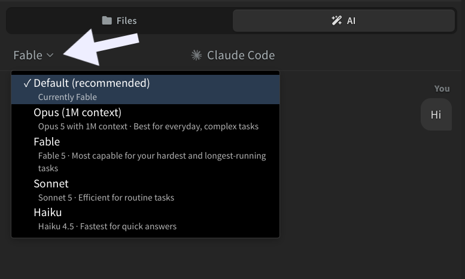
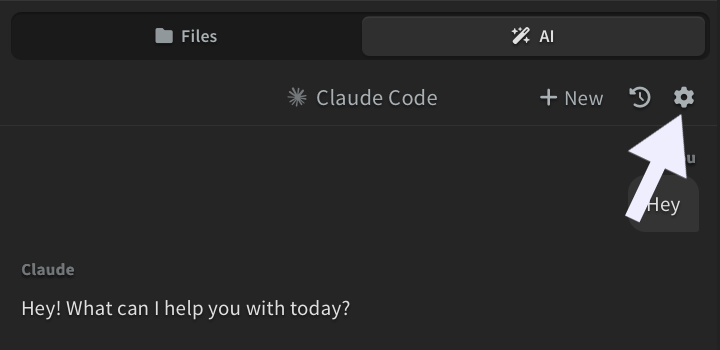
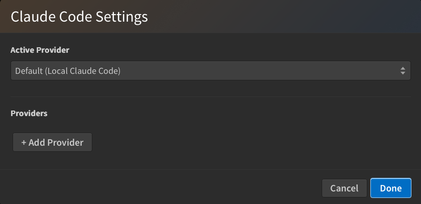

## Choosing a Model

The chat header shows which model is answering you. Hover over the panel and the model name appears on the left. Click it to pick a different one.

The dropdown lists:

- **Default**: lets Claude Code pick. The row shows which model that is right now, for example *Currently Fable*.
- The models your provider offers, such as **Fable**, **Opus**, **Sonnet**, and **Haiku**. Fable appears only on plans that include it.

You can switch models in the middle of a chat. The new model takes over from your next message and keeps the conversation history.

## Settings

Click the **gear icon** in the chat panel to open AI settings.

This will open a dialog where you can:

- Pick the **active provider** from a dropdown at the top
- Add a custom API provider with a name, API key (masked), and base URL
- Edit or delete any custom provider you've added
- Set a custom API timeout

When a custom provider with a base URL is active, the chat shows a one-time **Using custom endpoint: \<hostname\>** notice on your next message.

### Compatible providers

Phoenix Code uses the Claude Code CLI under the hood, so it works with any provider that exposes an Anthropic-compatible API.

- **Anthropic Claude** (default): recommended; gives the best results. Create an API key at [platform.claude.com](https://platform.claude.com).
- **z.ai GLM**: tested working as a drop-in alternative. Use z.ai's Anthropic-compatible endpoint as the base URL.
- **Other Anthropic-API-compatible providers**: add the provider's base URL and API key in the dialog above.

> The Claude Code CLI must be installed even when a custom provider is active. See [Setup](./01-ai-setup.md).
