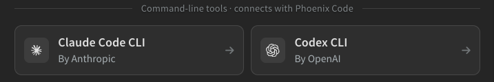
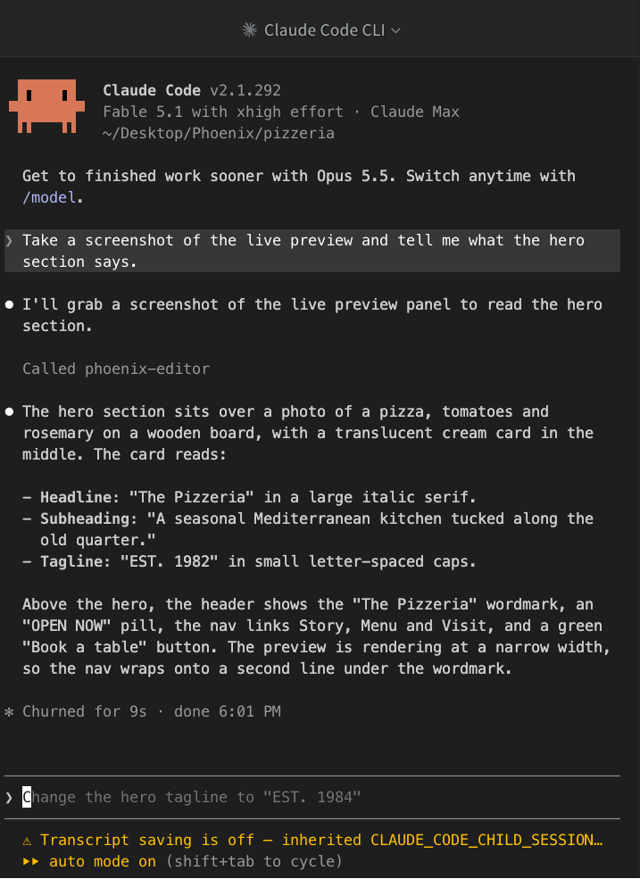
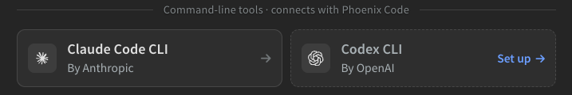
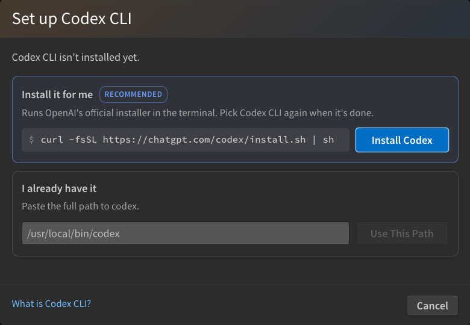
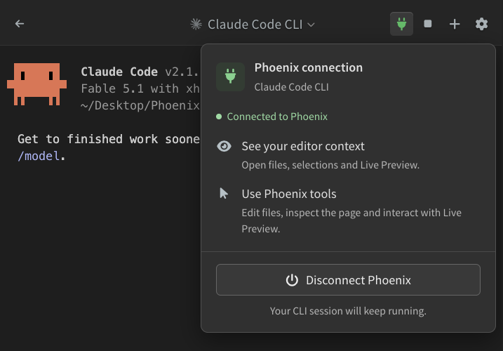
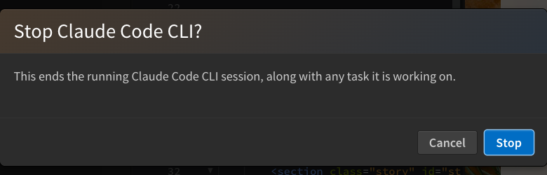

import React from 'react';
import VideoPlayer from '@site/src/components/Video/player';

:::info Pro Feature
[Upgrade to Phoenix Code Pro](https://phcode.dev/pricing) to access this feature.
:::

If you already work with **Claude Code** from Anthropic or **Codex** from OpenAI, you can run them inside the AI panel. The CLI runs in a real terminal, started in your project folder, and is connected to the editor: it sees the file you are editing, your unsaved changes, and the Live Preview, and it can use Phoenix Code's tools to take screenshots, inspect the page, and open files.

Everything you type goes to the CLI itself. Its prompts, slash commands, permission questions, and model picker are its own. The CLI also uses its own login, so Claude Code bills your Claude account and Codex bills your ChatGPT or OpenAI account.

<VideoPlayer
  src="https://docs-images.phcode.dev/videos/ai/ai-cli.mp4"
/>

## Opening a CLI

On the start screen, the **Command-line tools** rows list both CLIs. Click one to start it. You can also pick it from the dropdown in the panel header.

The terminal appears in the panel once the CLI is up, and the header changes to the CLI's name. Claude Code is bundled with Phoenix Code, so it starts right away. On the first run in a folder, the CLI may ask you to trust the folder, and Codex may ask you to review Phoenix Code's hooks. Choose **Trust all and continue** so the CLI receives the editor state with each prompt.

Both CLIs can run at the same time, and they keep running while you look at the other one, at Visual AI, or at another sidebar tab. A green dot on the row marks a running CLI.

> Free users can still run the CLIs from the bottom Terminal panel. Pick a CLI row and click **Open in Terminal**. The CLI then runs on its own, without the Phoenix Code connection.

### Setting Up a CLI

When a CLI is not installed, its row reads **Set up**:

Click it to open the setup dialog:

- **Install it for me**: Runs the official installer in the built-in terminal. Pick the row again when it finishes.
- **I already have it**: Paste the full path to the CLI and click **Use This Path**. Phoenix Code checks that it runs before saving it.

The saved path is shown in [AI Settings](./09-ai-models-providers.md#settings). Clear it to go back to automatic detection.

## Connected to Phoenix

The **plug** icon in the header shows the connection. Green means the CLI is connected. Click it to see what the connection gives the CLI, and to turn it off or on for this session:

While connected, the CLI:

- Receives a line with every prompt that names the file you are editing, which open files have unsaved changes, and what the Live Preview shows.
- Can take screenshots of the editor and the Live Preview, run JavaScript in the page, resize the preview, read lint problems, open files and jump to lines, search Unsplash, show notifications, and ask you questions inside the Live Preview. These appear in the terminal as `phoenix-editor` tools.
- Works on what you see. Before the CLI reads or edits a file with unsaved changes, Phoenix Code saves it. After the CLI edits a file, the open document updates in place. If you typed in that file in the meantime, your text is kept and Phoenix Code asks which version to keep.

Click **Disconnect Phoenix** to run the CLI on its own for the rest of the session, and **Reconnect Phoenix** to connect it again. To start CLIs without the connection, turn off **Connect Claude Code to Phoenix** or **Connect Codex to Phoenix** in [AI Settings](./09-ai-models-providers.md#settings).

> The connection shows **Paused** when a different project is open than the one the CLI started in. See [Switching Projects](#switching-projects).

## Stopping and Restarting

The header has three controls for the session:

- **Back**: Returns to the start screen. The CLI keeps running, and the row shows a green dot. Click the row to come back.
- **New**: Ends the session and starts a fresh one in the current project.
- **Stop**: Ends the session and returns to the start screen.

New and Stop ask you to confirm while the CLI is running, because they also end whatever task it is working on. If the CLI exits on its own, for example after `/exit`, a banner at the bottom of the terminal offers **Restart**.

> CLI sessions are not saved. They end when you close Phoenix Code, and the panel has no history for them.

## Switching Projects

A CLI session stays in the project it started in. When you open another project, a banner over the terminal says so, with two choices:

- **Switch to "NewProject"**: Restarts the CLI in the new project.
- **Stay on "OldProject"**: Keeps the session where it is. The Phoenix connection is paused until you return to that project.

## Sending from Ask AI

When the panel is showing a CLI, the [Ask AI](./05-ai-ask.md) dialog transfers your question into the CLI's prompt instead of the chat. See [Sending to a CLI](./05-ai-ask.md#sending-to-a-cli).

## Differences from Visual AI

- The CLI's own permission modes apply. The Phoenix Code permission bar, the model dropdown, and session history are not shown.
- Edits made by a CLI do not get diff cards, **Undo**, or restore points. Use the CLI's own undo, or version control.
- API usage of connected sessions is added to the [usage card](./08-ai-usage.md#the-usage-card) on the start screen.
- Right-click in the terminal for **Copy** and **Paste**. `Shift + Esc` moves focus back to the editor.
