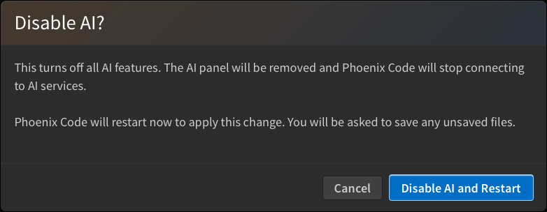

If you don't want AI in your editor, you can switch it off completely. Go to `View > Enable AI` and unselect it. Phoenix Code asks you to confirm with the **Disable AI and Restart** button. Phoenix Code restarts right away to apply the change.

You can also do this from the AI settings dialog, with the **Enable AI features** checkbox.

This turns off everything: the AI tab in the sidebar and the chat panel. To get it back, go to `View > Enable AI` again and confirm with **Enable AI and Restart**.

> This is a user controlled preference. For schools and workplaces, please refer to [AI Control For School And Work](/docs/control-ai).
