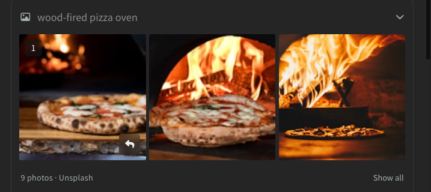
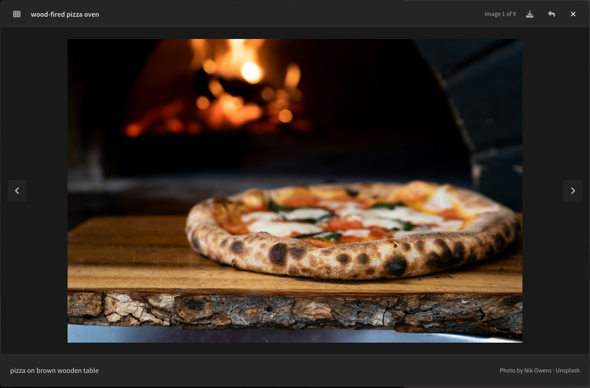

import React from 'react';
import VideoPlayer from '@site/src/components/Video/player';

Ask the AI for pictures and it searches [Unsplash](https://unsplash.com) for you. The results appear in the chat, and the AI can put the photo you want on the page, either linked from Unsplash or downloaded into your project.

<VideoPlayer
  src="https://docs-images.phcode.dev/videos/ai/ai-image-search.mp4"
/>

## Searching

There is no button. Just ask, for example *Find a photo of a wood-fired oven for the story section*. The AI runs a search and shows the results as a card:

- Hover a photo to see its number and a **Reply with this image** button. Click the button to attach the photo to your next message, for example to say *use number 4*.
- Click a photo to open it full size.
- Cards with more than three photos start collapsed to one row. Click **Show all** to see the rest, or **View collage** to see them all side by side.

The AI picks a photo itself when your request is clear enough. By default it links to the photo on Unsplash. Ask for the file to be downloaded, or name a folder, and it saves the photo into your project instead. Downloaded files are added to the file tree right away.

> The AI credits the photographer and Unsplash when it adds a photo. Keep the credit if the site is public.

## The Image Viewer

Clicking a photo opens it over the editor:

- **Previous** and **Next** *(arrows)*, or the `Left` and `Right` keys, move through the results.
- **Download to project and open** *(down arrow icon)* saves the photo into your project and opens it. You are asked where to put it the first time; after that it goes into the same folder.
- **Quote image in chat** *(reply icon)* attaches the photo to your next message.
- **Show all** *(grid icon)* shows every photo of the card at once.

Press `Esc` to close the viewer.

## Limits

Each search returns up to nine photos, and the AI can ask for more pages. Searches are limited to 120 per hour. Free accounts share a monthly search allowance with the Live Preview [Image Gallery](../02-Live%20Preview/07-image-gallery.md). Pro accounts have no monthly limit.
