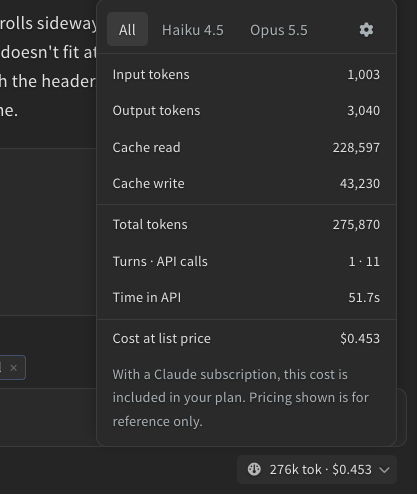
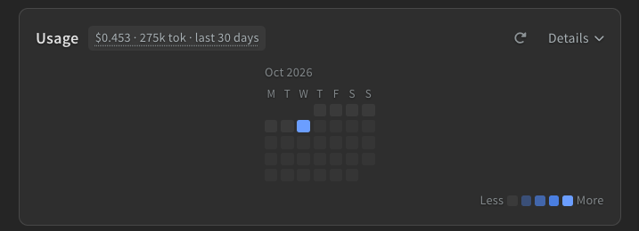
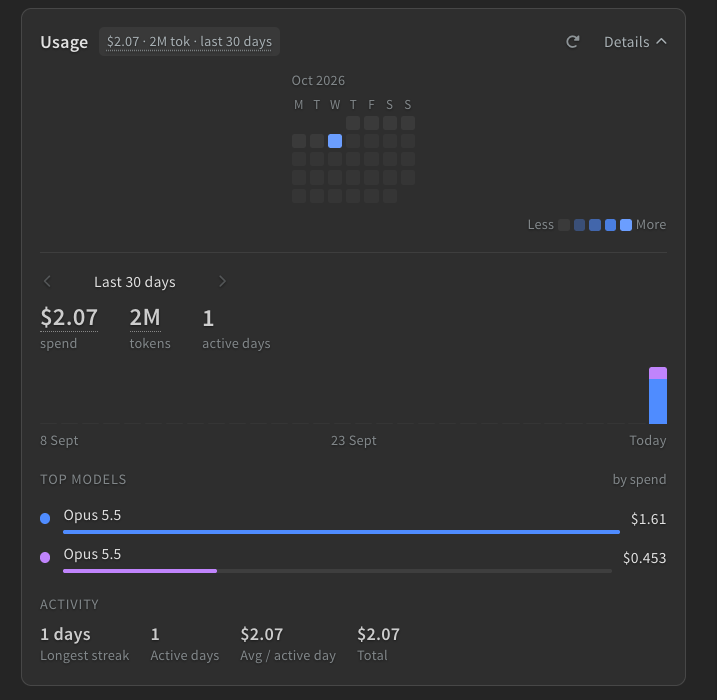

Phoenix Code keeps track of the tokens the AI uses and what they would cost at API list prices. Nothing here is billed by Phoenix Code. With a Claude subscription the cost is included in your plan, and with an API key your provider bills you. The figures are there to help you see what a task costs.

## The Usage Chip

The chip at the bottom right of the chat shows the tokens and cost of the current conversation, like *275k tok · $0.453*. It updates while the AI works. Click it for the details:

- **All** shows the totals for the chat: input and output tokens, cache reads and writes, the number of turns and API calls, time spent in the API, and the cost at list price.
- A tab for each **model** that took part shows its share.
- The **gear** tab has two options. **Show usage after every turn** adds a line under each reply with that turn's tokens, API calls, time, model, and cost. **Show $ cost** turns the cost figures on or off everywhere.

> Most tokens in a chat are cache reads, which are much cheaper than fresh input. The cost figure already takes that into account.

The chip resets when you start a new conversation. Session history shows the totals of each saved session.

## The Usage Card

After your first chat, a **Usage** card appears on the start screen. Its header sums up the last 30 days, and the heat map below shows each month, with the busiest days darkest.

Click the card, or **Details**, to open the breakdown:

- The headline figures show spend, tokens, and active days for the period. Hover a figure to see the split by kind of token.
- The bars show each day, split by model. Hover a bar or a heat map cell for that day's numbers.
- **Top models** lists the top five models by spend, or by tokens when **Show $ cost** is off. Click **See more** for the rest.
- **Activity** shows your longest streak, active days, and the average per active day.
- The arrows next to **Last 30 days** page back through earlier months.

The **reload** button *(circular arrow)* fetches the latest figures, for example after a chat in another Phoenix Code window or on another computer.

The card counts every Visual AI turn, and the API calls of [CLI sessions](./06-ai-cli.md) started from the panel with the Phoenix connection on, listed as `cli-` models. Usage belongs to your Phoenix Code account, so chats from every computer you sign in on are counted.

## Free Account Limits

Free accounts get a daily and a monthly limit on Visual AI chats. Every message you send counts as one chat, including messages queued while the AI works. Once you pass half of either limit, a bar above the message box shows how many you have used, like *3 / 5 daily chats used*. Click its **x** to hide it.

When a limit is reached, the bar says so with a link to [Phoenix Code Pro](https://phcode.dev/pricing), and the message box is disabled until the limit resets: the next day for the daily limit, the next month for the monthly one. Pro removes both limits.
