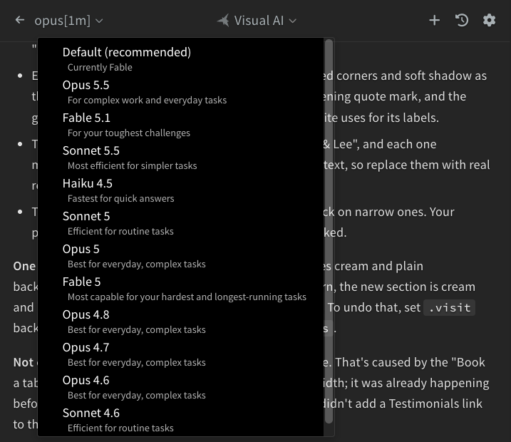
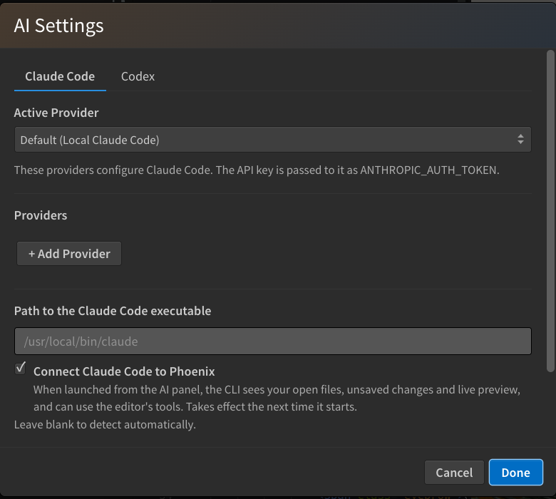
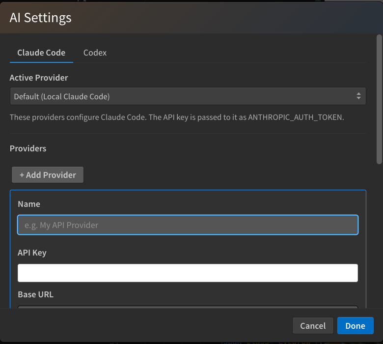

## Choosing a Model

The model name sits at the left of the panel header. It appears when you move the pointer over the panel. Click it to pick a different model.

- **Default**: Lets Claude Code pick, using the model setting of your Claude account. Once you have sent a message on Default, the row shows which model that is, for example *Currently Fable*.
- The models you can pick, with a short description of each. The list is refreshed from Claude Code after your first reply.

You can switch models in the middle of a chat. The new model takes over from your next message and keeps the conversation history, and a notice in the chat confirms the switch. The first reply after a switch can take a little longer. The message box placeholder shows which model you are talking to, like *Ask Opus 5.5...*.

> The model dropdown belongs to Visual AI. In a CLI session, pick the model inside the CLI.

## Settings

Click the **gear** button in the panel header, or the **AI Settings** link on the start screen, to open the settings dialog.

The dialog has a tab for each CLI: **Claude Code**, which also covers Visual AI, and **Codex**. Each tab has:

- **Active Provider**: Which provider to use. **Default (Local Claude Code)** uses Claude Code's own login, and **Default (Local Codex)** does the same for Codex. A provider on the Claude Code tab applies to Visual AI and to Claude Code CLI sessions started from the panel.
- **Providers**: The custom providers you have added, with **Edit** and **Delete** buttons.
- **Path to the executable**: Where the CLI is installed. Leave it blank to let Phoenix Code find it.
- **Connect to Phoenix**: Whether a CLI started from the panel is connected to the editor. See [Claude Code CLI and Codex CLI](./06-ai-cli.md#connected-to-phoenix).

At the bottom, **Enable AI features** switches AI on or off. See [Turning AI Off](./10-ai-disable.md). Click **Done** to save your changes, or **Cancel** to drop them.

### Adding a Provider

Click **+ Add Provider** to use your own API key or endpoint:

- **Name**: Any name you like.
- **API Key**: Your key. It is stored encrypted on this computer.
- **Base URL**: The endpoint of the provider. Leave it blank to use the provider's default.
- **API Timeout (ms)**: How long to wait for a reply. Claude Code only.

Click **Save Provider**, then pick it under **Active Provider** and click **Done**. When a provider with a base URL is active, the chat shows a one-time **Using custom API endpoint** notice on your next message.

With a provider active on the Claude Code tab, Visual AI skips the Claude login.

### Compatible Providers

- **Anthropic Claude** (default): Recommended. Create an API key at [platform.claude.com](https://platform.claude.com).
- **z.ai GLM**: Tested working as a drop-in alternative. Use z.ai's Anthropic-compatible endpoint as the base URL.
- **Other Anthropic-compatible providers**: Add the provider's base URL and API key on the Claude Code tab.
- **OpenAI-compatible providers**: Add them on the Codex tab. They apply to the Codex CLI.
