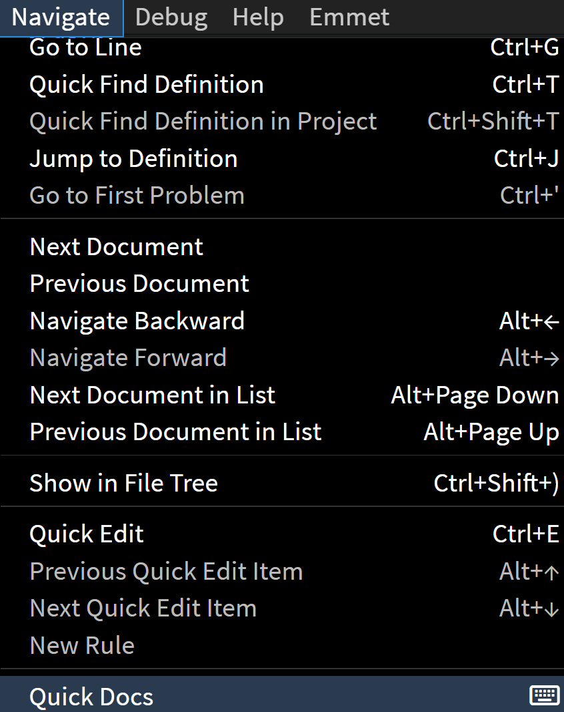
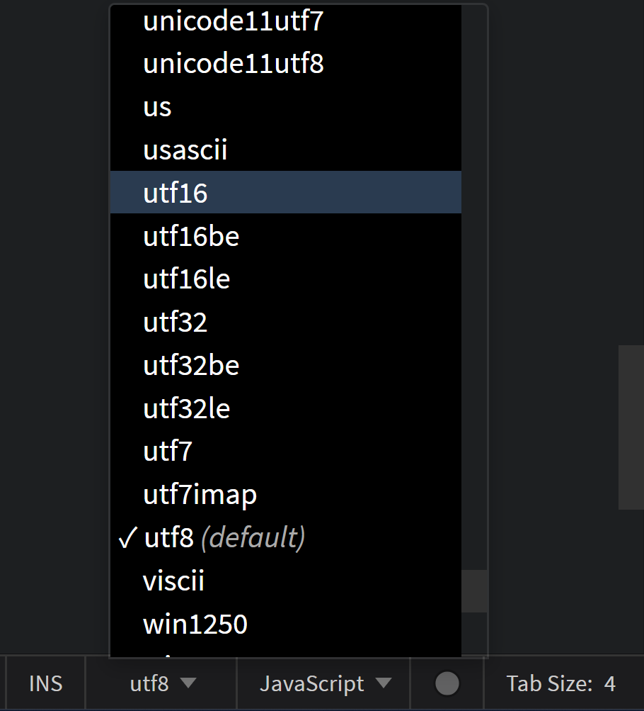

---

import React from 'react';
import VideoPlayer from '@site/src/components/Video/player';

## Multi Cursor
Using **Multi-Cursor**, you can place multiple cursors in different locations, allowing you to edit text simultaneously. This feature is especially useful for making quick, consistent changes across multiple lines or sections of a file.

### Creating multiple cursors 
#### **Using Mouse** : 
Hold the `Alt` key on Windows/Linux (`Option` key on macOS) and `Click` on the desired locations to place additional cursors. To quickly place cursors across multiple lines, drag the mouse while holding the same key.
<VideoPlayer 
  src="https://docs-images.phcode.dev/videos/editing-text/multi_cursor.mp4"
  winLinuxTitle="Multi Cursors: Alt + Click"
  macTitle="Multi Cursors: Option + Click"
/>

#### **Using Keyboard** :
If you want the cursor to be placed in the line above, use `Alt + Shift + Up Arrow` on Windows/Linux and `Option + Shift + Up Arrow` on MacOS.
If you want the cursor to be placed in the line below, use `Alt + Shift + Down Arrow` on Windows/Linux and `Option + Shift + Down Arrow` on MacOS. 

### Switching back to single cursor
To revert back to a single cursor, just press the `Esc` key.

---

## Quick Edit
With the **Quick Edit**, you can edit your CSS file directly within HTML files. 

[Read More](./08-quick-edit.md)

---

## Quick Docs
**Quick Docs** provides immediate access to documentation for code elements directly within the editor.

### Accessing Quick Docs
1. Right click on the element you want details about.
2. A context menu will appear, click on **Quick Docs** or simply press `F1` to bring up Quick Docs directly.

---

## Find in Files
With the **Find in Files**, you can search for specific text across multiple files within a project.

[Read More](./05-find-in-files.md)

---

## File Encoding
**File encoding** is the method used to represent text in a file by converting characters into bytes. We need it to ensure that text is displayed correctly across different platforms and to handle special characters or symbols. Phoenix Code Editor supports multiple file encoding formats.

*`UTF-8`* is the default encoding format in Phoenix.

### Set Encoding of a file
1. Click on the `utf8` button on the status bar. (UTF-8 represents the default encoding format).
2. A list of available encoding formats will appear. Select your desired format, or start typing to filter and find matching options in the drop-down menu.

---

## File Type Associations
**File Type Associations** *(Associating a file type with a language)* allows Phoenix Code Editor to provide language-specific features, such as syntax highlighting, code completion, and error checking, based on the file extension. This ensures that your files are treated according to their intended programming or markup language.

*When you create a new file, if the file extension is recognized, it is associated with the default language. If the extension is unknown, a generic text file is opened.*

### Associate a new file type with a language
To associate a new file type with a specific language in Phoenix Code Editor, use the Language dropdown button in the status bar. For example, if you want files with `.myjs` extension to be treated as JavaScript files, follow these steps:
1. Create a new file with the desired extension. For our example, we create (newfile.myjs). By default, it will be associated with a Text file.
2. Click on `Text` button on the status bar.
3. A list of all the supported languages will appear. Select the language you want to associate with the file type. For our example, we select `JavaScript`.

4. At the top of the popup box, you’ll find an option labeled `Set as default for .myjs files`. Click on it.

Now, files with `.myjs` extension will be treated as JavaScript files.

<VideoPlayer 
  src="https://docs-images.phcode.dev/videos/editing-text/file_association.mp4"
/>

---

## Insert and Overwrite Mode
Users can toggle between **Insert Mode** and **Overwrite Mode** for different text input behaviors.

*Insert Mode is enabled by default when you begin typing in a file.*

### Understanding Insert Mode
When in **Insert Mode**, any text you type is inserted at the current cursor position, pushing the existing text to the right.

### Understanding Overwrite Mode
**Overwrite Mode** replaces the existing text at the cursor position with the new text you type. Instead of pushing text to the right, it overwrites the characters directly under the cursor.

### Toggle between Insert Mode & Overwrite Mode

#### **Using Editor Interface**
Click on the `INS(OVR)` button on the status bar to toggle between Insert Mode and Overwrite Mode. `INS` represents Insert Mode. `OVR` represents Overwrite Mode.

#### **Using Keyboard**
Press the `Ins` or the Insert key to toggle between Insert Mode and Overwrite Mode.

--- 

## Auto Space Detection
The **Auto Space Detection** feature in Phoenix Code Editor is designed to automatically detect and adapt to the indentation style used in your files, whether it’s tabs or spaces.

### Automatic and Fixed Modes
* **Auto mode**: Automatically detects and applies the indentation style (tabs or spaces) based on the existing code in the file.
* **Fixed mode**: Locks the editor to use a specific indentation style, regardless of the existing formatting in the file.

### Toggle between Auto Mode & Fixed Mode

When you open a new file, by default it is set to `Auto` mode, but you can easily switch to `Fixed` mode.

In the editor's status bar, you’ll find the `Auto` button. When clicked, it toggles between `Auto` and `Fixed` modes.

You can toggle between spaces and tab size by clicking the `Tab Size` or `Spaces` button in the status bar.

You can adjust the tab size width or number of spaces by clicking the value in the status bar and modifying it as needed.

### Quick Tips
* If you need to recompute the tab spacing configuration for a file, toggle the `Auto` button twice (switch to Fixed mode and back to Auto). This will refresh the spacing settings for the current file.
* Switching to `Fixed` mode will apply a fixed spacing across the system.
* You can use the `Beautify Code` feature to reformat the file according to the new tab size or spacing settings after making changes(use `Ctrl-B` in Windows/Linux, `Cmd-B` in macOS or `right-click` and select `Beautify Code`).

<VideoPlayer 
  src="https://docs-images.phcode.dev/videos/editing-text/beautify_format.mp4"
  winLinuxTitle="Beautify Code: Ctrl + B"
  macTitle="Beautify Code: Cmd + B"
/>

---

## No-Distractions Mode
**No-Distractions Mode** helps you focus by minimizing visual clutter and hiding non-essential interface elements, creating a clean, minimalist editing environment.

### Activating No-Distractions Mode
#### **Using Editor Interface** : 
Toggle between `No-Distractions` Mode and `Normal` Mode through `View > Menu` option.

#### **Using Keyboard** :
Press `Shift + F11` to toggle between `No-Distractions` Mode and `Normal` Mode.

---

