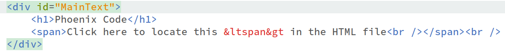
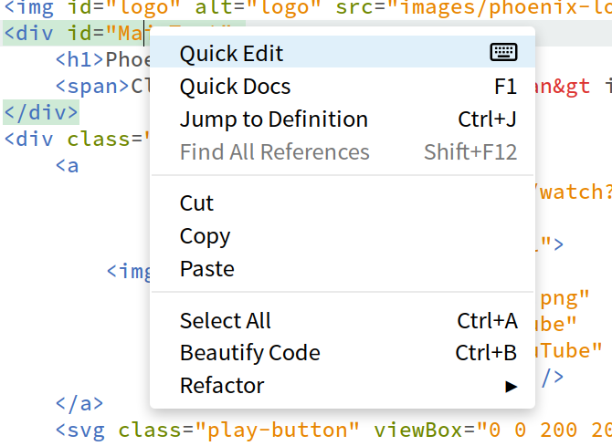

import React from 'react';
import VideoPlayer from '@site/src/components/Video/player';

# Quick Edit

The Quick Edit feature in Phoenix Code allows you to edit CSS files directly within HTML files. This integration enables you to focus on one file at a time, minimizing distractions. When used with the Live Preview functionality, Quick Edit provides instant feedback on your changes, streamlining your workflow and enhancing efficiency.

## How to Use Quick Edit

Follow these steps to utilize the Quick Edit feature effectively:

1. **Position the Cursor**:
   Place the cursor at the location within the HTML file where you wish to initiate Quick Edit.
   
   

2. **Access Quick Edit**:
   You can access the Quick Edit function in one of three ways:
   - **Keyboard Shortcut**: Use `Ctrl + E` (Windows/Linux) or `Cmd + E` (Mac).
   - **Mouse Shortcut**: `Ctrl + click` (Windows/Linux) or `Cmd + click` (Mac).
   - **Context Menu**: Right-click to open the context menu and select Quick Edit.

   

3. **Edit CSS**:
   The Quick Edit window will appear, allowing you to make the necessary CSS adjustments. This window is context-sensitive, showing CSS relevant to the selected HTML element.

   

4. **Save and Close**:
   After making the desired changes, save your edits and close the Quick Edit window to resume your workflow.

## Visual Demonstration

Watch the video below for a step-by-step demonstration of how to use the Quick Edit feature effectively:

<VideoPlayer 
  src="https://docs-images.phcode.dev/videos/quick-edit/quick_edit.mp4"
  winLinuxTitle="Quick Edit Access: Ctrl+click / Ctrl+E"
  macTitle="Quick Edit Access: Cmd+click / Cmd+E"
/>
