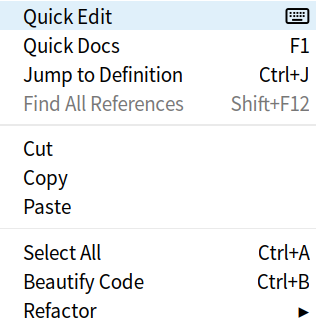

import React from 'react';
import VideoPlayer from '@site/src/components/Video/player';

The Quick Edit feature in Phoenix Code allows you to edit CSS files directly within HTML files. This integration helps you focus on one file at a time, reducing distractions. Using Quick Edit with the Live Preview function provides immediate feedback on your changes, allowing you to adjust your CSS efficiently.

## How to Use Quick Edit

Follow these steps to use the Quick Edit feature:

1. **Position the Cursor**:
   Place the cursor where you need to start Quick Edit in the HTML file.
   
   

2. **Access Quick Edit**:
   You can access Quick Edit in one of three ways:
   - **Keyboard Shortcut**: Press `Ctrl + E` (Windows/Linux) or `Cmd + E` (Mac).
   - **Mouse Shortcut**: Combine `Ctrl + click` (Windows/Linux) or `Cmd + click` (Mac).
   - **Context Menu**: Right-click to open the context menu and choose Quick Edit.

   

3. **Edit CSS**:
   The Quick Edit window will appear, showing the CSS related to your selected HTML element.

   

4. **Save and Close**:
   After you've made the necessary changes, save your edits and close the Quick Edit window to continue your work.

## Visual Demonstration

Watch the video below to see the Quick Edit feature in action:

<VideoPlayer 
  src="https://docs-images.phcode.dev/videos/quick-edit/quick_edit.mp4"
  winLinuxTitle="Quick Edit Access: Ctrl+click / Ctrl+E"
  macTitle="Quick Edit Access: Cmd+click / Cmd+E"
/>
