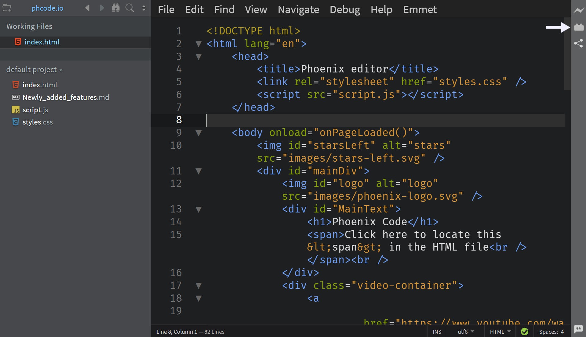
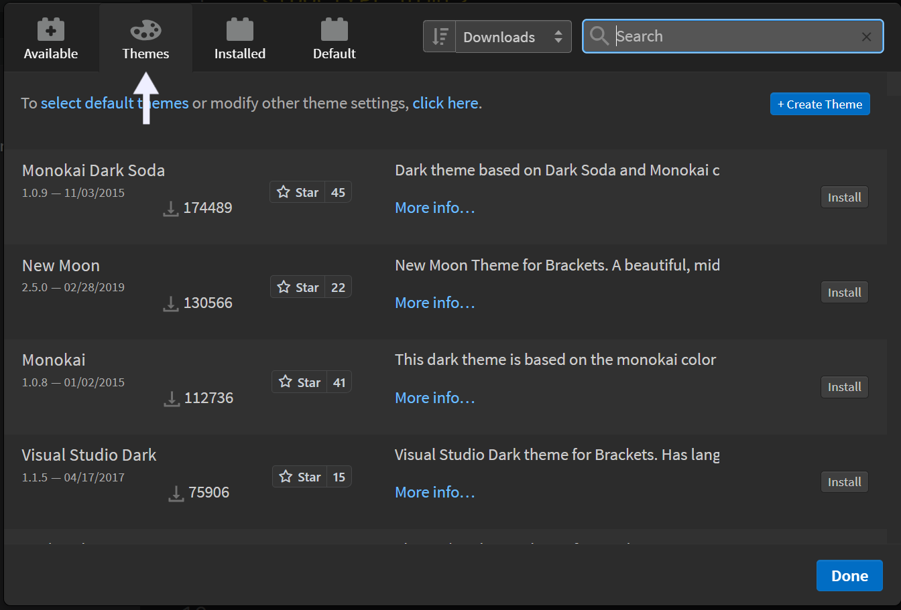
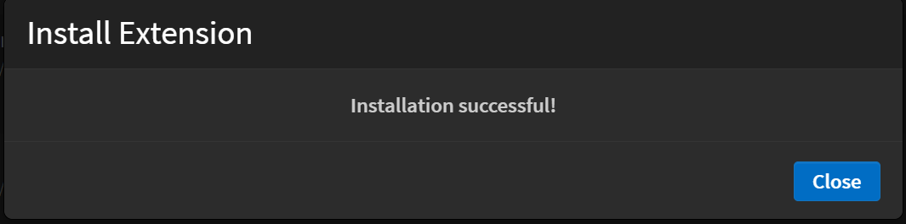
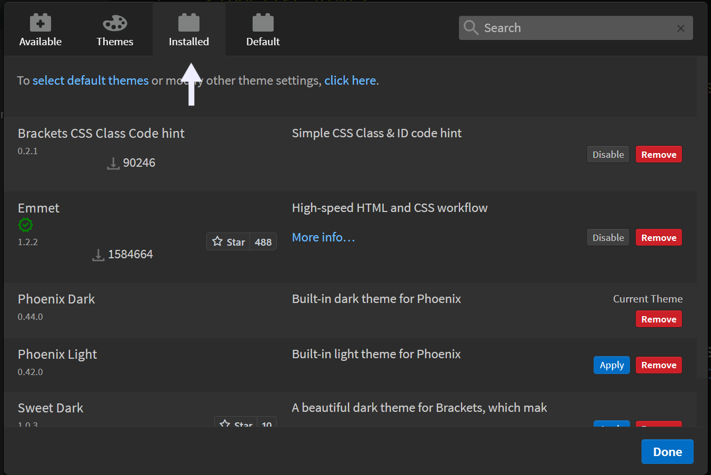
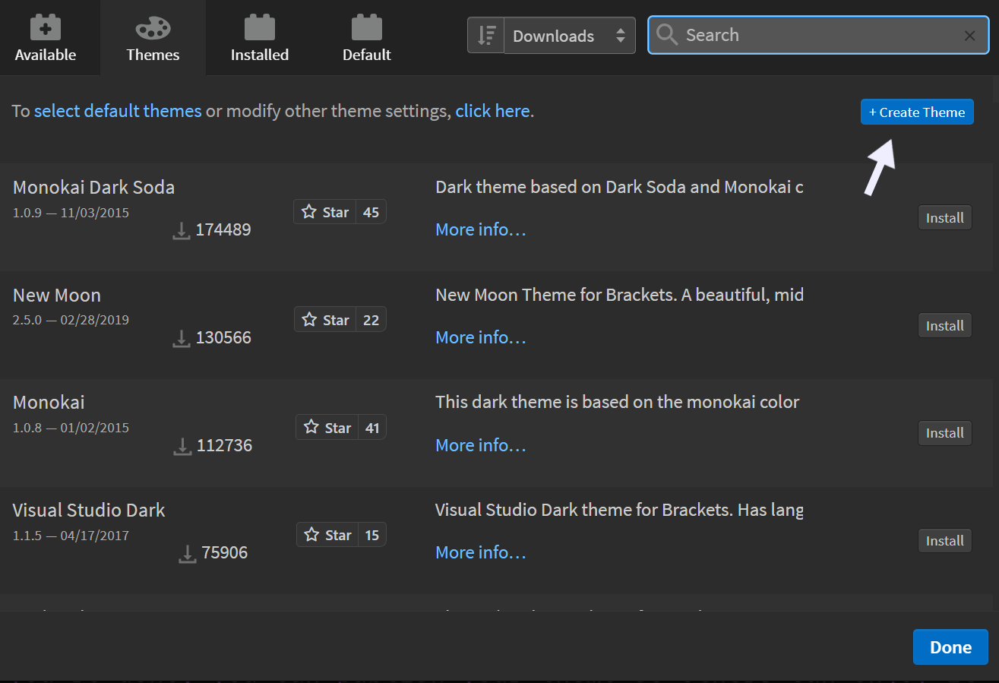
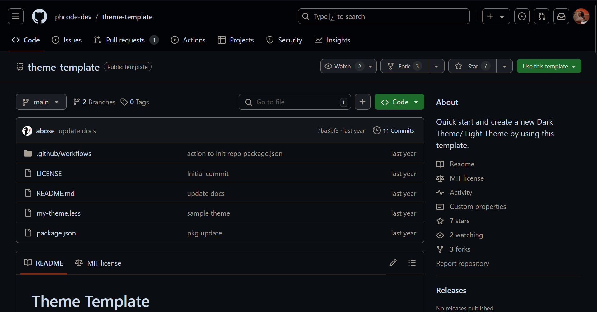
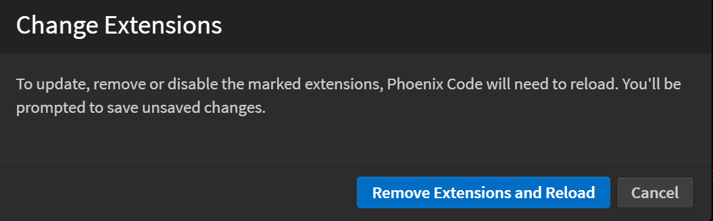

Phoenix Code offers a wide range of themes to match your style whether you prefer the calm of dark mode or dare we say, the boldness of light mode, there's a theme for you. Switching things up is really simple, so you can easily create a coding environment that feels just right. 

## Installing a new theme
1. Click the extension manager button on the right panel.
   
2. The modal window pops up, head to the Themes tab.
   
3. Browse through the list of available themes, pick the one that best suits your needs, and hit Install.
4. A confirmation popup will appear, letting you know the installation was successful. Click 'Close.'
   
   
And just like that, your new theme is now installed. Told you it was easy! 

## Applying a theme
1. Click the extension manager button on the right panel.
2. The modal window pops up, navigate to the Installed tab.
   
3. A list of all the installed extensions will appear, choose the theme and click the 'Apply' button. Finally, click 'Done'.

That's all, your theme is now applied. Happy Coding!

## Creating your own theme.
If no theme pleases your eyes, don't worry. We’ve got you covered! You can create your own theme in Phoenix, and the best part is, other developers can use it too.
1. Click the extension manager icon on the right panel.
2. The modal window pops up, navigate to the Themes tab.
3. In the top right corner, click the 'Create Theme' button.
   
4. You’ll be redirected to Phoenix Code’s official Theme Template repository.
   
5. Use the provided template to design your own theme.
6. Once you're done, you can publish your theme so others can enjoy it too!
   
   
## Removing a theme.
If a theme no longer suits you, no worries! It’s easy to remove.
1. Click the extension manager icon on the right panel.
2. In the modal window, go to the Installed tab.
3. Locate the theme you want to remove & click the Remove button next to it.
4. After closing the modal window, click on 'Remove Extensions and Reload' in the pop-up window that appears.
   
5. The theme will be removed, and you can choose a new one or enjoy the default look!
