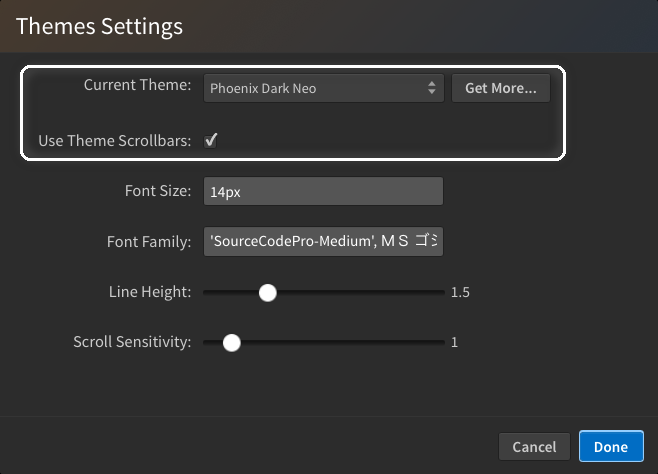
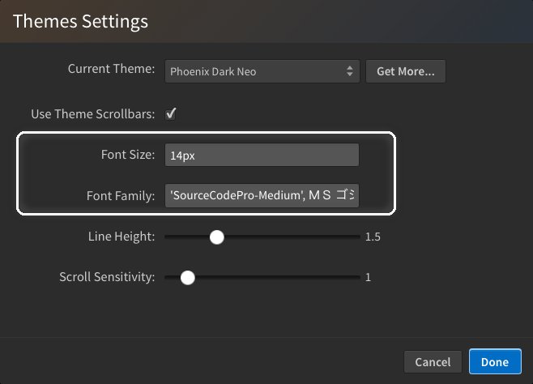
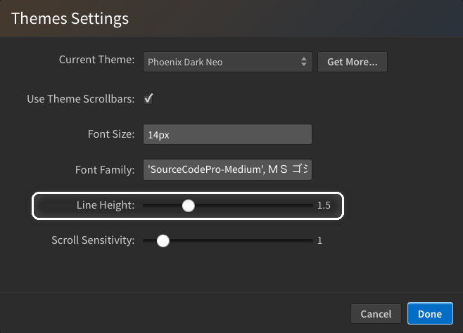
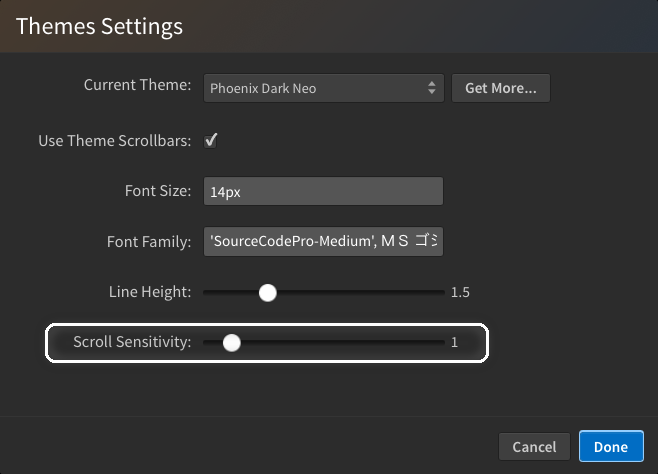
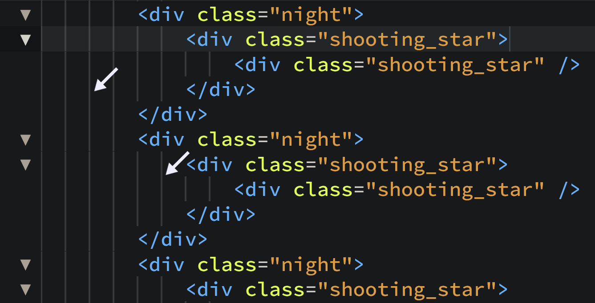
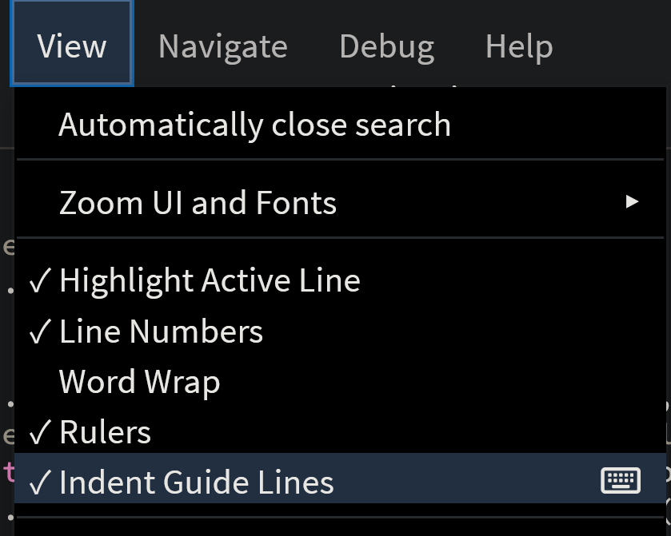
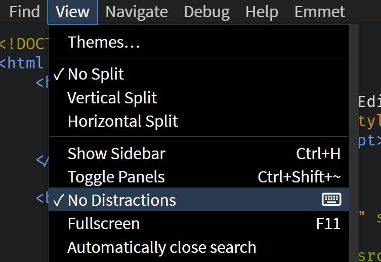

import React from 'react';
import VideoPlayer from '@site/src/components/Video/player';

This section provides an overview of the editor appearance and display settings in **Phoenix Code**.

## Themes

Phoenix Code ships with two built-in themes:

- **Phoenix Dark Neo**: default dark theme
- **Phoenix Light Neo**: default light theme

You can install more themes, create your own, or remove themes you have installed, see [Extensions](./extensions).

### Switching the Theme

Open `View > Themes...` and pick a theme from the **Current Theme** dropdown. The change applies immediately.



Click **Get More...** to browse community themes. See [Extensions](./extensions) for installation steps.

### Use Theme Scrollbars

The **Use Theme Scrollbars** checkbox controls scrollbar styling.

- **On** (default): scrollbars use colors from the active theme.
- **Off**: scrollbars use your operating system's default style.

## Font

Phoenix Code uses **SourceCodePro** as the default editor font. Change the size and family from `View > Themes...`.



### Font Size

Type a value into the **Font Size** field. Accepted units: `px` (1 to 72) or `em` (0.1 to 7.2). Decimals work, e.g. `12.5px`. The default is `12px`.

Keyboard shortcuts to resize the editor text:

| Action | Windows / Linux | macOS |
| --- | --- | --- |
| Increase font size | `Ctrl + Shift + +` | `Cmd + Shift + +` |
| Decrease font size | `Ctrl + Shift + -` | `Cmd + Shift + -` |
| Restore default | `Ctrl + Shift + (` | `Cmd + Shift + (` |

:::note
The shortcuts above change only the editor text size. To zoom the entire interface at once, use these:

| Action | Windows / Linux | macOS |
| --- | --- | --- |
| Zoom in | `Ctrl + +` | `Cmd + +` |
| Zoom out | `Ctrl + -` | `Cmd + -` |

The current zoom level is shown next to **Zoom In** under `View > Zoom UI and Fonts`.
:::

### Font Family

Type a CSS `font-family` string into the **Font Family** field. The first available font in the list is used:

```
'Fira Code', 'JetBrains Mono', monospace
```

Wrap names containing spaces in single quotes. 
> The font must be installed on your system. Phoenix Code only bundles `SourceCodePro` (the default).

## Line Height

The **Line Height** feature lets you customize the vertical spacing between lines of text in the editor.

### Adjusting Line Height

To adjust line height:
1. Click on `View` in the menu bar.
2. Navigate to the `Themes...` option.
3. Use the Line Height slider to set a value between 1 and 3. The default is 1.5.  



Adjustments apply instantly, updating the editor dynamically.

### Modifying Line Height via Preferences

You can also modify the line height by updating the `themes.editorLineHeight` property in the preferences file. [Click Here](./editing-text#editing-preferences) to read on how to edit the preferences.

## Scroll Sensitivity

**Scroll Sensitivity** sets a multiplier for mouse-wheel scroll speed in the editor. Increase it if scrolling feels too slow, decrease it if scrolling feels too fast.

### Adjusting Scroll Sensitivity

1. Click `View` in the menu bar.
2. Select `Themes...`.
3. Use the **Scroll Sensitivity** slider to set a value between `0.1` and `10`. The default is `1` (normal speed).



The new value applies immediately.

### Modifying Scroll Sensitivity via Preferences

Set the `mouseWheelScrollSensitivity` property in the preferences file. Accepts any number from `0.1` to `10`. [Click Here](./editing-text#editing-preferences) to read on how to edit the preferences.

## Indent Guide Lines


**Indent Guide Lines** are vertical lines that help visually align code blocks and indicate indentation levels. They assist in understanding code hierarchy and nested structures, improving overall readability.

### Enabling/Disabling Indent Guide Lines


To enable or disable Indent Guide Lines, go to `View > Indent Guide Lines`.

### Editor Preferences for Indent Guides
You can customize indent guide behavior in the editor preferences with the following options:

[Click here](./editing-text#editing-preferences) to read on how to edit the preferences.

**editor.indentGuides**: Set to `true` to display indent guide lines; set to `false` to hide them.
**editor.indentHideFirst**: Set to `true` to hide the first indent guide line; set to `false` to display it.

## Editor Rulers

Add vertical column rulers to the editor to keep track of line lengths. By
default, a single ruler is set at the 120-character position.

### Enabling and Disabling Rulers

Toggle the visibility of rulers through the `View > Rulers` menu option.


### Adding Multiple Rulers

To add multiple rulers, edit the preferences file. [Click Here](./editing-text#editing-preferences) to read on how to edit the preferences.

Add the following entries to the JSON configuration:

```js
{
    // existing json items
    "editor.rulers": [40, 80],
    "editor.rulerColors": ["green", "#f34d5a"],
}
```

These settings introduce two rulers at the 40th and 80th character positions,
colored green and red respectively.


#### Configuration Options

1. `editor.rulers` : Specifies an array of column numbers where vertical rulers
   will appear.
1. `editor.rulerColors` : An optional array to set colors for each ruler,
   corresponding to the positions listed in `editor.rulers`.

#### Q: How do I add different rulers for each project?

To set up different rulers for individual projects, create a `.phcode.json` file
in the root directory of each project. Include the same ruler configurations as
shown in the example above.

## No-Distractions Mode
**No-Distractions Mode** helps you focus by minimizing visual clutter and hiding non-essential interface elements, creating a clean, minimalist editing environment.

### Activating No-Distractions Mode
#### **Using Editor Interface** :
Toggle between `No-Distractions` Mode and `Normal` Mode through `View > Menu` option.



#### **Using Keyboard** :
Press `Shift + F11` to toggle between `No-Distractions` Mode and `Normal` Mode.
