import React from 'react';
import VideoPlayer from '@site/src/components/Video/player';

This section provides an overview of the core text and code editing features in **Phoenix Code**.

---

## Editing Preferences
You can personalize Phoenix to suit your workflow by adjusting the preferences.

### Open the Preferences File: 
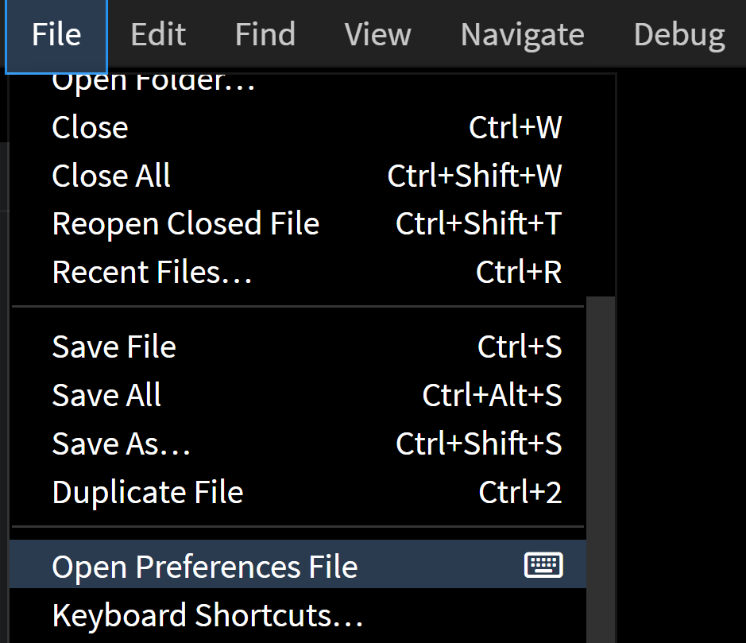
To modify the preferences, go to `File` > `Open Preferences File`.

### Understanding the Preferences Layout
Once selected, two files will appear side by side:
 * defaultPreferences.json (on the left) :- This file is a read-only file containing the default settings.
 * phcode.json (on the right) :- This file is editable and used for any custom preferences you wish to apply.

### Modifying Preferences
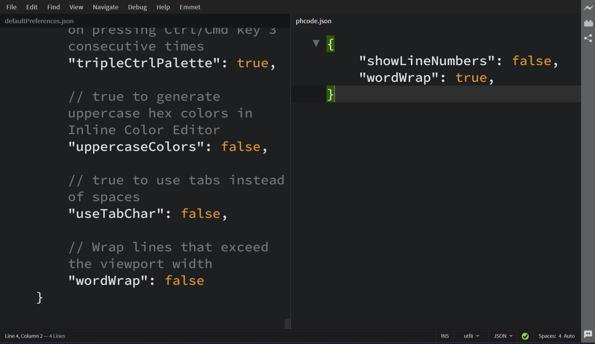
To change a preference, simply write the desired configuration and values in the **phcode.json** and save the file. These custom settings will automatically override the corresponding values in the default preferences.

---

## Multi Cursor
Using **Multi-Cursor**, you can place multiple cursors in different locations, allowing you to edit text simultaneously. This feature is especially useful for making quick, consistent changes across multiple lines or sections of a file.

### Creating multiple cursors 
#### **Using Mouse** : 
Hold the `Alt` key on Windows/Linux (`Option` key on macOS) and `Click` on the desired locations to place additional cursors. To quickly place cursors across multiple lines, drag the mouse while holding the same key.
<VideoPlayer 
  src="https://docs-images.phcode.dev/videos/editing-text/multi_cursor.mp4"
  winLinuxTitle="Multi Cursors: Alt + Click"
  macTitle="Multi Cursors: Option + Click"
/>

#### **Using Keyboard** :
If you want the cursor to be placed in the line above, use `Alt + Shift + Up Arrow` on Windows/Linux and `Option + Shift + Up Arrow` on MacOS.
If you want the cursor to be placed in the line below, use `Alt + Shift + Down Arrow` on Windows/Linux and `Option + Shift + Down Arrow` on MacOS. 

### Switching back to single cursor
To revert back to a single cursor, just press the `Esc` key.

---

## Quick Edit
With **Quick Edit**, you can edit your CSS file directly within HTML files. 

[Read More](./Features/quick-edit)

---

## Quick Docs
**Quick Docs** provides immediate access to documentation for code elements directly within the editor.

### Accessing Quick Docs
1. Right click on the element you want details about.
2. A context menu will appear, click on **Quick Docs** or simply press `F1` to bring up Quick Docs directly.

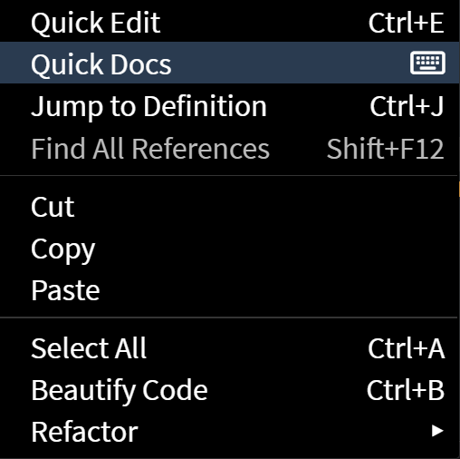

---

## Find in Files
With **Find in Files**, you can search for specific text across multiple files within a project.

[Read More](./Features/find-in-files)

---

## Auto Rename Tag
The **Auto Rename Tag** feature updates matching tags automatically when you rename one. It works with HTML, XHTML, HTM, XML, SVG, PHP, and JSP files.

### How It Works
When you rename an opening or closing tag, the corresponding tag updates instantly.

<VideoPlayer 
  src="https://docs-images.phcode.dev/videos/editing-text/auto-rename-tag.mp4"
/>

### Enabling/Disabling Auto Rename Tag feature
#### Toggle the Feature
To enable or disable the **Auto Rename Tag** feature, go to `Edit` > `Auto Rename HTML Tags`.

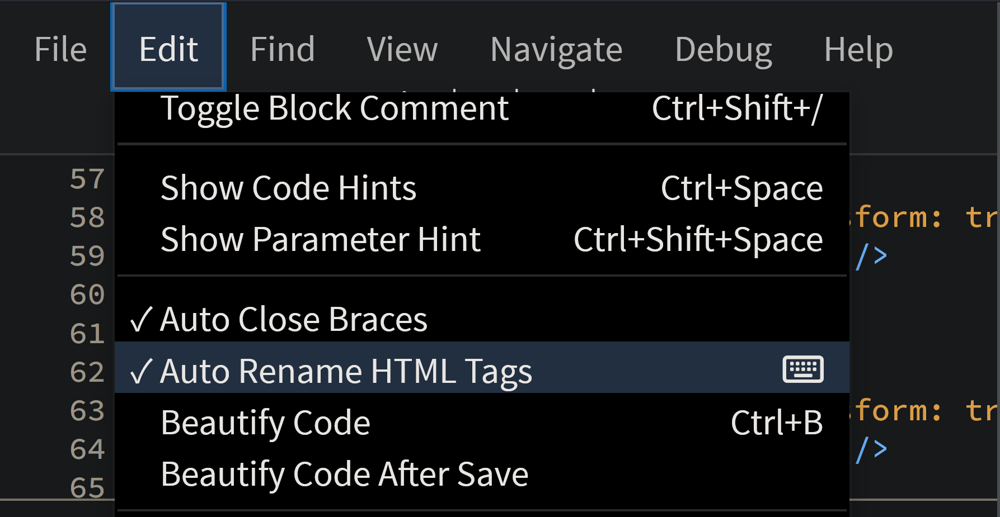

*The **Auto Rename HTML Tags** feature is enabled by default.*

#### Temporary Disabling
To temporarily disable tag synchronization for the current tag:
Press `ESC`.

To re-enable synchronization:
Move your cursor out of the tag and then back into the tag.

<VideoPlayer 
  src="https://docs-images.phcode.dev/videos/editing-text/auto-rename-temp-disable.mp4"
/>

---

## Zoom and Font Size Adjustments
The **Zoom UI and Fonts** options allow you to adjust the overall interface scale and font size.

### Zoom UI 
**Zoom In** :- Enlarges the overall UI, making all elements larger.

**Zoom Out** :- Reduces the overall UI, making all elements smaller.

### Font Size Adjustment 
**Increase Font Size** :- Enlarges the text in the editor without affecting other UI elements.

**Decrease Font Size** :- Reduces the text size in the editor without affecting other UI elements.

**Restore Font Size** :- Resets the editor text to its default size.

### Using Zoom UI and Fonts Options
####  Using Menu
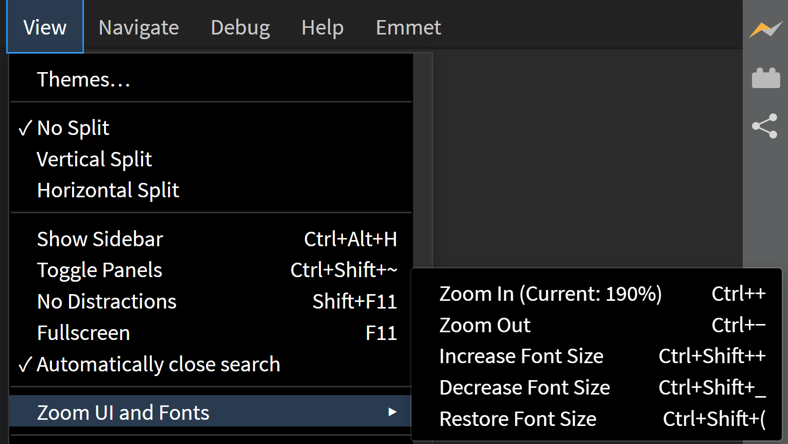

1. Click on "View" in the menu bar.
2. Hover over "Zoom UI and Fonts".
3. Select the desired option from the submenu.

#### Using Keyboard Shortcuts
* **Zoom In**: `Ctrl + +`   (`Cmd + +` on MacOs)
* **Zoom Out**: `Ctrl + -`   (`Cmd + -` on MacOs)
* **Increase Font Size**: `Ctrl + Shift + +`   (`Cmd + Shift + +` on MacOs)
* **Decrease Font Size**: `Ctrl + Shift + -`   (`Cmd + Shift + -` on MacOs)
* **Restore Font Size**: `Ctrl + Shift + (`   (`Cmd + Shift + (` on MacOs)

*Note :- The current zoom level is displayed next to the **Zoom In** option.*

---

## Indent Guide Lines

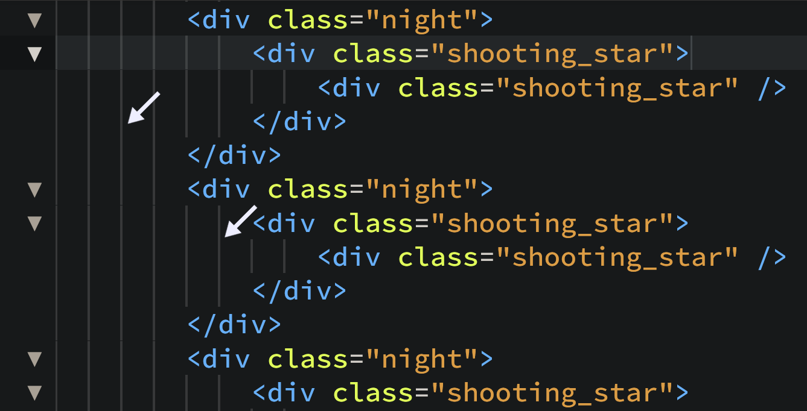
**Indent Guide Lines** are vertical lines that help visually align code blocks and indicate indentation levels. They assist in understanding code hierarchy and nested structures, improving overall readability.

### Enabling/Disabling Indent Guide Lines
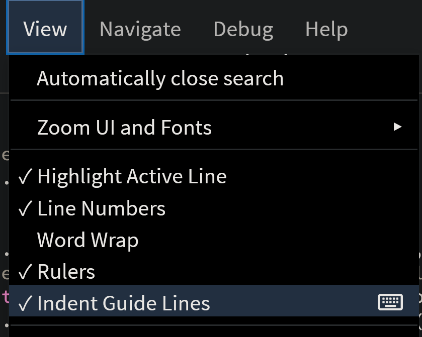

To enable or disable Indent Guide Lines, go to `View > Indent Guide Lines`.

### Editor Preferences for Indent Guides
You can customize indent guide behavior in the editor preferences with the following options:

[Click here](#editing-preferences) to read on how to edit the preferences.

**editor.indentGuides**: Set to `true` to display indent guide lines; set to `false` to hide them.
**editor.indentHideFirst**: Set to `true` to hide the first indent guide line; set to `false` to display it.

---

## File Encoding
**File encoding** is the method used to represent text in a file by converting characters into bytes. We need it to ensure that text is displayed correctly across different platforms and to handle special characters or symbols. Phoenix Code Editor supports multiple file encoding formats.

*`UTF-8`* is the default encoding format in Phoenix.

### Set Encoding of a file
1. Click on the `utf8` button on the status bar. (UTF-8 represents the default encoding format).
2. A list of available encoding formats will appear. Select your desired format, or start typing to filter and find matching options in the drop-down menu.

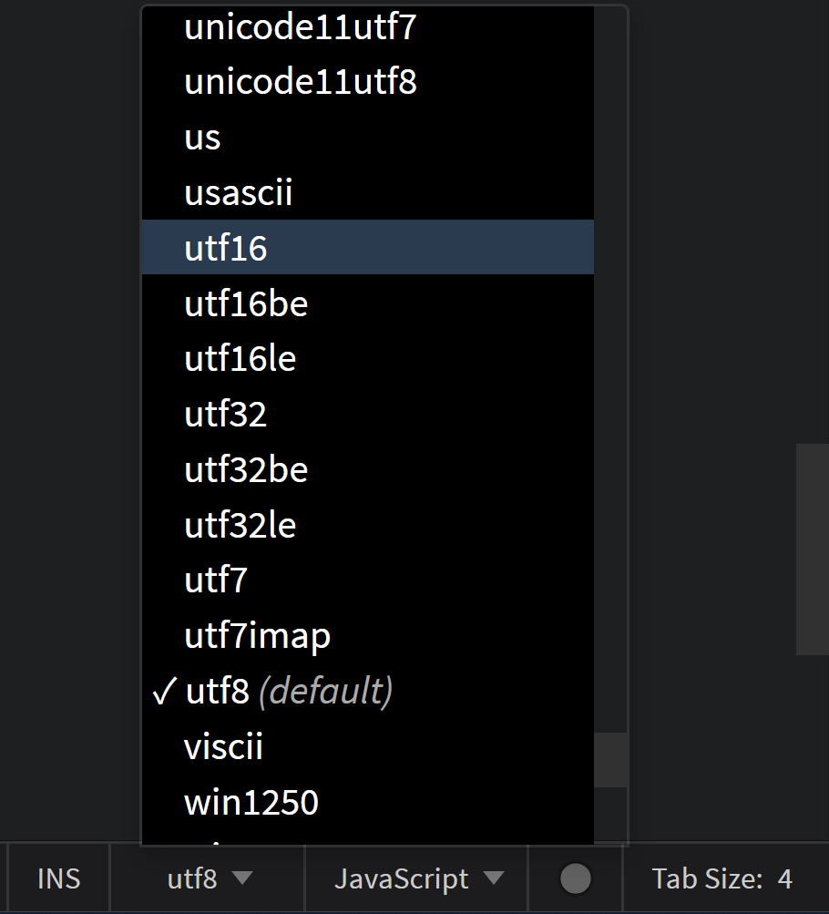

---

## File Type Associations
**File Type Associations** *(Associating a file type with a language)* allows Phoenix Code Editor to provide language-specific features, such as syntax highlighting, code completion, and error checking, based on the file extension. This ensures that your files are treated according to their intended programming or markup language.

*When you create a new file, if the file extension is recognized, it is associated with the default language. If the extension is unknown, a generic text file is opened.*

### Associate a new file type with a language
To associate a new file type with a specific language in Phoenix Code Editor, use the Language dropdown button in the status bar. For example, if you want files with `.myjs` extension to be treated as JavaScript files, follow these steps:
1. Create a new file with the desired extension. For our example, we create (newfile.myjs). By default, it will be associated with a Text file.
2. Click on `Text` button on the status bar.
3. A list of all the supported languages will appear. Select the language you want to associate with the file type. For our example, we select `JavaScript`.

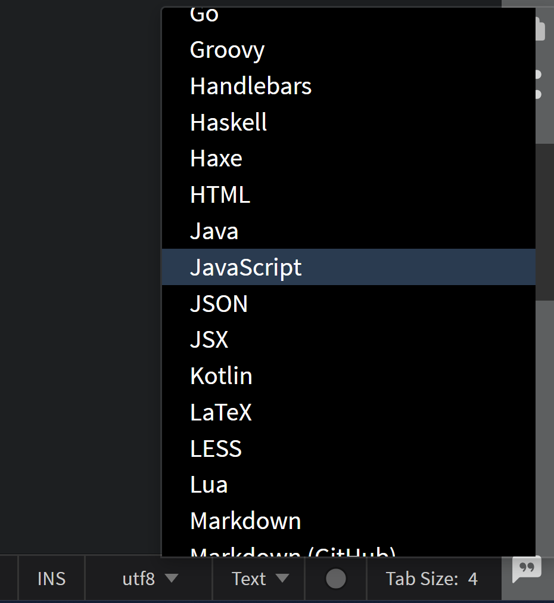

4. At the top of the popup box, you’ll find an option labeled `Set as default for .myjs files`. Click on it.

Now, files with `.myjs` extension will be treated as JavaScript files.

<VideoPlayer 
  src="https://docs-images.phcode.dev/videos/editing-text/file_association.mp4"
/>

---

## Beautify Code
With **Beautify Code**, you can format your code to follow consistent styling rules, improving readability and making it easier to maintain.

[Read More](./Features/beautify-code)

---

## Insert and Overwrite Mode
Users can toggle between **Insert Mode** and **Overwrite Mode** for different text input behaviors.

*Insert Mode is enabled by default when you begin typing in a file.*

### Understanding Insert Mode
When in **Insert Mode**, any text you type is inserted at the current cursor position, pushing the existing text to the right.

<VideoPlayer 
  src="https://docs-images.phcode.dev/videos/editing-text/insert-mode-video.mp4"
/>

### Understanding Overwrite Mode
**Overwrite Mode** replaces the existing text at the cursor position with the new text you type. Instead of pushing text to the right, it overwrites the characters directly under the cursor.

<VideoPlayer 
  src="https://docs-images.phcode.dev/videos/editing-text/overwrite-mode-video.mp4"
/>

### Toggle between Insert Mode & Overwrite Mode

#### **Using Editor Interface**
Click on the `INS(OVR)` button on the status bar to toggle between Insert Mode and Overwrite Mode. `INS` represents Insert Mode. `OVR` represents Overwrite Mode.

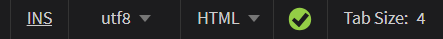

#### **Using Keyboard**
Press the `Ins` or the Insert key to toggle between Insert Mode and Overwrite Mode.

--- 

## Auto Space Detection
The **Auto Space Detection** feature in Phoenix Code Editor is designed to automatically detect and adapt to the indentation style used in your files, whether it’s tabs or spaces.

### Automatic and Fixed Modes
* **Auto mode**: Automatically detects and applies the indentation style (tabs or spaces) based on the existing code in the file.
* **Fixed mode**: Locks the editor to use a specific indentation style, regardless of the existing formatting in the file.

### Toggle between Auto Mode & Fixed Mode

When you open a new file, by default it is set to `Auto` mode, but you can easily switch to `Fixed` mode.

In the editor's status bar, you’ll find the `Auto` button. When clicked, it toggles between `Auto` and `Fixed` modes.

You can toggle between spaces and tab size by clicking the `Tab Size` or `Spaces` button in the status bar.

You can adjust the tab size width or number of spaces by clicking the value in the status bar and modifying it as needed.

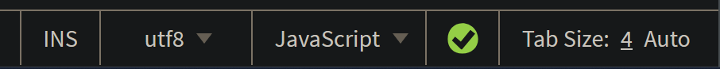

### Quick Tips
* If you need to recompute the tab spacing configuration for a file, toggle the `Auto` button twice (switch to Fixed mode and back to Auto). This will refresh the spacing settings for the current file.
* Switching to `Fixed` mode will apply a fixed spacing across the system.
* You can use the `Beautify Code` feature to reformat the file according to the new tab size or spacing settings after making changes(use `Ctrl-B` in Windows/Linux, `Cmd-B` in macOS or `right-click` and select `Beautify Code`).

<VideoPlayer 
  src="https://docs-images.phcode.dev/videos/editing-text/beautify_format.mp4"
  winLinuxTitle="Beautify Code: Ctrl + B"
  macTitle="Beautify Code: Cmd + B"
/>

---

## No-Distractions Mode
**No-Distractions Mode** helps you focus by minimizing visual clutter and hiding non-essential interface elements, creating a clean, minimalist editing environment.

### Activating No-Distractions Mode
#### **Using Editor Interface** : 
Toggle between `No-Distractions` Mode and `Normal` Mode through `View > Menu` option.

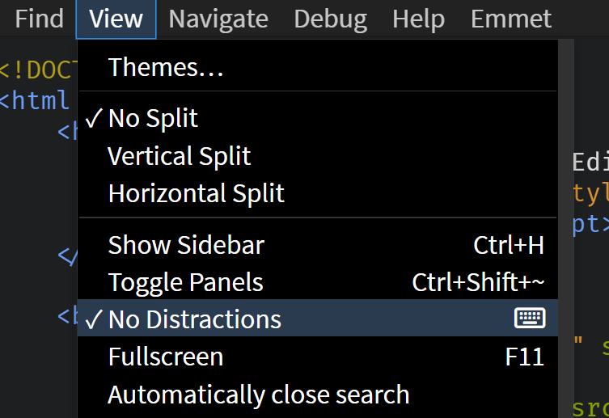

#### **Using Keyboard** :
Press `Shift + F11` to toggle between `No-Distractions` Mode and `Normal` Mode.

---

## File Recovery
Phoenix Code Editor has a built-in file recovery feature to help you retrieve unsaved changes after unexpected events like crashes or accidental closures.

### Recovering Files after a crash
**Reopen the Editor**: If there are any unsaved changes from the previous session, a dialog box will appear, with two options `Discard` and `Restore`.

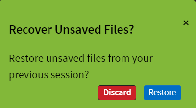

* **Restore Changes**: To recover your unsaved files, simply click the `Restore` button. This action will reinstate all the changes you made to the files before the last save.

* **Discard Changes**: To remove the unsaved changes, click `Discard`.   
*Note: This will permanently delete the data.*

---
