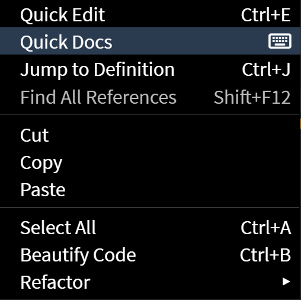
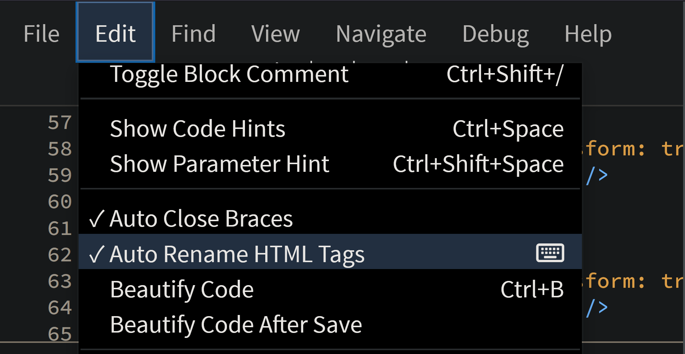
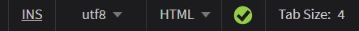
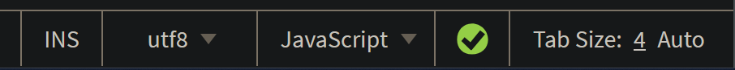
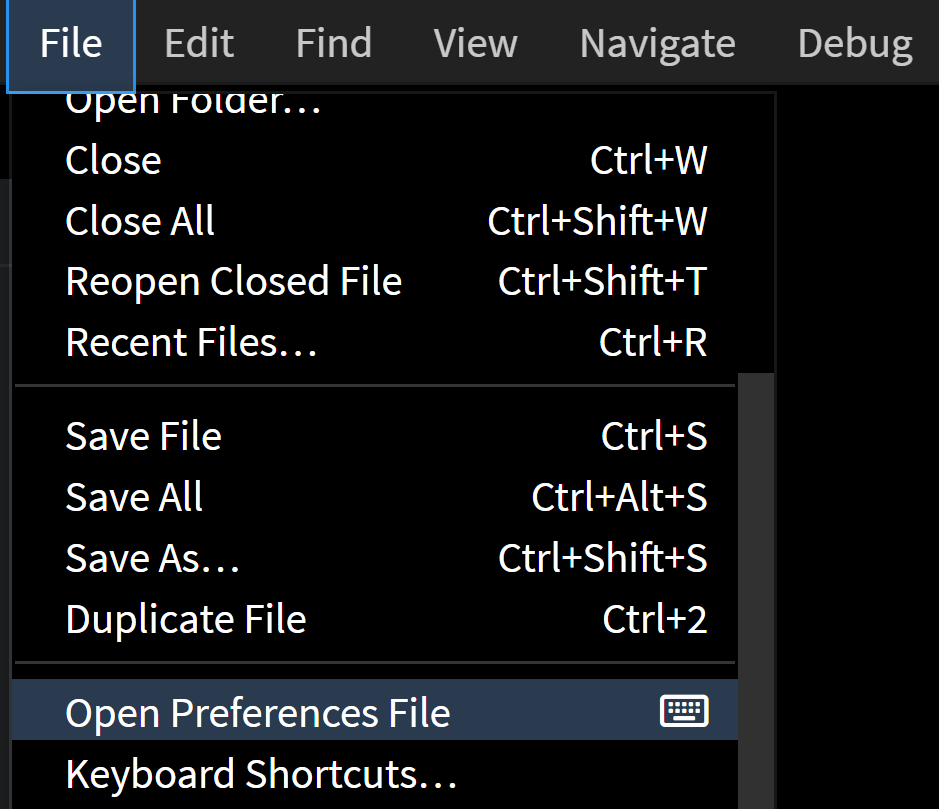
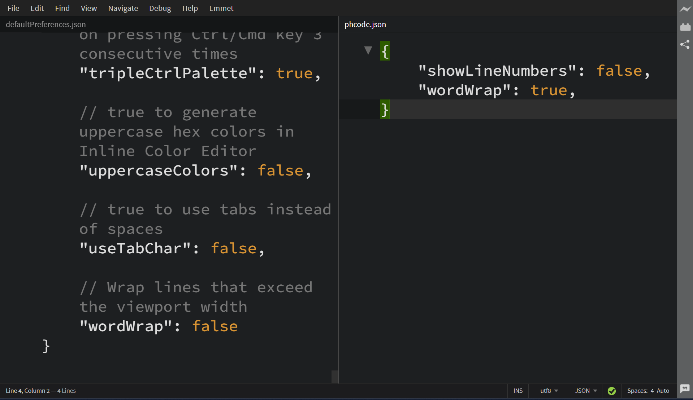

import React from 'react';
import VideoPlayer from '@site/src/components/Video/player';

This section provides an overview of the core text and code editing features in **Phoenix Code**.

## Multi Cursor
Using **Multi-Cursor**, you can place multiple cursors in different locations, allowing you to edit text simultaneously. This feature is especially useful for making quick, consistent changes across multiple lines or sections of a file.

### Creating multiple cursors 
#### **Using Mouse** : 
Hold the `Alt` key on Windows/Linux (`Option` key on macOS) and `Click` on the desired locations to place additional cursors. To quickly place cursors across multiple lines, drag the mouse while holding the same key.
<VideoPlayer 
  src="https://docs-images.phcode.dev/videos/editing-text/multi_cursor.mp4"
  winLinuxTitle="Multi Cursors: Alt + Click"
  macTitle="Multi Cursors: Option + Click"
/>

#### **Using Keyboard** :
If you want the cursor to be placed in the line above, use `Alt + Shift + Up Arrow` on Windows/Linux and `Option + Shift + Up Arrow` on MacOS.
If you want the cursor to be placed in the line below, use `Alt + Shift + Down Arrow` on Windows/Linux and `Option + Shift + Down Arrow` on MacOS. 

### Switching back to single cursor
To revert back to a single cursor, just press the `Esc` key.

## Quick Docs
**Quick Docs** provides immediate access to documentation for code elements directly within the editor.

### Accessing Quick Docs
1. Right click on the element you want details about.
2. A context menu will appear, click on **Quick Docs** or simply press `F1` to bring up Quick Docs directly.

## Auto Rename Tag
The **Auto Rename Tag** feature updates matching tags automatically when you rename one. It works with HTML, XHTML, HTM, XML, SVG, PHP, and JSP files.

### How It Works
When you rename an opening or closing tag, the corresponding tag updates instantly.

<VideoPlayer 
  src="https://docs-images.phcode.dev/videos/editing-text/auto-rename-tag.mp4"
/>

### Enabling/Disabling Auto Rename Tag feature
#### Toggle the Feature
To enable or disable the **Auto Rename Tag** feature, go to `Edit` > `Auto Rename HTML Tags`.

*The **Auto Rename HTML Tags** feature is enabled by default.*

#### Temporary Disabling
To temporarily disable tag synchronization for the current tag:
Press `ESC`.

To re-enable synchronization:
Move your cursor out of the tag and then back into the tag.

<VideoPlayer 
  src="https://docs-images.phcode.dev/videos/editing-text/auto-rename-temp-disable.mp4"
/>

## Insert and Overwrite Mode
Users can toggle between **Insert Mode** and **Overwrite Mode** for different text input behaviors.

*Insert Mode is enabled by default when you begin typing in a file.*

### Understanding Insert Mode
When in **Insert Mode**, any text you type is inserted at the current cursor position, pushing the existing text to the right.

<VideoPlayer 
  src="https://docs-images.phcode.dev/videos/editing-text/insert-mode-video.mp4"
/>

### Understanding Overwrite Mode
**Overwrite Mode** replaces the existing text at the cursor position with the new text you type. Instead of pushing text to the right, it overwrites the characters directly under the cursor.

<VideoPlayer 
  src="https://docs-images.phcode.dev/videos/editing-text/overwrite-mode-video.mp4"
/>

### Toggle between Insert Mode & Overwrite Mode

#### **Using Editor Interface**
Click on the `INS(OVR)` button on the status bar to toggle between Insert Mode and Overwrite Mode. `INS` represents Insert Mode. `OVR` represents Overwrite Mode.

#### **Using Keyboard**
Press the `Ins` or the Insert key to toggle between Insert Mode and Overwrite Mode.

## Auto Space Detection
The **Auto Space Detection** feature in Phoenix Code Editor is designed to automatically detect and adapt to the indentation style used in your files, whether it’s tabs or spaces.

### Automatic and Fixed Modes
* **Auto mode**: Automatically detects and applies the indentation style (tabs or spaces) based on the existing code in the file.
* **Fixed mode**: Locks the editor to use a specific indentation style, regardless of the existing formatting in the file.

### Toggle between Auto Mode & Fixed Mode

When you open a new file, by default it is set to `Auto` mode, but you can easily switch to `Fixed` mode.

In the editor's status bar, you’ll find the `Auto` button. When clicked, it toggles between `Auto` and `Fixed` modes.

You can toggle between spaces and tab size by clicking the `Tab Size` or `Spaces` button in the status bar.

You can adjust the tab size width or number of spaces by clicking the value in the status bar and modifying it as needed.

### Quick Tips
* If you need to recompute the tab spacing configuration for a file, toggle the `Auto` button twice (switch to Fixed mode and back to Auto). This will refresh the spacing settings for the current file.
* Switching to `Fixed` mode will apply a fixed spacing across the system.
* You can use the `Beautify Code` feature to reformat the file according to the new tab size or spacing settings after making changes(use `Ctrl-B` in Windows/Linux, `Cmd-B` in macOS or `right-click` and select `Beautify Code`).

<VideoPlayer 
  src="https://docs-images.phcode.dev/videos/editing-text/beautify_format.mp4"
  winLinuxTitle="Beautify Code: Ctrl + B"
  macTitle="Beautify Code: Cmd + B"
/>

## Editing Preferences
You can personalize Phoenix to suit your workflow by adjusting the preferences.

### Open the Preferences File:

To modify the preferences, go to `File` > `Open Preferences File`.

### Understanding the Preferences Layout
Once selected, two files will appear side by side:
* defaultPreferences.json (on the left) :- This file is a read-only file containing the default settings.
* phcode.json (on the right) :- This file is editable and used for any custom preferences you wish to apply.

### Modifying Preferences

To change a preference, simply write the desired configuration and values in the **phcode.json** and save the file. These custom settings will automatically override the corresponding values in the default preferences.

