import React from 'react';
import VideoPlayer from '@site/src/components/Video/player';

:::info Pro Feature
[Upgrade to Phoenix Code Pro](https://phcode.io/pricing) to access this feature.
:::

Phoenix Code comes with a built-in AI assistant powered by Claude Code. You can ask it to write code, fix bugs, explain files, and more. The AI can read and edit your project files, run terminal commands, take screenshots, and work alongside you as you code.

> AI Chat is available only in desktop apps. 

:::note
Free users get a daily and monthly chat limit. Once you're past halfway on either limit, a usage bar appears at the top of the chat. [Upgrade to Phoenix Code Pro](https://phcode.io/pricing) for unlimited access.
:::

<VideoPlayer
  src="https://docs-images.phcode.dev/website/videos/ai-pro-dialog.mp4"
/>

## What you can do

- **[Plan, Auto-Edit, and Edit modes](#permission-modes)** let you decide how much freedom the AI has. Plan mode confirms before any change, Auto-Edit applies safe edits automatically, and Edit lets you approve each action.
- **[Restore points and a visual undo timeline](#undo-and-restore)** mean every AI change is reversible. If you don't like what it did, roll back with one click.
- **Live preview integration** — the AI can see your running app, take screenshots, click around, and verify its own work.
- **[Bring your own provider](#settings)** — Claude from Anthropic (the default) gives the best results, or bring your own API key from any Claude Code CLI-compatible provider.
- **Privacy-first onboarding** with a clear consent dialog and a video walkthrough.
- **[Type while the AI is still working](#sending-messages)** — your next message gets queued.
- **[Session history](#session-history)** keeps your conversations alive across restarts.
- **Free-tier quotas** let everyone try AI; pro users get unlimited use.

## Getting Started

AI Chat requires the Claude Code CLI to be installed on your machine. If it's not installed, Phoenix Code shows a setup screen with the install command for your platform.

Once installed, click **Set up Claude Code** to log in. Phoenix Code detects when the login is complete and opens the chat panel automatically.

<VideoPlayer
  src="https://docs-images.phcode.dev/website/videos/claude-code-config.mp4"
/>

## Opening the AI Panel

Click the **AI tab** *(sparkle icon)* in the sidebar to open the chat panel.

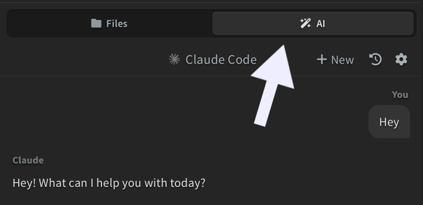

## Sending Messages

Type your message in the input box at the bottom and press `Enter` to send. Press `Shift + Enter` to add a new line.

While the AI is working, you can type your next message. It shows up as a queued message and gets sent automatically once the AI finishes its current response.

To stop the AI mid-response, click the **stop button** *(square icon)* that appears next to the send button while the AI is working, or press `Escape`.

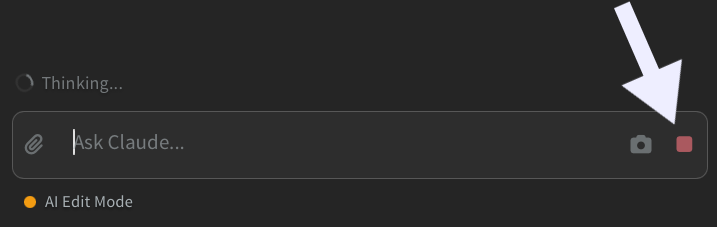

### Context

Phoenix Code automatically provides context about what you're working on. Small chips appear above the input box showing:

- **Selection** - the file and line range you have selected in the editor
- **Cursor** - your current line and file
- **Live Preview** - if the Live Preview panel is open

You can dismiss any of these by clicking the **x** button on the chip.

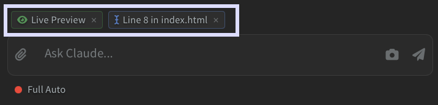

## Attachments and Screenshots

Click the **paperclip button** to attach a file or folder. The dropdown lets you choose:

- **Attach a file** - attach a single file. Supported image formats include PNG, JPG, GIF, WebP, and SVG. You can also attach code or document files.
- **Add folder as context** - attach an entire folder so the AI can read its contents.

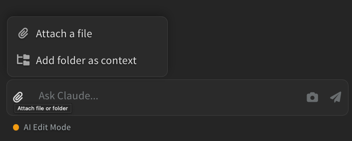

You can also paste an image directly from your clipboard into the input box.

Click the **camera button** to take a screenshot and attach it. The dropdown lets you choose what to capture:

- **Live Preview** - your Live Preview panel (if open)
- **Live Preview Selection** - the currently selected element in Live Preview
- **Full Editor** - the entire editor window
- **Select Area** - a custom region you select with a crop tool
- **Upload from Device** - choose an existing image from your computer instead of taking a new screenshot

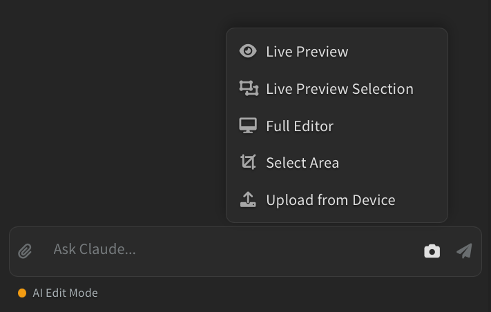

## Permission Modes

The AI has three permission levels that control how much it can do on its own. Click the **permission label** at the bottom of the panel to cycle between them.

- **Plan** - the AI proposes a plan first as a card in the chat (titled **Proposed Plan**). Click the **expand icon** in the card header to view the plan in full screen. Then click **Approve** to proceed, or **Revise** to open an inline feedback box where you describe what should change before the AI tries again. If the AI tries to edit a file while in Plan mode, you'll see an **Allow / Stay in Plan** prompt; choosing **Allow** switches the session to Edit mode for the rest of the turn. Good for complex tasks where you want to stay in control.
- **Edit** (default) - the AI can read and edit files on its own, but asks for your approval before running terminal commands.
- **Full Auto** - the AI runs everything without pausing — file edits, terminal commands, and tool calls all execute without confirmation. The first time you turn this on in a project, Phoenix Code shows a one-time warning so you understand the risk.

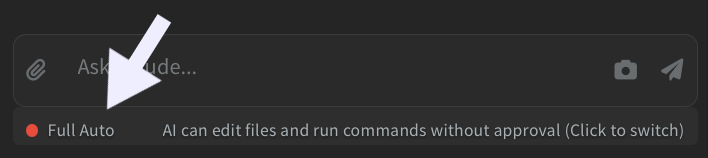

## Approving Terminal Commands

In Edit mode (the default), the AI shows an **Allow / Deny** card before running any terminal command. The card displays the full command so you can verify it before approving. Choosing **Deny** lets the AI continue with the rest of its response without running it.

> Bash confirmations are skipped in Full Auto mode.

## Reviewing Diffs

Every edit card shows the number of lines added and removed, along with a **Show diff** button that toggles a unified diff of the change inline. Click the **three-dot menu** on the card to:

- **Expand all** - open every diff section on the card at once
- **Collapse all** - hide every diff section on the card
- **Always show** - keep diffs open by default on future edits without clicking Show diff each time

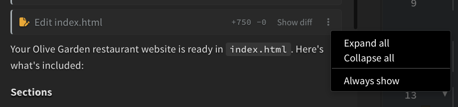

## Session History

Every conversation is saved automatically. Click the **history dropdown** at the top of the panel to see your recent sessions and switch between them.

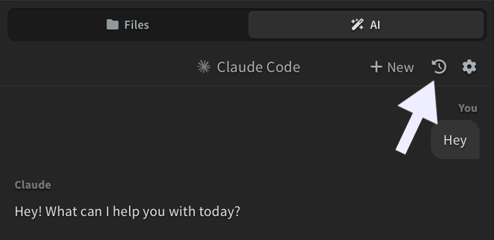

> Sessions are saved per project, so each project has its own chat history.

## Undo and Restore

Before each AI response that edits files, Phoenix Code creates a **restore point**. Each edit summary card has a button to revert to that point: it reads **Undo** on the most recent response and **Restore to this point** on earlier ones. Both do the same thing: they roll your files back to the saved state.

The first time you undo or restore in a session, Phoenix Code shows a confirmation dialog before reverting.

> Restore only reverts changes made by the AI. Edits you made outside the AI Chat are not tracked and may be lost if they overlap with files the AI also edited. For full version history, use version control like Git.

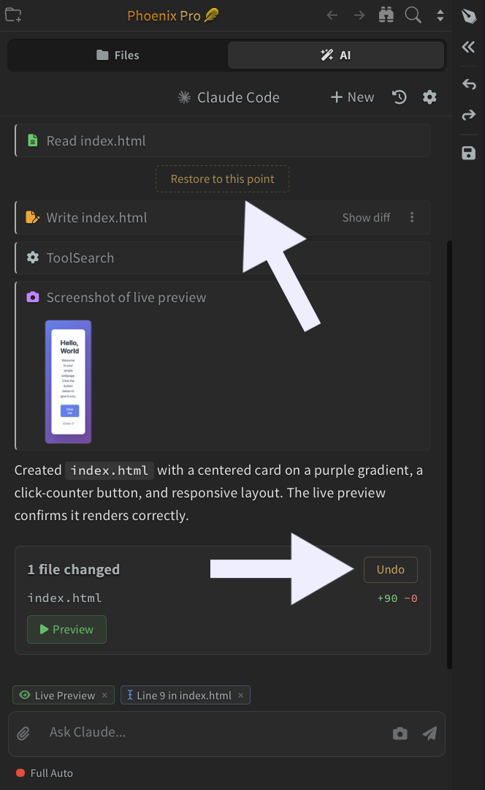

## Settings

Click the **gear icon** in the chat panel to open AI settings.
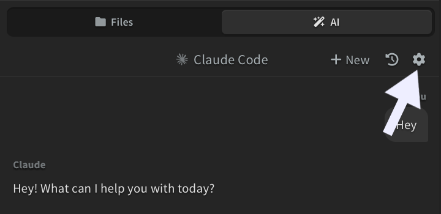

This will open a dialog where you can:
- Pick the **active provider** from a dropdown at the top
- Add a custom API provider with a name, API key (masked), and base URL
- Edit or delete any custom provider you've added
- Set a custom API timeout

When a custom provider with a base URL is active, the chat shows a one-time **Using custom endpoint: \<hostname\>** notice on your next message.

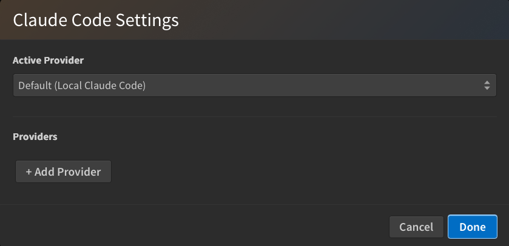

### Compatible providers

Phoenix Code uses the Claude Code CLI under the hood, so it works with any provider that exposes an Anthropic-compatible API.

- **Anthropic Claude** (default) — recommended; gives the best results.
- **z.ai GLM** — tested working as a drop-in alternative. Use z.ai's Anthropic-compatible endpoint as the base URL.
- **Other Anthropic-API-compatible providers** — add the provider's base URL and API key in the dialog above.

## Keyboard Shortcuts

| Action | Shortcut |
|--------|----------|
| Send message | `Enter` |
| New line | `Shift + Enter` |
| Cycle permission mode | `Shift + Tab` |
| Stop the AI mid-response | `Escape` (while AI is generating) |
| Clear input and focus the editor | `Escape` (when idle) |
