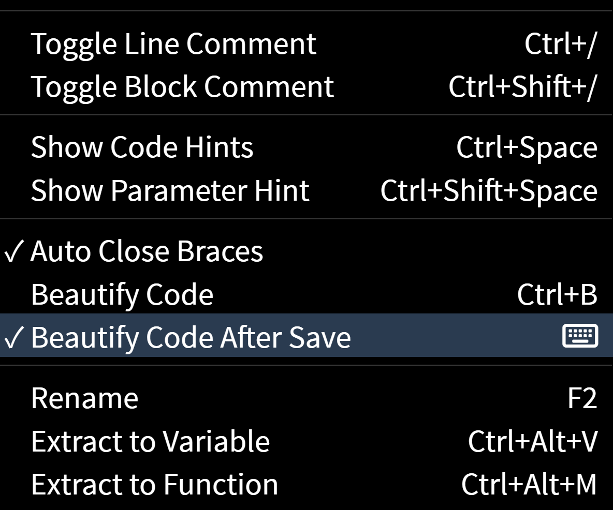
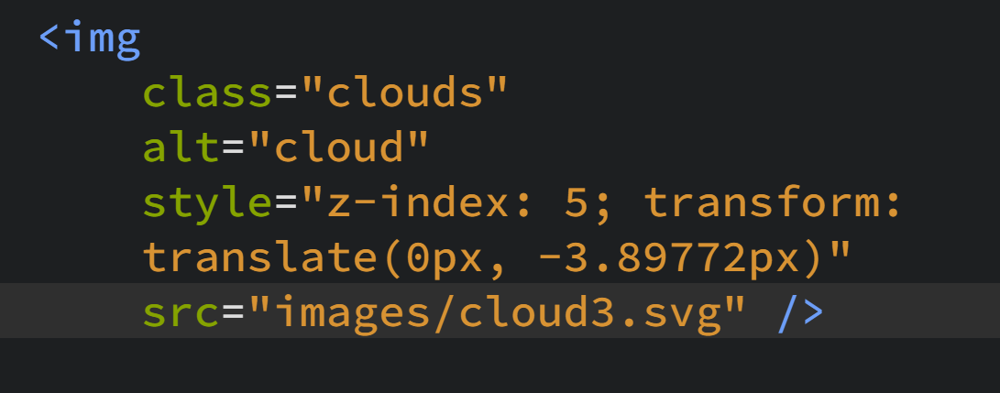
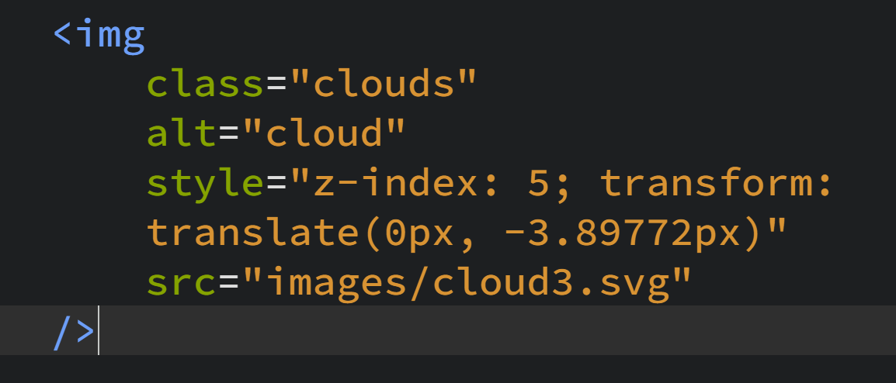
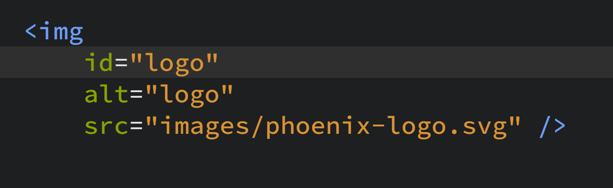
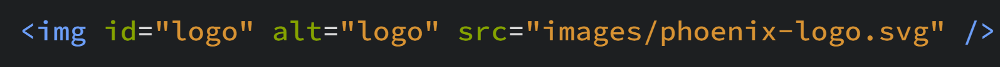
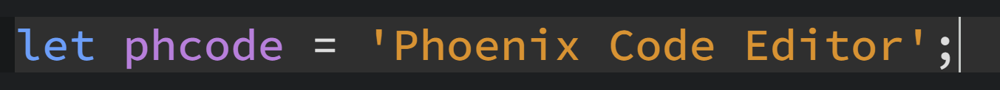
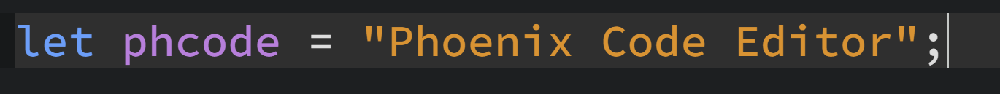
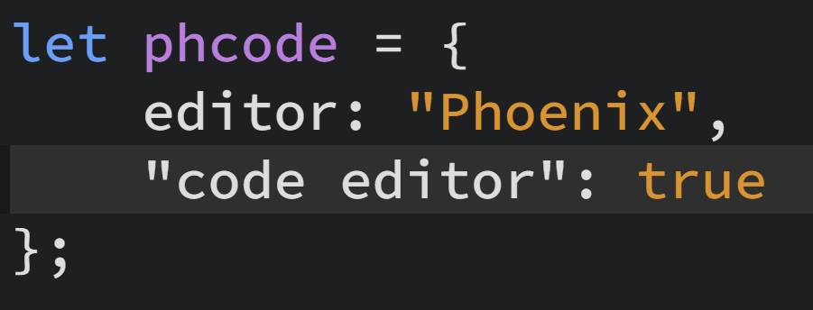
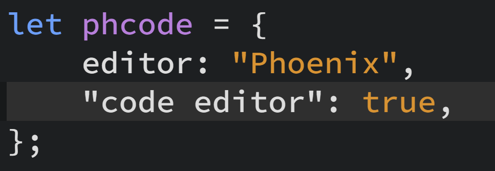
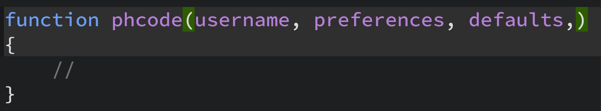

import React from 'react';
import VideoPlayer from '@site/src/components/Video/player';

The **Beautify Code** feature ensures your code is consistently formatted, improving readability and maintainability. It automatically aligns your code with your preferred style, taking into account indentation, spacing, and other formatting rules.


## How to Use
You can format your code using Beautify Code through the following methods:
### Context Menu :
    * Right-click in the editor.
    * Select **Beautify Code** from the context menu.

    


### Keyboard Shortcut :
    * Press `Ctrl+B` to format your code. (`Cmd+B` in MacOS)


**Note**: *You can also format just a selected part of your code using the Beautify Code feature. However, this option will only work if the selected code is syntactically valid.*


## Automatic Formatting on Save

To automatically format your code every time you save :
1. Go to `Edit` > `Beautify Code After Save`.
2. Toggle this option on.

   

   
## Customizing Beautify Code

You can adjust the settings for Beautify Code to match your coding preferences:
1. Go to `File` > `Open Preferences File`.
When you open the preferences, two files will appear:
    * **defaultPreferences.json** on the left pane: This file contains the default settings and is not editable.
    * **phcode.json** on the right pane: This is the file you should edit to customize your settings.

2. Look for the section named `beautify.options`.
    ```json
    {
        "beautify.options": {
            "bracketSameLine": true,
            "printWidth": 120,
            "proseWrap": "preserve",
            "quoteProps": "as-needed",
            "semi": true,
            "singleAttributePerLine": false,
            "singleQuote": false,
            "trailingComma": "none"
        }
    }
    ```

3. Modify the options as needed to control aspects like : 

  * **bracketSameLine** :- This option controls the placement of the closing > bracket in multi-line HTML, JSX, Vue, or Angular elements. When set to `false`, the closing bracket is placed on its own line. Setting this option to `true` positions the closing bracket at the end of the last line, aligning it with the content for a more compact and readable format, but this does not apply to self-closing elements.

    Default value of bracketSameLine is *True*.

  When set to *True* :
    

  When set to *False* :
    

    ---


  * **printWidth**: Sets the maximum line length for code formatting. The beautifier will wrap lines that exceed the number of characters specified by the `printWidth` value.

    Default value of printWidth is *120*.  

    ---


  * **proseWrap**: Determines how text in Markdown files is wrapped. The different values of `proseWrap` are :
  **"always"**: Automatically wraps prose to fit within the printWidth, regardless of original formatting.
  **"never"**: Prevents any automatic wrapping, keeping prose as-is even if it exceeds the printWidth.
  **"preserve"**: Maintains the original formatting of prose, wrapping text only where line breaks are already present.

    Default value of proseWrap is *preserve*.

    ---


  * **quoteProps**: Determines when properties in objects should be quoted:
  **"as-needed"**: Quotes properties only when necessary, such as when a property name contains special characters or conflicts with reserved keywords.
  **"consistent"**: Quotes all properties consistently based on the first property's quoting style. If the first property is quoted, all properties will be quoted, and vice versa.
  **"preserve"**: Maintains the existing quoting style of properties, leaving them quoted or unquoted as they are in the original code.

    Default value of quoteProps is *as-needed*.

    ---


  * **semi**:  Determines whether to add a semicolon at the end of every statement. When set to `true`, a semicolon is automatically inserted at the end of each statement. If set to `false`, semicolons are omitted.

    Default value of semi is *true*.

    ---


  * **singleAttributePerLine**: Controls whether to enforce placing each attribute on a new line in HTML, Vue, and JSX elements. When set to `false`, multiple attributes can be on the same line. If set to `true`, each attribute will be placed on its own line.

    Default value of singleAttributePerLine is *false*.

    When set to *True* :
    

     When set to *False* :
    

    ---


  * **singleQuote**: Determines whether to use single quotes instead of double quotes in your code. When set to `false`, double quotes are used for strings. If set to `true`, single quotes are used instead.

    Default value of singleQuote is *false*.

    When set to *True* :
    

     When set to *False* :
    

    ---


  * **trailingComma**: Controls the use of trailing commas in multi-line comma-separated structures.
  **"none"**:  No trailing commas are added.
  **"es5"**:  Adds trailing commas where valid in ES5 (e.g., in objects, arrays, etc., but not in function parameters).
  **"all"**:  Adds trailing commas in all possible places, including function parameters and imports.

    **Note**: `All JavaScript environments does not support trailing commas in function parameters, and including them could cause compatibility issues.`

    Default value of trailingComma is *none*.

    When set to *none*:
    

    When set to *es5*:
    

    When set to *all*:
    

    ---


## Modifying Indentation with Beautify Code

To adjust the indentation style or size in your code, use the Spaces/Tabs button in the status bar.

 * **Toggle between spaces and tabs**: Click on the button to switch between `spaces` or `tabs` for indentation.
 * **Adjust the number of spaces or tabs**: Click on the value in the status bar beside `spaces`/`tabs` and modify it as required to select your desired indentation size.

After you change the indentation style or size, use **Beautify Code** to reformat the entire file.

## Visual Demonstration
<VideoPlayer 
  src="https://docs-images.phcode.dev/videos/editing-text/beautify_format.mp4"
  winLinuxTitle="Beautify Code: Ctrl + B"
  macTitle="Beautify Code: Cmd + B"
/>
