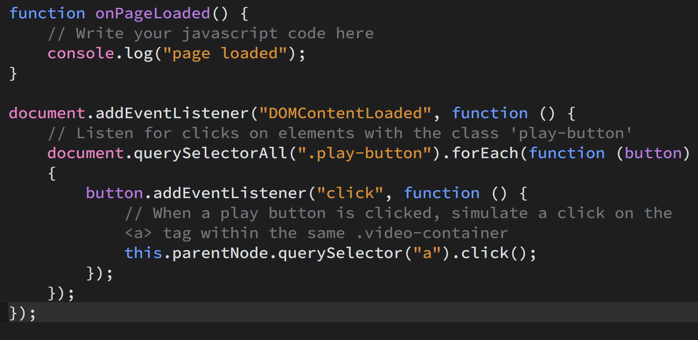
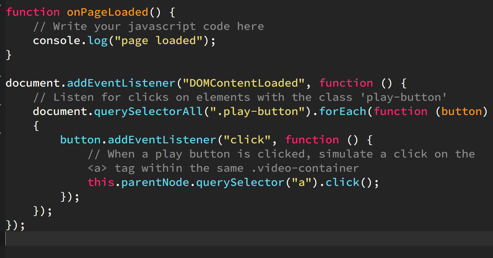
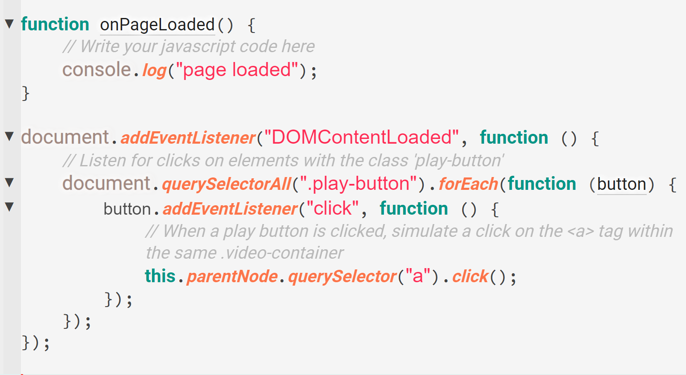

**Syntax highlighting** improves code readability by coloring different syntax elements in your code. This feature helps you quickly identify keywords, variables, and other code components, aiding in error detection and code comprehension.

## How It Works

Syntax highlighting works by analyzing the code and applying color schemes to various elements:

 * `Keywords`: Special words with predefined meanings (e.g., if, else).
 * `Strings`: Text literals enclosed in quotes.
 * `Comments`: Non-executable text, used for annotations.
 * `Variables`: Names assigned to data values.
 * `Functions`: Defined operations or methods.

Phoenix uses predefined rules for different programming languages to apply the appropriate colors.

 
Syntax Highlighting Example in a JavaScript File

## Theme Dependency

The colors used for syntax highlighting depend on the theme you are using. Themes define the color schemes for various syntax elements, allowing you to choose a style that suits your preference or needs.

Syntax Highlighting Example [Theme : `Monokai Dark Soda`]
 

Syntax Highlighting Example [Theme : `Material Color Light`]
 

To learn more about Themes. [Click Here](./08-themes.md)
   

## Troubleshooting

 * **No Highlighting** : Ensure that the file type is correctly recognized by the editor. Check the file extension and language mode.
 * **Incorrect Colors** : Verify your color scheme settings. You may need to adjust or switch to a different theme.
 * **Missing Language Support** : Install the necessary language extension from the editor’s marketplace.