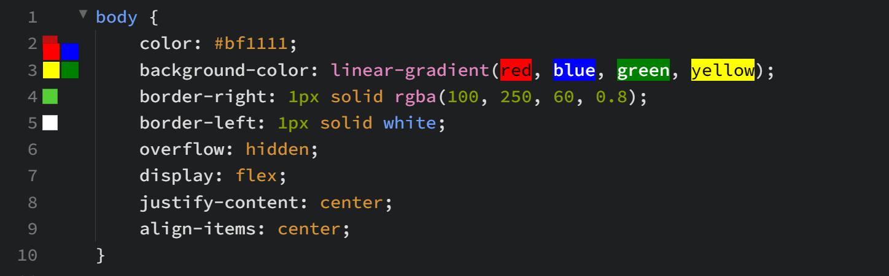

import React from 'react';
import VideoPlayer from '@site/src/components/Video/player';

This section provides an overview of the core color editing features in **Phoenix Code**.

---

## Inline Color Editor
**Inline Color Editor** lets you edit colors directly inside **Phoenix Code** using a color picker.

### Accessing the Inline Color Editor
To open the **Inline Color Editor** just hover over the color you want to edit.

The **Inline Color Editor** provides you an `Edit` button, click on it to open the color picker.

### Understanding the Color Picker Dialog
The **Color Picker** dialog lets you edit the colors visually. Here are the key components:

* **Color Spectrum**: The square on the left adjusts the brightness and intensity of the color. Drag the circle to select a specific shade.

* **Hue Slider**: The vertical slider adjusts the main color (hue). Move it up or down to switch between colors like red, green, or blue.

* **Transparency Slider**: The checkered slider adjusts the Alpha(transparency) of the color. Move it to set the color between fully solid and fully transparent.

* **Color Preview**: On the top right, you’ll see a Color Preview. The preview is divided into two parts:
    * *Right Side: Displays the new color being selected. It dynamically updates as you adjust the controls.*
    * *Left Side: Displays the original color before editing.*

* **Color Suggestions**: On the right, a list of already used colors in the file are displayed. Hovering over a color shows how many times it has been used in the file. This helps you pick consistent colors without needing to remember their codes.

* **Code Format Selection**: Below the Color Spectrum we have the option to switch between different formats:
    * *RGBA: Red, Green, Blue, and Alpha(transparency).*
    * *Hex: Standard hexadecimal color code.*
    * *HSLa: Hue, Saturation, Lightness, and Alpha.*
    * *Hex 0x: Hexadecimal format with a 0x prefix, such as 0xFF5733.*

* **Input Field**: At the bottom of the dialog, you can type in specific color values directly (e.g., #FF5733, rgb(255, 87, 51, 1), orange).

### Visual Reference

<VideoPlayer 
  src="https://docs-images.phcode.dev/videos/editing-colors/inlineColorEditor.mp4"
/>

___

## Color Preview
The **Color Preview** feature displays the color(s) used in the current line in the gutter area.

> A maximum of four colors can be displayed for a single line.

### Hover Interaction
* Hovering over a color box highlights the corresponding color text in the editor with a background of the same color.
* If a container has multiple colors, the hovered color box enlarges for easier accessibility, and its color text gets highlighted with the same color.

### Click Behavior
Clicking a color in the gutter moves the cursor to its position in the editor and opens the Color Picker for editing.

### Enabling/Disabling Color Preview

You can enable/disable the feature by updating the `colorPreview` property in the preferences file. [Click Here](./03-editing-text.md#editing-preferences) to read on how to edit the preferences.

---

## Color Hints
After typing a color related property, **Phoenix Code** displays a list of color suggestions.  

### Previous Color Suggestions
**(Coming Soon...)**  

If a file already contains colors (named colors, hex, or RGB values), **Phoenix Code** prioritizes those colors in the hint list. Colors are sorted in **descending order** based on their usage count in the file.  

> This helps in reusing frequently used colors without manually searching for them.  
