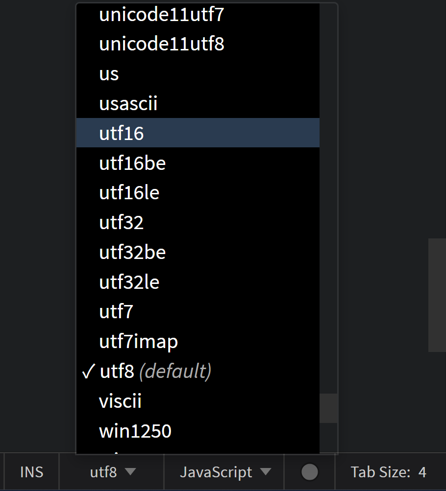
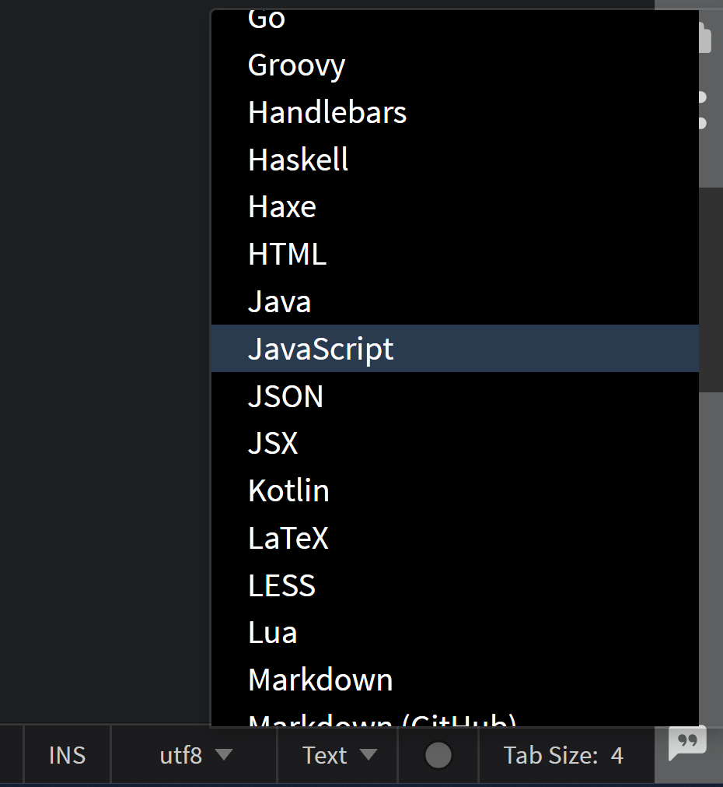

import React from 'react';
import VideoPlayer from '@site/src/components/Video/player';

This section covers how **Phoenix Code** decides which language to treat a file as, and which character encoding to read and write it with. Both settings are controlled from buttons in the editor's status bar.

## File Encoding
**File encoding** is the method used to represent text in a file by converting characters into bytes. We need it to ensure that text is displayed correctly across different platforms and to handle special characters or symbols. Phoenix Code Editor supports multiple file encoding formats.

*`UTF-8`* is the default encoding format in Phoenix.

### Set Encoding of a file
1. Click on the `utf8` button on the status bar. (UTF-8 represents the default encoding format).
2. A list of available encoding formats will appear. Select your desired format, or start typing to filter and find matching options in the drop-down menu.

## File Type Associations
**File Type Associations** *(Associating a file type with a language)* allows Phoenix Code Editor to provide language-specific features, such as syntax highlighting, code completion, and error checking, based on the file extension. This ensures that your files are treated according to their intended programming or markup language.

*When you create a new file, if the file extension is recognized, it is associated with the default language. If the extension is unknown, a generic text file is opened.*

### Associate a new file type with a language
To associate a new file type with a specific language in Phoenix Code Editor, use the Language dropdown button in the status bar. For example, if you want files with `.myjs` extension to be treated as JavaScript files, follow these steps:
1. Create a new file with the desired extension. For our example, we create (newfile.myjs). By default, it will be associated with a Text file.
2. Click on `Text` button on the status bar.
3. A list of all the supported languages will appear. Select the language you want to associate with the file type. For our example, we select `JavaScript`.

4. At the top of the popup box, you'll find an option labeled `Set as default for .myjs files`. Click on it.

Now, files with `.myjs` extension will be treated as JavaScript files.

<VideoPlayer 
  src="https://docs-images.phcode.dev/videos/editing-text/file_association.mp4"
/>
